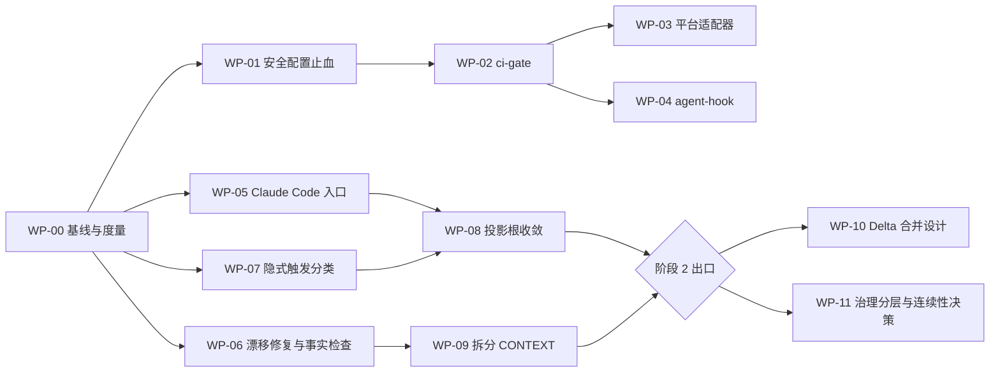

# 模板加固执行计划

本计划执行 [模板加固规格](harness-hardening-v1.md)。规格持有需求、验收与未决项；本文只持有顺序、写范围、验证和回退。两者冲突时以规格为准，并修正本文。

## 1. 执行规则

1. **从干净提交起步。** 当前工作树有 20 余个未提交改动。先由维护者提交或暂存进行中的工作，再从该提交为每个工作包建独立 worktree 与分支 `harden/wp-<编号>`（`using-git-worktrees`）。
2. **一个工作包一个 PR。** PR 标题带工作包编号；PR 描述列出命中的 FR / AC 与 `harness-metrics` 前后对比（WP-00 之后）。
3. **维护 checkpoint。** 每个工作包按 `.template-source/process/templates/maintenance-checkpoint-template.yaml` 建立 checkpoint，用 `scripts/maintenance-path checkpoints/harden-wp-<编号>/checkpoint.yaml` 取得仓外路径；`intensity` 与 `triggers` 按下表填写，命中 `permission-boundary` / `release-semantics` / `lifecycle-gate` 时附反例证据。
4. **验证顺序。** WP-02 合入前：`scripts/verify-template-fast --plan` → 执行所选集合 → `scripts/verify-maintenance-checkpoint <checkpoint>`。WP-02 合入后：再加 `scripts/ci-gate --mode pr --base <base SHA>`。
5. **跨仓顺序。** 涉及 Profile 子模块时，先在子模块提交并推送，再更新本仓 gitlink（模板工程说明 §7.6）。
6. **冻结。** 执行期间只允许本计划登记的技能退役或更名（FR-016）；例外写入本文第 6 节。
7. **不加概念。** 任何工作包如需新增流程文档、术语或门禁，先停下更新规格并取得维护者确认（NFR-005）。

## 2. 阶段与依赖



| 阶段 | 工作包 | 目标时长 | 出口条件 |
|---|---|---|---|
| 0 止血 | WP-00、WP-01 | 1–2 天 | AC-001、AC-002、AC-020 通过；基线指标已存档 |
| 1 执行点 | WP-02～WP-07 | 1 周 | AC-003～AC-014 通过；`template-gate` 已设为 PR 必需检查；连续 5 个 PR 的 `ci-gate` 耗时已记录（NFR-002） |
| 2 削减 | WP-08、WP-09 | 1–2 周 | AC-015～AC-017 通过；NFR-003、NFR-004 达标或差距已记录 |
| 3 设计 | WP-10、WP-11 | 1 周 | AC-018、AC-019、AC-022 的决策记录已签署；实现另立合同 |

阶段 1 内 WP-05、WP-06、WP-07 可与 WP-02 并行。

## 3. 工作包总表

| 编号 | 规格引用 | 维护强度与触发 | 允许写入 | 依赖 | 未决项 |
|---|---|---|---|---|---|
| WP-00 | FR-015、FR-016 | L2：non-core-validator | `scripts/harness-metrics`、`scripts/lib/harness-metrics.mjs`、`tests/harness-metrics.test.mjs`、`bundle-profile.json`（排除该脚本） | 无 | — |
| WP-01 | FR-001 | L2：permission-boundary、release-semantics、cross-repo-contract（需反例） | `.codex/config.toml`（删除）、三个子模块的同名文件（删除）、`bundle-profile.json`、`scripts/lib/agent-config-safety.mjs`、升级场景测试 | WP-00 | — |
| WP-02 | FR-002、FR-009 | L2：core-validator | `scripts/ci-gate`、`scripts/ci-setup`、`scripts/lib/ci-gate.mjs`、`tests/ci-gate.test.mjs`、`package.json`、`template-verification-profiles.yaml`（登记新检查输入）、`bundle-profile.json`（排除新脚本） | WP-01 | — |
| WP-03 | FR-003、FR-004 | L2：release-semantics（需反例） | `.github/workflows/template-gate.yml`、`.gitlab-ci.yml`、`.github/actions/setup-template/`、`github-workflows.md`、`scripts/ci-setup`（`--print-versions`、Python 下限、缺 pip 补装）、`tests/ci-adapters.test.mjs`、`tests/ci-gate.test.mjs`、`template-verification-profiles.yaml`（登记新路径）、`bundle-profile.json`（排除 `.gitlab-ci.yml`） | WP-02 | — |
| WP-04 | FR-005 | L2：local-rule、permission-boundary（需反例） | `scripts/agent-hook`、`scripts/lib/agent-hook.mjs`、`tests/agent-hook.test.mjs`、`.claude/settings.json`、`.codex/hooks.json`、`bundle-profile.json`、`template-verification-profiles.yaml`（登记新检查输入） | WP-02 | Q-003（已答复，见第 6 节） |
| WP-05 | FR-006 | L2：generation-semantics、cross-repo-contract | `CLAUDE.md`、`yss-skill-registry.yaml`（`projection_roots`、`runtimes`）、`scripts/lib/skill-supply-chain.mjs`、`skills-lock.json`、`.claude/skills/`（生成）、`bundle-profile.json`、`profile-skill-sync.json`、子模块对应文件（本轮只含三个 Profile 的 `CLAUDE.md`，见第 6 节）、`scripts/lib/skill-registry.mjs`、`template-verification-profiles.yaml`、`tests/claude-entry.test.mjs`、`strategic-handoff-tools.lock.json`（根锁） | WP-00 | Q-004（Claude Code 部分已答复，见第 6 节；Codex、Cursor、Pi 部分仍属 WP-08） |
| WP-06 | FR-007、FR-008 | L1：textual-only；检查脚本部分 L2：non-core-validator | `docs/process/yss-product-lifecycle-team-guide.md`、`README.md`、`skills-maintenance.md`、`digital-human-roles.md`、`scripts/verify-doc-facts`、`scripts/lib/doc-facts.mjs`、`scripts/lib/doc-facts-patterns.json`、测试、`template-verification-profiles.yaml`（登记检查输入）、`bundle-profile.json`（排除该脚本） | WP-00；检查接入 `ci-gate` 需 WP-02 | — |
| WP-07 | FR-010 | L2：generation-semantics、lifecycle-gate（第二批需反例） | `yss-skill-registry.yaml`（`invocation` 字段）、`scripts/lib/skill-supply-chain.mjs`、各技能 frontmatter 与 `agents/openai.yaml`（由同步生成）、`skills-lock.json`、`AGENTS.md`（仅入口说明） | WP-00 | — |
| WP-08 | FR-011 | L2：generation-semantics、release-semantics、cross-repo-contract（需反例） | `yss-skill-registry.yaml`、`skill-supply-chain.mjs`、`.codex/skills`、`.cursor/skills`、`.pi/skills`、`skills-lock.json`、`bundle-profile.json`、`skills-maintenance.md`、`skill-migrations.md`（登记删除的投影根）、子模块对应文件 | WP-05、WP-07 | Q-004 |
| WP-09 | FR-012 | L2：template-structure | `CONTEXT.md`、`.template-spec/process/process-glossary.md`（新增）、运行时 profile 文档、`AGENTS.md`、所有指向被迁术语的链接 | WP-06 | — |
| WP-10 | FR-013 | L2：lifecycle-gate（仅设计，不改注册表） | `.template-source/contracts/spec-delta-rebaseline-design.md`（新增） | 阶段 2 出口 | Q-006 |
| WP-11 | FR-014、FR-017 | L1：textual-only | `.template-source/contracts/governance-core-layering-design.md`（新增）、本计划第 6 节决策记录 | 阶段 2 出口 | Q-007 |

“允许写入”之外的路径只读。`lifecycle-registry.yaml`、批准记录 schema、交接包 schema、`digital-human-roles.yaml` 在本轮全部只读（规格“非目标范围”）。

## 4. 工作包说明

### WP-00 基线与度量

1. 实现只读 `scripts/harness-metrics [--json] [--root .]`，输出规格 FR-015 列出的字段。description 字符数按 frontmatter `description` 计；“可隐式触发”指未声明 `disable-model-invocation: true` 的技能。耗时字段在对应脚本不存在时输出 `null`。
2. 测试覆盖：空技能目录、含 `disable-model-invocation` 的技能、符号链接与完整副本的区分。
3. 在模板源与三个子模块各运行一次，存档到 `maintenance:research/harden/baseline/`。基线应与规格“现状证据”的数字一致；不一致时以实测为准并回写规格。
4. 在本计划第 6 节登记冻结开始日期。

完成：AC-020 的基线部分通过。回退：删除脚本，无其它影响。

### WP-01 安全配置止血

1. 删除被追踪的 `.codex/config.toml`（Q-002 已决），在 `bundle-profile.json` 的 `excludePaths` 登记该路径；三个 Profile 子模块同样处理并分别提交。删除前先把当前内容抄到维护者的 `~/.codex/config.toml`，确认本机行为不变。
2. 在 `scripts/lib/agent-config-safety.mjs` 实现检查：被追踪的 Codex 配置含 `danger-full-access` 或 `approval_policy = "never"` 时报错。WP-02 和 WP-04 复用该函数。
3. 新增升级场景测试：旧实例带高危配置时，升级计划把它列为建议移除并要求确认；用户拒绝时保留原文件（AC-002）。
4. 反例证据：构造仍带高危配置的 bundle，确认检查失败。
5. 在 `.gitignore` 中不忽略 `.codex/config.toml`：以后若有人重新提交该文件，由检查函数拦截高危值，而不是让它悄悄消失。

完成：AC-001、AC-002。回退：恢复原文件；检查函数保留但不接入。

### WP-02 ci-gate

1. `scripts/ci-setup`：从 `.github/actions/setup-template/action.yml` 抽出环境准备（Node 24、pnpm frozen lockfile、可选 Python schema 依赖、按需初始化固定子模块、可选固定 `yss` 源码构建），只用 bash，GitHub 与 GitLab 共用。
2. `scripts/ci-gate --mode pr --base <SHA> | --mode push [--report-dir <仓外目录>]`。步骤列表集中在 `scripts/lib/ci-gate.mjs` 的一个数组里，后续工作包只追加数组项。
3. 初始步骤：配置安全检查（WP-01）→ `sync-skills --check` → `update-skill-lock --check` → `verify-lifecycle-registry` → `verify-skill-registry` → `verify-doc-facts`（WP-06 步骤 4，随数组一并接入）→ Node 版本声明一致性（`package.json` 的 `engines.node` 是范围，`.nvmrc` 与 `scripts/ci-setup` 的 `YSS_CI_NODE_MAJOR` 默认值都必须落在该范围内）→ `verify-template-fast`（必需；PR 模式 `--base` 取目标分支 SHA，推送模式取 `HEAD^`，因为干净检出且不带 `--base` 时 fast 的变更范围为空）→ 仅 PR 模式：`verify-template-candidate --base`（非阻断，见第 6 节 2026-10-11 记录）。
4. 每步记录命令、退出码、耗时、日志路径；失败时打印修复建议。默认报告目录用 `scripts/maintenance-path`。
5. `package.json` 增加 `engines.node`，取值与 `github-workflows.md` 的受支持范围一致（Node 24 为验证运行器，Node 22 为工具兼容下限，故取 `>=22`）；该文档的叙述不做机器解析，运行器主版本以 `ci-setup` 的默认值为准。
6. 在 `template-verification-profiles.yaml` 登记新脚本为检查输入，避免 fast 选择器漏选。
7. 若 candidate 在本机超过 15 分钟，按规格风险表先把它设为非阻断步骤，并在 checkpoint 中记录。

完成：AC-003、AC-004、AC-012。回退：删除脚本与 `engines`；其它检查不受影响。

### WP-03 平台适配器

1. GitHub：`.github/workflows/template-gate.yml`，触发 `pull_request` 与 `push: main`；步骤只有 checkout（完整历史）、`setup-template`（只供给 Node、Python、Go 并调用 `scripts/ci-setup`，版本取自 `scripts/ci-setup --print-versions`，子模块由 `ci-setup --submodules` 初始化，原生 `yss` 由 `ci-setup --yss-commit gitlink` 从固定提交构建）、`scripts/ci-gate`。两个平台的报告目录都用 `/tmp/ci-gate`，保证报告里的命令字符串可逐步比对。PR 模式的 base 取 `github.event.pull_request.base.sha`。
2. GitLab：`.gitlab-ci.yml` 一个 `template-gate` job，`rules` 覆盖 `merge_request_event` 与默认分支推送；镜像固定 `node:24`（Debian 12，自带 Python 3.11、无 pip、无 Go；`scripts/ci-setup` 在 root 容器内补装预检要求的 Python 3.12 与 Go）；步骤为 `scripts/ci-setup` 与 `scripts/ci-gate`；GitLab artifact 只收项目目录内文件，报告在 `ci-gate` 结束后由 `after_script` 复制进去。MR 模式的 base 取 `CI_MERGE_REQUEST_DIFF_BASE_SHA`。
3. GitLab 拉取 `iloveZzz` 名下子模块：已确认匿名可读（2026-10-11 对三个 Profile 仓库、`yss-cli` 与主仓做 `git ls-remote` 均成功），无需令牌或镜像；若日后变为不可读，则在 GitLab 配置只读部署令牌或镜像，并写进 `github-workflows.md`。拉取失败时检查必须失败（AC-023），不得跳过。
4. 改写 `github-workflows.md` 的“已移除”段落，登记两平台的 `template-gate` 为必需检查；正式发布段落不动。文件名保持不变，避免断链。
5. 反例：同一个故意破坏投影的提交分别推到两个平台，确认两边都失败；再推修复提交，对比两份报告的步骤名单与退出码（AC-023）。
6. 维护者在两个平台把 `template-gate` 设为必需检查（仓库设置，不在代码中），并分别记录 5 次耗时（NFR-002）。

完成：AC-005、AC-006、AC-023。回退：删除两个适配器，恢复合同原段落；`ci-setup` 与 `ci-gate` 保留。

### WP-04 agent-hook

1. 先按 Q-003 查阅 Claude Code 与 Codex 当期 hook 文档，把事件名、输入格式和阻断返回值写进 checkpoint。
2. `scripts/agent-hook` 从 `git diff --name-only`（含未跟踪文件）取变更路径，按规格 FR-005 的路径表选择检查；无相关路径立即返回 0。
3. `.claude/settings.json` 注册 `Stop` hook；`.codex/hooks.json` 注册等价事件。`YSS_AGENT_HOOK=off` 跳过一次并在输出中声明。
4. 用 20 次运行测 p95（NFR-001），存档。
5. 反例：修改 `skills-lock.json` 后结束会话，确认被阻止。
6. 决定 hook 是否进入实例分发：默认只在模板源与 Profile 启用，实例通过 `project-ci` 选择启用。

完成：AC-007、AC-008。回退：清空两个 hook 配置，脚本保留。

### WP-05 Claude Code 入口

1. 按 Q-004 核对 Claude Code 当期的项目技能路径与 `@` 导入语法。
2. 根目录新增 `CLAUDE.md`，内容为 `@AGENTS.md` 和一行说明；三个子模块已有的 `CLAUDE.md` 改为同样形式。
3. 注册表 `runtimes` 增加 `claude`，`projection_roots` 增加 `claude: .claude/skills`；`sync-skills` 生成符号链接投影；更新 lock、`bundle-profile.json` 的 `allowRootEntries` / `allowRootFiles`、`profile-skill-sync.json`。
4. 在 Claude Code 中实际打开仓库确认技能可见，截图或日志存档。

完成：AC-009。回退：删除 `CLAUDE.md` 与投影根，回滚注册表与 lock。

### WP-06 漂移修复与事实检查

1. 修复四处漂移：团队指南的门禁数和 Discovery 阶段改为链接 `lifecycle-registry.yaml` 与 `lifecycle-artifact-map.md`；README 删除硬编码 revision，改为“版本见 `skills-lock.json`”；“六个共享投影根”改为链接注册表 `projection_roots`；“四条正交轴”与表格行数对齐。
2. 统一定位表述：README 与团队指南对本仓的一句话定位使用同一句，以 `template-engineering-overview.md` §1 为准。
3. `scripts/verify-doc-facts`：检查 README revision 与 lock 一致；检查登记的复述模式（如“\d+ 个门禁”“六个共享投影根”）不出现在说明文档。模式表放在脚本旁的小 JSON 中。
4. WP-02 合入后把该检查追加到 `ci-gate` 步骤数组。

完成：AC-010、AC-011。回退：文本修改无需回退；检查可从步骤数组移除。

### WP-07 隐式触发分类

分类原则（Q-005 由实施者判断）：

- **保持 `implicit`**：领域知识和组件规范类技能。它们应在用户写相关代码时自动生效，描述短，误触发代价低。
- **`explicit` 第一批**：有仓外副作用（提交、发布、安装、生成整套工程），只用于维护模板本身，或应当由用户主动发起。
- **`explicit` 第二批**：只由 `yss-product-lifecycle` 路由的阶段技能。Claude Code 中 `disable-model-invocation: true` 会让模型完全无法调用该技能，不只是不再自动选择，所以必须先通过 AC-024 的路由测试。任一运行时失败时该技能保持 `implicit`。
- **`yss-product-lifecycle` 保持 `implicit`**：它是“阶段不清楚时”的入口，描述只有 41 字符，改成显式会让 agent 错过入口，得不偿失。

| 类别 | 技能 | description 字符 |
|---|---|---|
| 已是 explicit（不变） | `git-commit-core`、`handoff`、`implement`、`setup-matt-pocock-skills`、`to-spec`、`to-tickets`、`triage`、`wayfinder` | 700 |
| 第一批 explicit | `frontend-commit`、`java-backend-commit`、`publish-skills-sh`、`setup-yss-harness`、`maintaining-skills`、`yss-skill-source-index-refresh`、`llm-wiki`、`yss-ddd-scaffold-generator`、`yss-layered-mvc-scaffold-generator`、`yss-frontend-scaffold-generator`、`grilling`、`prototype` | 975 |
| 第二批 explicit（以 AC-024 为前提） | `yss-stage-decision`、`yss-prototype-stage`、`yss-technical-design`、`yss-tactical-design`、`yss-implementation-contract-compiler`、`cross-repo-implementation-routing`、`implementation-repo-onboarding`、`yss-backend-spec-review`、`prototype-review`、`yss-openapi-draft-review` | 1,130 |
| 保持 implicit | 其余技能，包括 `yss-product-lifecycle`、`yss-research`、`code-review`、`tdd`、`diagnosing-bugs`、全部 YSS 后端组件、Formily / YTable / YTree 等前端组件技能 | — |

按 2026-10-10 的描述长度估算，模板源可隐式触发的 description 合计约为：现状 5,707 → 第一批后约 4,800 → 第二批后约 3,670，第二批完成才能达到 NFR-004 的 4,000 目标。若第二批有技能因路由测试保持 implicit，再缩短最长的几条描述来补足：`yss-prototype-stage` 284、`codebase-design` 265、`prototype-review` 184。WP-00 的度量脚本已按“可隐式触发”口径重算，规格已回写（5,707）。

步骤：

1. 注册表增加 `invocation` 字段，默认 `implicit`；按上表写入第一批。
2. `sync-skills` 生成 frontmatter 的 `disable-model-invocation: true` 与 `agents/openai.yaml` 的 `allow_implicit_invocation: false`；`--check` 校验一致（AC-013）。同步到三个 Profile 子模块中对应的技能。
3. 搭建 AC-024 路由测试：分别在 Claude Code 与 Codex 中，用一个需要进入 `yss-stage-decision`、`yss-technical-design` 的生命周期样例，确认编排器仍能加载这些技能（读取 SKILL.md 路径，或显式调用）。复用 `skills-agent-eval` 的 baseline / candidate 结构。
4. 路由测试通过的第二批技能切换为 `explicit`；未通过的保留 `implicit` 并写明原因。
5. 运行 `harness-metrics`，记录模板源与各 Profile 的数值（AC-014）。

完成：AC-013、AC-014、AC-024。回退：删除 `invocation` 字段并重新同步。

### WP-08 投影根收敛

1. 按 Q-004 的实测结果确定删除哪些投影根。预期：Codex 与 Cursor 原生读取 `.agents/skills`，删除 `.codex/skills` 与 `.cursor/skills`；Pi 视实测保留或删除。
2. `.codex/skills/product-design`：迁入 `.agents/skills` 并在注册表标为 Codex 独有，或保留为登记的运行时独有目录。
3. `sync-skills` 增加 `--copy` 模式供 Windows 使用，`--check` 对副本校验哈希（AC-016）。
4. 在 `skill-migrations.md` 登记被删除的投影根及日期；更新 `skills-maintenance.md`。
5. 实例经升级计划删除旧投影根，用户可拒绝；反例：旧实例拒绝删除后仍可正常使用。

完成：AC-015、AC-016。回退：恢复注册表 `projection_roots` 并重新同步。

### WP-09 拆分 CONTEXT

1. 把 `CONTEXT.md` 表格逐行分类为业务语言、流程术语、运行时平台细节，分类表存档。
2. 流程术语迁入 `.template-spec/process/process-glossary.md`；平台细节迁入运行时 profile 文档；`CONTEXT.md` 只留业务语言与一行指向术语表的链接。
3. 全仓检索被迁术语的链接并改指新位置；运行链接检查。
4. `AGENTS.md` 的阅读地图增加“流程术语按需读取 `process-glossary.md`”。
5. 运行 `harness-metrics` 验证 NFR-003。

完成：AC-017。回退：还原两个文件。

### WP-10 Delta 合并设计

只交付设计文档，内容覆盖：触发时点（Delta 批准且对应切片交付后）、合并规则（ADDED / MODIFIED / REMOVED 应用到稳定 ID）、新基线版本与血缘字段、`inspect-plan-spec diff` 报告与批准摘要的绑定、冲突与回退、与现有不可变包规则的关系，以及 Q-006 的落点决策。

### WP-11 治理分层与连续性决策

设计文档给出核心层与 YSS profile 层的归属表（AC-019）。连续性决策写入本文第 6 节：仓库归属、第二维护者、`CODEOWNERS` 范围、CLI 平台矩阵（AC-022）。

## 5. 交给 agent 执行时的指令

每个工作包可单独派发。派发指令模板：

```text
读取 .template-source/contracts/harness-hardening-v1.md 与 harness-hardening-v1-plan.md。
执行工作包 WP-<编号>：只修改计划第 3 节该行“允许写入”列出的路径；其它路径只读。
开工前确认依赖工作包已合入、相关未决项已有答复；没有答复时停下并提问，不自行假设。
按计划第 1 节建立 worktree、分支和维护 checkpoint，按第 4 节步骤执行，按第 1 节第 4 条验证。
结束时报告：命中的 AC 及证据路径、harness-metrics 前后对比、未完成项。
```

## 6. 决策与例外记录

| 日期 | 项 | 决定 | 决定人 |
|---|---|---|---|
| 待填 | 冻结开始（FR-016） |  |  |
| 2026-10-10 | Q-001 CI 平台 | GitHub 与 GitLab 都要；环境准备抽到 `scripts/ci-setup` | 维护者 |
| 2026-10-10 | Q-002 Codex 高权限配置 | 本机仍需要，改放 `~/.codex/config.toml`；仓库内文件删除 | 维护者 |
| 2026-10-10 | Q-005 显式技能清单 | 交实施者判断；分两批，见 WP-07 | 维护者授权，实施者执行 |
| 2026-10-10 | WP-06 写范围例外 | 补登 `doc-facts-patterns.json`、`template-verification-profiles.yaml` 与 `bundle-profile.json`：与 WP-00 一样登记检查输入，并把模板源专用检查排除出实例分发 | 维护者批准执行计划 |
| 2026-10-11 | WP-02 写范围例外 | 补登 `bundle-profile.json`：`ci-gate`、`ci-setup` 与 `lib/ci-gate.mjs` 是模板源专用检查工具，与 WP-00 / WP-06 一样排除出实例分发 | 待维护者确认 |
| 2026-10-11 | WP-02 candidate 降为非阻断 | 按规格风险表执行：选择性 gate policy 未激活，candidate 实际退化为 `legacy-full` / `release`，其预检要求固定 yss 二进制，且 Bundle 的模板来源必须等于被验证提交；实测四个 Profile 的 Bundle 提交都是 `yss-cli/docs/source-lock.json` 的固定值（落后当前 main 16 个提交），对新提交无法在托管 runner 通过。`fast` 为必需检查并带 `--base`，candidate 只记录；转为必需的条件并入 Q-008 | 待维护者确认 |
| 2026-10-11 | WP-03 写范围例外 | 补登 `scripts/ci-setup` 与 `tests/ci-gate.test.mjs`（适配器需要 `--print-versions`，GitLab 的 `node:24` 映像需要 Python 下限与补装 pip）、`tests/ci-adapters.test.mjs`、`template-verification-profiles.yaml`（登记新路径）和 `bundle-profile.json`（把根目录的 `.gitlab-ci.yml` 排除出实例分发，否则实例会继承一个调用不存在脚本的流水线） | 待维护者确认 |
| 2026-10-11 | WP-03 GitLab 运行时补装 | 验证预检硬性要求 Python 恰为 3.12，且改动 `bundle-profile.json` 等路径会选中 `go -C submodules/yss-cli test`（`go.mod` 要求 go 1.27.1）。`node:24` 映像是 Debian 12（Python 3.11.2，无 pip，无 Go），按字面「步骤只有 ci-setup 与 ci-gate」在 GitLab 上跑不起来。`ci-setup` 因此在 CI 的 root 容器内补装：Python 经固定版本的 uv，Go 取 `go.mod` 指定版本并校验 go.dev 的 sha256；非 root 或非 apt 环境仍要求镜像自带。长期更稳妥的做法是维护者提供含 Node 24、Python 3.12、Go 的固定 CI 镜像 | 待维护者确认 |
| 2026-10-11 | WP-03 Linux runner 上 fast 的已知失败 | 在 `node:24` 容器（单容器、无负载）里，`tests/verification-execution.test.mjs` 的「真实进程超时返回124…」（期望 `SIGKILL` 实得 `SIGTERM`）与「准备和主检查使用独立日志…」（退出码 1）稳定失败，macOS 本机通过；yss-cli 的 `native.yml` 也只在 `macos-15` 对 darwin/arm64 做资格。两个适配器按计划使用 Linux，改动验证基础设施的 PR 会在上面失败。待维护者决定：修这两个测试，或 GitHub 改用 `macos-15`、GitLab 指定 macOS runner | 待维护者确认 |
| 2026-10-11 | yss-cli 源码锁落后于模板 | `yss-cli/docs/source-lock.json` 仍固定模板 `d947b648`（schema v1，`core-validator` 属 L3），而 `de5c2055` 已把维护强度合并为 L1/L2。yss-cli 的 Go 测试以固定模板为 Node 预言机，因此 `TestMaintenanceIntensityTwoLevels` 报 `Node/Go verdict differs`（已用旧模板复现、用 `cad38300` 验证通过）。需要在 yss-cli 提交更新后的锁与重新生成的 Bundle 资产，再更新本仓 gitlink；同一落后也是 candidate 的 `release-sources` 不匹配的根因之一 | 待维护者确认 |
| 2026-10-11 | Q-003 hook 接线（WP-04 实施记录） | 依据 2026-10-11 的当期文档：[Claude Code hooks](https://code.claude.com/docs/en/hooks) 与 [Codex hooks](https://developers.openai.com/codex/hooks)（现重定向到 learn.chatgpt.com/docs/hooks）。两个运行时都用 `Stop` 事件，stdin 带 `stop_hook_active`；退出码 2 且原因写 stderr 即阻止结束并把原因交给 agent；退出 0 且 stdout 为空或为 JSON 视为通过（Codex 规定 Stop 的 stdout 纯文本非法，所以通过时不输出，只用 `systemMessage` 这个两边共有的通用字段声明放行）。Claude Code 在连续 8 次 Stop 续跑后强制结束；Codex 文档未给上限，所以 hook 在 `stop_hook_active` 为真且仍失败时自行放行并声明，不连续阻断，合入前由 `ci-gate` 兜底。Codex 项目级 hook 需在 CLI 里经 `/hooks` 审阅并信任，信任绑定 hook 哈希，改动后须重新信任；Claude Code 项目级 hook 的信任规则不在已读到的文档段落内，首次使用时以会话提示为准 | 实施者 |
| 2026-10-11 | WP-04 写范围例外 | 补登 `template-verification-profiles.yaml`：登记 `check.agent-hook` 的输入、路径组与补充检查，否则 fast 选择器会把 hook 相关路径判为未知；与 WP-00 / WP-02 / WP-06 相同 | 待维护者确认 |
| 2026-10-11 | WP-04 取舍 | ① 批准记录只做 `verify-approval-record --history` 结构校验：当前批准校验需要调用方给出 checkpoint，hook 无从得知，也不得因此放行执行；② 技能注册表变化额外运行 `verify-skill-registry`（毫秒级，与 `ci-gate` 步骤同源）；③ 检查的标题、命令与修复建议直接取自 `ci-gate` 的 `STEPS`，避免两处漂移；④ 本轮只在模板源启用：三个 Profile 子模块的 hook 配置与脚本不在 WP-04 写范围，是否另开工作包待维护者决定；⑤ `harness-metrics` 的 `timings_ms.agent_hook` 仍为 `null`（该脚本不在 WP-04 写范围），20 次计时存档在维护目录 `research/harden/wp-04/agent-hook-p95.json` | 待维护者确认 |
| 2026-10-11 | Q-004 Claude Code 部分（WP-05 实施记录） | 依据 2026-10-11 的当期文档：[Claude Code skills](https://code.claude.com/docs/en/skills) 与 [Claude Code memory](https://code.claude.com/docs/en/memory)。项目技能只读 `.claude/skills/<name>/SKILL.md`，文档不提 `.agents/skills`，所以必须有 `.claude/skills` 投影根；技能目录可以是指向别处的符号链接，同一目标只加载一次，因此投影沿用符号链接。`AGENTS.md` 只在工作目录及其上级没有任何 `CLAUDE.md` 时才被原生读取（v2.1.277 起），存在 `CLAUDE.md` 时只读它；`CLAUDE.md` 用 `@AGENTS.md` 导入则在所有会话与版本中都生效，导入路径相对本文件、最多四层。`disable-model-invocation: true` 让模型无法自行调用，用户仍可 `/name` 调用，也不会预载进子代理（与 WP-07 的第二批判断相关）。Codex、Cursor、Pi 是否原生读取 `.agents/skills` 留给 WP-08 | 实施者 |
| 2026-10-11 | WP-05 写范围例外 | 补登 `scripts/lib/skill-registry.mjs`（校验器把 `agent_runtime_roots` 写死为三个运行时）、`template-verification-profiles.yaml`（登记 `.claude/skills/**`、`CLAUDE.md` 与 `check.claude-entry`，否则 fast 选择器拒绝未映射路径）、`tests/claude-entry.test.mjs`、`strategic-handoff-tools.lock.json`（`skill-registry.mjs` 与 `skill-supply-chain.mjs` 是共享工具，改动后须重新钉住根锁）；与前几个工作包相同 | 待维护者确认 |
| 2026-10-11 | WP-05 Profile 范围 | 三个 Profile 子模块本轮只把 `CLAUDE.md` 改为 `@AGENTS.md` 加一行说明；不给 Profile 生成 `.claude/skills`。原因：Profile 的技能准备把运行时写死为 `.codex`、`.cursor`、`.pi`（`.template-source/scripts/lib/profile-skills-preparation.mjs` 第 48、52 行，`.template-source/scripts/prepare-profile-skills.mjs` 第 29、44 行，及 `profile-skills-preparation.test.mjs`），不在 WP-05 写范围；而把改动后的 `skill-registry.mjs`、`skill-supply-chain.mjs` 同步进 Profile，会让它们的注册表（`agent_runtime_roots`）与锁（`projectionRoots`）立刻不一致。因此只用 `sync-strategic-handoff-tools --root-only` 重钉根锁，Profile 副本保持三根版本。后果：`sync-strategic-handoff-tools --check` 会在两个 Profile 的这两份副本上报漂移（`check.agents-shared-sync` 的输入清单没有列 `skill-supply-chain.mjs`，fast 不会选它，candidate 与 release 会）。Profile 采用 `.claude/skills` 需另开工作包，同时改准备脚本、注册表、锁与 `.gitignore`，并在 Profile 里重新准备技能 | 待维护者确认 |
| 2026-10-11 | WP-05 yss-cli 前置条件 | 实例要得到 `.claude/skills` 与根 `CLAUDE.md`，须先改 yss-cli（不在 WP-05 写范围）。Go 侧硬编码三个运行时：`internal/bundle/render.go` 第 45 行按字面量匹配 `export const PROJECTION_ROOTS = [...]`，匹配不到即报“Skill 投影脚本分发基线变化”，所以**下一次把 `yss-cli/docs/source-lock.json` 升到包含本工作包的模板提交之前必须先改**，否则 Bundle 资产再生成会失败；另有 `render.go` 第 286 行（运行时到根的映射）、`skill_lock.go` 第 122 行（目标白名单）、`producer.go` 第 556 行、`native_work_layout.go` 第 78 行、`internal/bundle/native/instance-metadata.mjs` 第 52 行与 `rules/*.json` 的 `renderPaths`。当前 yss-cli 的 Go 测试以固定的旧模板为预言机，所以不受影响；`yss` 创建实例在升级资产前仍只带三个运行时 | 待维护者确认 |
| 2026-10-11 | WP-05 验证环境与偶发失败 | ① 新建 worktree 的 Profile 子模块没有生成技能（被 `.gitignore` 忽略），`skill-registry.test.mjs` 的“in all profiles”用例会因读不到 `git-commit-core/SKILL.md` 而 ENOENT；需把已物化的主检出里被忽略的生成文件复制过来，与本工作包无关。② 一次 fast 在 `tests/verification-report*.test.mjs` 失败（日志指向被杀 worker 的临时目录 ENOENT），单独运行 19/19 通过，立即重跑 fast 通过，判断为时序敏感用例，未复现。③ `scripts/verify-retired-skill-ids` 在 main 上同样失败（输出逐行一致），是既有问题，不在 ci-gate 步骤内 | 实施者 |
| 2026-10-10 | WP-06 团队指南 | `docs/process/yss-product-lifecycle-team-guide.md` 被 `.gitignore` 排除，只在维护者本地修正；文档事实检查在文件存在时扫描 | 维护者 |

## 7. 执行状态

| 工作包 | 状态 | 分支 | 说明 |
|---|---|---|---|
| WP-00 | 已合并到 main | `harden/wp-00` | `harness-metrics` 与 4 个测试通过；基线已测 |
| WP-01 | 已合并到 main | `harden/wp-01`（主仓与三个 Profile 子模块同名；子模块合并提交在各自的 `harden/integration`） | 配置已删除并加检查；AC-002 未完成（需 yss-cli 改动）；维护者需把配置抄到 `~/.codex/config.toml` |
| WP-02 | 已合并到 main | `harden/wp-02` | `ci-gate`、`ci-setup`、`engines.node` 与 21 个测试通过；AC-003、AC-004、AC-012 已实测；`verify-doc-facts` 已接入；`ci-setup` 已在本机隔离环境实跑通过（52 秒），托管 runner 上的耗时与 GitLab 路径待 WP-03；candidate 按风险表降为非阻断，原因见第 6 节 |
| WP-03 | 已合并到 main | `harden/wp-03` | 两个适配器、`setup-template` 薄封装、`github-workflows.md` 改写与 12 个契约测试；GitLab 任务在 `node:24` 容器里按 `.gitlab-ci.yml` 原样实跑；真实平台的 PR / MR、必需检查设置与 5 次耗时仍待维护者；Linux 上 fast 有两个已知失败测试，见第 6 节 |
| WP-04 | 已合并到 main | `harden/wp-04` | `scripts/agent-hook`、库与 19 个测试；Claude Code 与 Codex 的 `Stop` hook 已注册，hook 文件已排除出实例分发；真实仓库反例（改坏 `skills-lock.json` → 退出 2 并给出修复命令，修复后通过）与 20 次计时（触发全部检查的最坏路径 p95 681 ms，仅 `.codex` 变更 123 ms，目标 ≤ 10 s）已实测；fast 通过；AC-008 由测试覆盖。两个客户端里的真实会话验证与 Codex 的 `/hooks` 信任需维护者在各自客户端确认；Profile 子模块未启用，见第 6 节 |
| WP-05 | 已提交，待合并 | `harden/wp-05`（主仓；三个 Profile 子模块同名，提交在各自的 `harden/wp-05`，推送前主仓 gitlink 引用本地提交） | 根 `CLAUDE.md`、`.claude/skills`（79 个符号链接）、注册表 `runtimes` / `projection_roots` / `agent_runtime_roots`、锁、`bundle-profile.json`、验证登记与 5 个契约测试；三个 Profile 的 `CLAUDE.md` 已改为导入形式；fast 通过。Profile 的 `.claude/skills` 与实例分发依赖 yss-cli 与 Profile 准备脚本的改动，见第 6 节两条记录；AC-009 的 Claude Code 实机确认**待维护者**：本机无头 `claude -p` 未登录（返回 Not logged in），未能在实施会话内完成。确认方法：在已登录的 Claude Code 里打开该分支的检出，`/skills` 应列出 79 个来自 `.claude/skills` 的技能，启动提示或 `/memory` 应显示 `CLAUDE.md` 经 `@AGENTS.md` 导入；WP-04 的 Stop hook 同样需要在客户端里实际结束一轮会话来确认 |
| WP-07 起 | 未开始 | — | WP-07 依赖 WP-00，已满足 |
| WP-06 | 已合并到 main | `harden/wp-06` | 基于 main（文本修复不依赖 WP-00 代码）；三处被追踪的漂移已修，`verify-doc-facts` 与 5 个测试通过；团队指南为未追踪文件，本地已修；已随 WP-02 接入 `ci-gate` |
