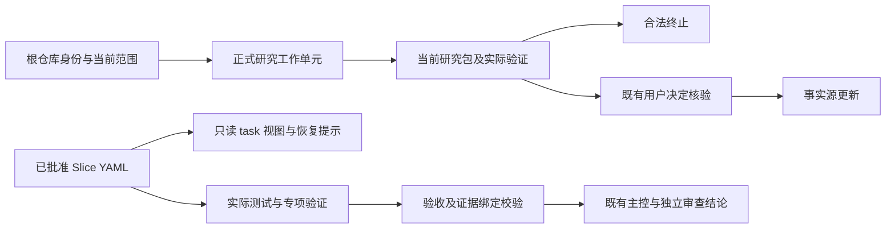

> 提交前实施记录。提交后的交付与验证状态见 [提交验证记录](committed-delivery.md)。

# YSS 生命周期核心闭环实施记录

本轮按用户确认的 P0 → P1 → P2 → P3 方案实现，强度为 L3；**尚未达到 `implementation-ready`**。代码与文档在工作树中，未提交来源门禁仍阻断完整验证。提交、推送、发布和存量项目迁移未执行。

隔离检出的完整计划执行 97 项，96 项通过，唯一失败为 `--require-committed`；输入未漂移。被门禁跳过的四项另行补跑，其中发布集成在全局 npm 12 下失败、在 Node 24 自带 npm 11.19.0 下通过；原失败均保留。103 项语法检查通过。原工作区的快照检查因已有 CodeGraph 数据库超过 2GiB 而未进入场景执行，未修改缓存。

真实对照评测使用 16 次会话、约 35.4 分钟；候选研究收尾 2/2 通过，但 API／UI 的隔离运行时能力不足，恢复步骤未执行。故保留原阅读默认，不推广 focused。最终元数据及入口预算修正另经确定性验证，未冒称已重跑 Agent。逐项结果、兼容步骤和回退见本文及同目录 `delivery-status.json`、`evaluation-decision.md`。

## 实施范围与行为

| 工作包 | 实际行为 | 主要事实源与回归 |
| --- | --- | --- |
| P0 研究收尾 | 注册模板研究工作单元；根身份决定路由；当前证据可终止；进入维护须消费既有真实用户决定协议 | `lifecycle-registry.yaml`、`lifecycle-transition.mjs`、`maintenance-research.mjs`；`fixtures/lifecycle-core/research.test.mjs` |
| P1 任务和恢复 | task 视图显式选择 `focused`；合并本任务、关联验证项与 required_for_all 的验收；保留全局、未知及跨仓约束；状态输出任务包、合同视图、适用预检和验证项定位 | `contract-views.mjs`、`lifecycle-status.mjs`；`fixtures/lifecycle-core/views.test.mjs` |
| P2 Slice 证据 | schema v3 合同不变；Execution Result v2 增量绑定合同原字节、工作单元、验证项、验收、证据与来源；当前完成重读绑定文件 | `execution-evidence.mjs`、`implementation-contract-compiler.mjs`；`fixtures/lifecycle-core/evidence.test.mjs`、Slice v3 跨仓场景 |
| P2 UI 专项 | 在既有前端校验器核验批准计划、结构化交互、状态与 case 覆盖、console、截图、实际命令及摘要；命令通过不能掩盖交互失败 | `verify-frontend-implementation-evidence` 及对应 scenarios、原前端 schema v2 与模板 |
| P3 分发与评测 | 同步 canonical、投影、锁、派生图、profile 适配补丁与共享工具；冻结来源，先基线后候选；保留失败与能力缺失 | `sync-profile-skills`、`sync-strategic-handoff-tools`、`skills-agent-eval.py`；同目录 manifest、轨迹和汇总 |

路径缩写均相对于本模板根；脚本模块位于 `scripts/lib/`，场景位于 `scripts/`，生命周期和前端 schema 位于 `.template-spec/process/`。



视图不发起实现，不授予权限。`active` 或未知执行状态先检查实际运行，不重复派发；已完成任务先检查适用验证项、当前输入和证据，不直接重做实现。状态命令本身不运行全套验证，明确保留 `not-checked`。

## 关键接口

```sh
# 输出到新目录，记录真实研究校验的日志和摘要
node scripts/verify-maintenance-research <brief.md> <evidence.yaml> --output <new-run-directory>

# 默认保留原 task 布局；裁剪布局显式选择
node scripts/contract view <slice.yaml> --kind slice --profile task --unit <unit-id> --task-layout focused

# 仅读状态并定位后续检查
node scripts/lifecycle-status --checkpoint <checkpoint.json> --task <task.json>

# 后续由执行者按当前依据运行，状态查看不会代执行
node scripts/slice-contract verify <slice.yaml> --unit <unit-id> --approval-ref <approval.json>
```

研究验证子进程最多 30 秒、输出最多 2 MiB，输出目录必须不存在；重读输入和结果摘要，避免验证期间来源变化被接受。研究中的事实缺口可作为明确限制保留；执行阻断、缺日志、旧摘要和非法路由不能作为“完成”。正式研究结束不等于批准后续维护。

Slice 证据采用 `evidence_binding_version: 1`。`verification_id` 唯一对应当前工作单元的验证项；`acceptance_refs` 覆盖该验证项的验收；`behavior_ref` 使用稳定验收 ID。来源绑定至少覆盖本轮变更，删除项使用明确 tombstone。单仓来源以实现目录解析，跨仓显式根必须登记且属于当前任务或其验证依赖。机器检查证明引用、覆盖与字节一致性，不能证明任意文字描述的行为真实成立，也不能自动发现未声明测试依赖；仍由实际测试、API、浏览器和专业审查证明。

前端专项复核过程中发现原 `interaction_results` 仅要求非空文字，无法拒绝“交互失败”。现保留历史 schema 读取，在正式当前完成路径要求结构化交互及批准计划绑定；这是 P2 的必要补齐。所选 case 与计划状态均须覆盖，console、实现图、差异图和实际命令日志都要重读摘要。仅补齐字段不代表真实浏览器验证通过。

## 历史兼容与显式升级

1. 旧研究任务包与暂停记录保持原字节。本轮在 `research-closure/` 另存四份新收尾记录，引用原研究包和旧阻断；新记录只证明此次重新核验与合法收尾，不声称旧 Agent 已被恢复或重新研究。
2. 旧 Slice v2 仍按原规则读取；Slice v3 无需升级 schema。缺新绑定的旧结果返回 `legacy-evidence-binding-missing`，不改写合同、批准或日志。
3. 恢复存量任务时，先核对真实执行状态，再核验原合同、批准与来源是否有效；无效即回交重编译和适用批准。有效时重新执行受影响验证，另存新结果，引用原记录。
4. 旧前端文字报告可历史读取；正式验证返回 `legacy-interaction-binding-missing`。重验当前计划和批准后，真实采集交互、console、截图和命令输出，保存新报告；禁止给历史日志补造时间或通过结论。
5. 新默认只适用于验收完成后的新项目、新任务。`focused` 保持显式试用；未证明质量与效率同时成立，不切换默认阅读方式。

## 验证与评测解释

确定性场景覆盖合法收尾／继续维护、身份伪造、产品 Plan 回归、非法空路由、缺证据、任务约束筛选、恢复状态、合同与来源漂移、跨仓同名文件、历史结果、交互失败和日志替换。合成批准与字符串证据只用于机制测试，不能当作真实 Maven、产品批准或浏览器成功。

真实评测使用同一 Codex CLI、`gpt-6-astra`、`xhigh`、固定提示与判定器。每组最多 10 次会话启动、1,800 秒窗口，单会话 300 秒；先完成基线再执行候选。UI 第一步失败时保留未执行的恢复步骤，不把缺失记作零成本。输入 token、恢复调用、耗时和字节分开报告；货币成本未知。自动断言之外逐项核对轨迹、实际工具结果和输出文件。

本轮 suite 的 task 布局没有强制切换 focused，因此不能据其 token 差异证明裁剪布局的收益。独立字节实验只作为合成机制观测：少量验收时恢复说明可能使正文变长，较多无关验收时正文缩短。真实恢复比较缺失时，不用字节变化替代 token／工具调用结论。

主环境对本地 HTTP 与浏览器做了实际 preflight；Agent 隔离环境的能力仍可能不同。能力不足如实记为未完成，不能用主环境成功补记 Agent 成功。

## 回退与后续交付

- P1：继续使用现有默认 `legacy`，即可停止 focused 试用；不修改 YAML、批准或历史视图。
- P0：若需撤回研究路由，恢复该工作包的事实源与派生物，保留本轮已产生的新旧研究证据，不回写旧暂停任务。
- P2：若证据新规则误阻断，修复规则或显式回退相关校验器及同版本文档、profile；保留全部失败样本。出现错误放行或约束遗漏时先停止推广，不降低断言或删除反例。
- 分发：按本轮变更清单逆向恢复对应事实源，再运行既有同步工具更新投影、profile 与锁；不能对整个脏工作树 reset。共享工具锁诚实记录 `working-tree`，不伪造 committed 来源。
- PR 前执行 candidate；获准提交后从最终提交重建 CLI 输入，发布前执行完整验证与固定版本 CLI 集成。当前工作树检查不等于可合并、可发布，也未安装三家专属适配器或外部编排器。

无关 `llm-wiki`、CLI 子仓改动与历史证据均属于初始工作区范围，按摘要核对保留。本轮独立审查未被冒领；普通 L3 维护使用维护者自检，产品切片的角色分离边界保持原规则。
