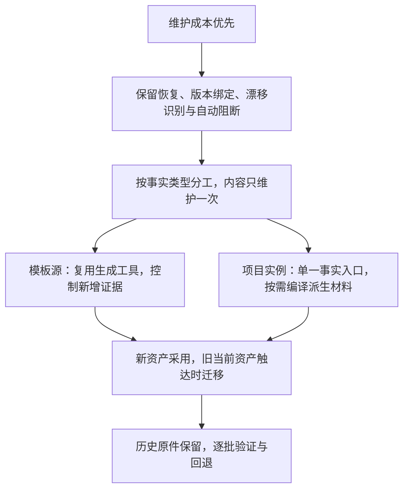

# 机器资产减量评估与渐进实施方案

日期：2026-10-02（Asia/Shanghai）

仓库身份：`template-source`

状态：分析路线已由用户确认；本文件为实施方案，不改变现有治理规则、Schema 或资产批准状态。

## 1. 结论与已确认决定

建议有选择地减少机器资产和重复字段，保留必要的结构化关系。优先减少人工维护入口、正文复写和同步步骤；单纯把 JSON/YAML 改成 Markdown，不能消除同一事实在多个位置重复维护的成本。

本次 grilling 中，用户依次确认了以下决定：

| 决定 | 已确认范围 |
|---|---|
| 目标 | 人工与 Agent 的维护负担优先；文件数量、体积及执行成本作为辅助指标 |
| 分析范围 | 模板源与项目实例分别处理 |
| 必须保留的能力 | 可恢复流程状态、批准与具体版本绑定、变更失效识别、关键门禁自动阻断 |
| 人工事实入口 | 按事实类型分工：业务正文只维护一次；工具维护状态和批准元数据；必要契约保留唯一结构化来源 |
| 存量过渡 | 新资产逐步切换；旧的当前资产在修改时迁移；历史批准和证据保留原件 |

上述确认用于本方案设计。真实批准人、决定原文、独立审查和具体实施范围仍由现有协议记录；工具不能生成用户回复或代替批准。本轮仅落本文档，不执行删除、历史迁移、真实实例修改、提交、推送或发布。

## 2. 当前事实与限制

本轮重新统计的 HEAD 为 `f4d8e99312148d6c9798a2d7c9a80a9cea9e37c8`。使用根仓 `git ls-files -z`，筛选 `.json/.yaml/.yml` 并读取当前工作树文件字节数；不递归 gitlink，不计未跟踪文件、Git 对象库或其它扩展名。MB 为十进制单位。

| 根仓跟踪机器文件 | 数量 | 字节数 | 约 MB |
|---|---:|---:|---:|
| 总计 | 2,757 | 102,430,234 | 102.43 |
| `.template-source/evidence/` | 2,396 | 98,318,361 | 98.32 |
| 其余 | 361 | 4,111,873 | 4.11 |

维护证据约占机器文件体积的 96%，但 [实例分发清单](../../../../submodules/create-yss-spec/template.manifest.json) 排除了 `.template-source`。该数量不能代表项目实例默认初始化落盘量，也不能证明 Agent 每次读取全部历史证据。

已有能力与待补能力必须区分：

| 对象 | 当前可核查事实 | 减负方向 |
|---|---|---|
| Slice v3 任务包 | [派发入口](../../../../scripts/dispatch-slice-task) 已调用 [编译器](../../../../scripts/lib/slice-task-package.mjs)，从批准合同取得技能、写范围、验证及约束；v2 保留原路径 | 优先统一使用已有入口，减少人工复写；当前生成快照仍保留 |
| Plan 与阶段包 | [覆盖工具](../../../../scripts/lib/plan-stage-coverage.mjs) 把 Markdown 决定和非目标映射到已存在的包；它不是阶段包生成器 | 补充有界编译入口，先输出符合当前 Schema 的候选，再评估引用结构 |
| 战略规则 | [关联校验](../../../../scripts/lib/strategic-handoff-rules.mjs) 要求 `scenario.rules` 与 `rule_catalog.statement` 一致，并要求不变量正文一致 | 先自动展开副本；新版本再评估取消重复正文，保留规则引用及关联核验 |
| 运行材料 | [运行留存规则](../../../../.template-spec/process/runtime-storage.md) 与 [模板留存策略](../../../../.template-source/process/runtime-storage.md) 已支持仓外运行存储、输入去重和独立正式证据包 | 复用现有机制，核查入口接入；不另造一套存储 |
| 历史机器证据 | 当前规则只允许 inventory，不按日期直接移除；引用闭包尚未全面核查 | 历史整理另按 [已有归档方案草案](../2026-10-02-machine-evidence-retirement/plan.md) 评估，不复制其候选清单或授权 |

人工维护次数、Agent token、准备耗时及默认实例实际落盘量尚未实测，本方案不承诺效率提升比例。

## 3. 目标模型与资产处置

以下四类是逻辑事实，不要求各建一个新文件，也不是删字段的完整白名单。实施时需用现有消费者检查字段依赖。

| 必要事实 | 建议维护方式 | 保留原因 |
|---|---|---|
| 当前工作单元、阶段、状态、阻塞及资产引用 | 由工具受控更新现有 checkpoint；展示和统计按需计算 | 支持恢复与就绪计算 |
| 稳定条目 ID、责任与依赖关系 | 在唯一权威来源登记，下游引用 | 支持覆盖、关联和失效传播 |
| 来源版本、路径和冻结摘要 | 编译、派发或裁决时由工具绑定，消费时比对 | 区分当前来源与旧快照 |
| 实际用户决定和批准裁决 | 保存真实来源、主体、范围、依据及结论；追加新记录 | 证明当时发生的决定，不可事后重生 |

具体处置建议：

- Plan、Spec、业务解释和评审正文保留适合人工维护的 Markdown。编译器只提取约定结构，不从自由文本猜规则、非目标、批准或风险接受。
- 战略规则先保留 `rule_catalog.statement` 为现有结构化规则正文的唯一维护入口；场景与不变量引用它。Markdown 阅读视图可以展开正文，但不成为另一份可编辑权威。
- OpenAPI、Slice、注册表、Schema 和锁文件按其消费者继续使用现有格式。结构化来源本身可以是人工事实入口；不强制所有内容转成 Markdown。
- 阅读视图、覆盖报告、派发快照和查询索引按需生成，绑定来源及工具版本。用于证明实际派发范围的快照和正式验证材料仍按现有规则留存，不能因“可生成”便删除旧证据。
- 状态和批准元数据由工具维护，不等于工具有批准权。批准人、独立主体、实际范围和结论仍来自真实裁决。
- 技能投影、Token 和锁文件继续从 canonical 来源生成；不因文件数量多而分别手改或删除。

## 4. 实施批次与退出条件

### P0：固定维护成本基线

用固定材料分别记录一次规则修改、Plan 决定修改和 Slice 派发：人工填写字段、同一事实的维护位置、同步步骤、生成文件、实际准备时间。实施起点保存 HEAD、index、既有工作树变更、受影响来源摘要和消费者列表。

只记录本批必要材料，不为每项再复制全仓清单。执行负责人及精确写范围在实施启动时登记；当前未指派。共享工作区的其他任务和子仓不属于本方案写范围。

退出条件：收益基线、输入与依赖可复核；未能识别的依赖留为缺口，不推断可以删除。

### P1：复用已有编译与运行入口

以一个固定、已批准的 Slice v3 派发场景为首批试点，人工输入保留绑定、工作单元和接收实例身份，技能、路径、命令和证据从原合同编译。受影响 Skill 的操作说明若存在手写重复，实施时使用 `maintaining-skills` 修改 canonical，再生成投影和锁。

这一批不必改任务包 Schema，也不承诺减少最终快照数量。v2 保留现有兼容路径，不能把未经迁移的 v2 输入送入 v3 入口。运行记录复用现有仓外存储及 `off` 回退方式。

退出条件：派发内容与批准合同一致；失效输入、未批准合同、未知工作单元、非法角色/运行时、扩大的写范围及缺验证项均被拒绝。人工复写项减少，正式证据仍可读取。

### P2：编译业务正文副本

先增加 Plan 约定决定表和非目标表的有界提取与候选生成，再增加战略规则副本的自动展开。第一步沿用当前输出 Schema，生成物不再作为第二个人工入口。

输入缺字段、重复 ID、结构不可识别、引用歧义、漏非目标或来源失效时拒绝生成可供流转的结果；不能靠模型猜测补齐。候选仍执行完整 Schema、语义审查、当前批准和用户决定核验，不因文字复制精确而跳过原门禁。

P2 还必须新增编译来源绑定及消费检查，冻结 Plan/决定主文的 `ref/digest`、编译器版本和候选摘要，并将实际来源纳入批准 `basis`。当前 [阶段包校验器](../../../../.agents/skills/yss-stage-decision/scripts/validate-stage-decision-package.mjs) 不会自动比对 Plan 主文摘要；仅生成正文副本不能提供这项能力。优先复用现有元数据和报告；当前包 Schema 无法承载时，使用一份小型编译绑定供入口强制校验，不为每个条目另建记录。

退出条件：每个业务事实只有一个人工维护入口；生成结果与来源一致；来源改变使旧候选或批准按原规则失效；生成工具不能设置 `ready-for-agent` 或自行批准。

### P3：精简新版本结构

在 P2 收益得到实测后，再按字段依赖取消场景和不变量的重复正文，评估阶段包中的正文是否可换成稳定引用，审查包是否可共用冻结依据。不是同时重写 checkpoint、战略模型、批准协议和所有 Schema。

新增版本只从精简入口写入；旧版本读取兼容。按需展开阅读和执行视图，保留跨仓交接时所需的冻结材料。Schema、读写工具、批准绑定、阅读视图、专职模板与 CLI 分发消费者同步完成后才切换默认。

退出条件：当前关键消费者行为一致；旧版本可读；新旧输入不会产生两份当前权威；受影响批准重新绑定，历史记录原字节保留。

## 5. 渐进迁移与回退

遵从 [结构化资产规则](../../../../.template-spec/process/structured-assets.md)：旧资产在需要修改时，通过显式计划迁移；先校验完整候选集合、输入摘要和冲突，再受控写入。工具支持新结构本身不代表真实实例已经升级。

迁移保留 source-to-target 对应、原件和必要事务恢复材料，明确当前权威引用。不按修改时间选择“最新文件”，不复制旧 `approved` 来批准新字节。序列化变化与业务决定变化分别评估；沿用用户决定仍按现有延续协议核验。

失败时回退本批精确差异，恢复仍由本事务拥有的路径和字节；后续编辑、活跃锁、目标冲突或损坏日志使恢复停止。不得 reset、clean、stash 或覆盖并行任务。旧批准恢复后仍保留历史身份，不能自动成为当前放行。

## 6. 验证与收益判定

| 验证对象 | 方法与预期 |
|---|---|
| 正文单一来源 | 修改同一条规则或决定一次，下游由工具更新；统计人工维护位置和同步步骤 |
| 编译覆盖 | 正常输入完整承接规则、决定与非目标；缺失、歧义及重复 ID 被拒绝 |
| 新鲜度与批准 | 修改合同、上游来源或批准依据后，旧绑定阻断；包含“仅修改 Plan、阶段包字节未更新”及缺编译绑定的拒绝场景；生成动作不产生批准 |
| 派发边界 | 接收端拒绝越界、遗漏命令、替换证据和禁用能力 |
| 存量兼容 | 旧版本可读；触达迁移明确当前引用；历史原件摘要不变 |
| 故障与回退 | 输入漂移、进程中断及恢复冲突不造成部分结果被当作完成 |
| 实际收益 | 对同一固定材料比较人工字段、维护位置、同步次数和准备耗时；再在一个真实后续任务观察 |

相同输入的生成副本减少人工录入，不必然减少文件数。模型去冗余可能减少字段和消费者复杂度，但收益需测量。历史归档主要改善工作树大小，不能直接换算为 token 或研发效率收益。

本轮仅文本方案，按 `textual-only` 为 L1。后续实施按 [维护强度策略](../../../../.template-source/process/maintenance-intensity.yaml) 重新计算；生成语义、核心校验器、跨仓契约或生命周期门禁改变通常命中 L3，不以文档分级代替实现分级。

内循环执行 `scripts/verify-template-fast`，PR 执行 `scripts/verify-template-candidate`，main 与发布前执行不可裁剪的 `scripts/verify-template`。发布还需最终完整提交来源、固定版本 CLI 集成与真实入口验证；本方案不宣称 `implementation-ready` 或 `release-ready`。

## 7. 本轮交付与待实施事实

本轮交付是一份评估与实施方案，已核实根仓统计、主要重复消费者和已有工具边界。未执行编译能力改造、Schema 切换、真实实例迁移或历史归档；运行成本和收益仍待 P0/P1 测量。

本轮 `scripts/verify-template-fast --concurrency 1 --runtime-store off` 返回 1，原因是 `tooling-input-drift`；快速核验不能计为通过，剩余 vendor 检查未执行。运行前后核查到四个 CLI 子仓的锁文件或快照有变化，但本轮未判定变化来自哪个执行者，也不处理这些超出文档范围的变更。[完整报告与日志](</var/folders/8d/60y8vj2j0nn37t4h26zbvvhw0000gn/T/yss-machine-file-analysis-0lfyve8g/fast-verification/report.json>) 保存在仓外临时目录，不能替代发布证据。最终文档单独核查引用、格式与方案事实；后续实施需要稳定输入后重新验证。

后续首先执行 P0/P1，再依据实测进入 P2。核心能力、人工入口和渐进兼容策略已确认，不重复询问；只有发现新业务决定、新授权、必要输入缺失或既有强制边界时再展示具体差异。
