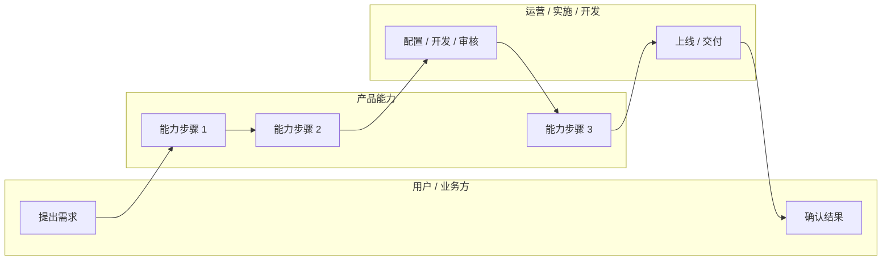

# [主题] 竞品深度分析报告

> 本文件是研究双文件的附属深度阅读材料，由 `competitive-intelligence` 执行分析、`yss-research` 持有模式和证据包，不能替代 `<slug>-research-brief.md`。
> 配套 `competitive-matrix-template.md` 用于横向功能矩阵。默认完整矩阵与深度报告同时输出；只选报告时第 5 节包含完整比较表，同时输出时引用同目录矩阵。
> 结论区分事实、推断、假设和建议并引用统一 Claim / Evidence。候选术语交给 `domain-modeling`，MVP、非目标和优先级交给 Plan / Spec 所有者；本研究不写入 `CONTEXT.md`、Spec、ADR、Ticket 状态或批准。

## 0. 文档信息

| 项 | 内容 |
|---|---|
| 调研主题 | [例如：数据中台数据建模] |
| 调研截至日期 | [YYYY-MM-DD，与 `competitive_analysis.as_of` 一致] |
| 调研对象 | [竞品 A] / [竞品 B] / [竞品 C] |
| 调研人 | [姓名 / Agent] |
| 资料边界 | [公开官网 / 官方文档 / 白皮书 / 访谈 / 试用环境] |
| 可信度说明 | [哪些信息已验证，哪些信息待验证] |
| Profile / 模式 | [`strategy-evidence` 或 `technical-evidence`] / [`evidence-audited`；探索材料注明未审计] |
| 输出选择 | [`report` 或 `both`] |
| 研究简报 / 证据 | [`<slug>-research-brief.md`] / [`<slug>-evidence.yaml`] |
| 关联矩阵 | [同时输出时链接 `<slug>-competitive-matrix.md`；仅报告时写比较表位于第 5 节] |
| 版本 / 套餐 / 地区范围 | [以第 5 节工具管理区为准；未确认字段写 `unknown`] |
| 审核与接收者 | [研究审核人、下游资产所有者和当前审核范围] |

## 1. 调研背景

### 1.1 业务背景

[说明为什么现在要调研这个主题，它关联的业务目标、用户问题或产品方向是什么。]

### 1.2 调研问题

1. [竞品如何定义该领域能力？]
2. [竞品如何组织功能对象、角色和流程？]
3. [用户如何完成从输入到落地的完整闭环？]
4. [哪些能力值得进入我们的 MVP，哪些应延后？]

### 1.3 范围与非目标

| 类型 | 内容 |
|---|---|
| 本次包含 | [竞品范围、能力范围、用户范围] |
| 本次不包含 | [暂不分析的竞品、能力、商业模式或技术细节] |

## 2. 关键结论

### 2.1 一句话结论

[用一段话说明整体判断。]

### 2.2 竞品分化

| 竞品 | 核心判断 | 对我们的启示 |
|---|---|---|
| [竞品 A] | [定位 / 强项 / 弱项] | [可学习或应规避的点] |
| [竞品 B] | [定位 / 强项 / 弱项] | [可学习或应规避的点] |
| [竞品 C] | [定位 / 强项 / 弱项] | [可学习或应规避的点] |

### 2.3 产品机会

1. [机会点 1]
2. [机会点 2]
3. [机会点 3]

## 3. 定位与流程摘要

> 本节综合定位与流程并引用 Claim；功能支持状态和比较范围以第 5 节工具管理区或其关联矩阵为准，避免另写一份功能事实表。

| 维度 | [竞品 A] | [竞品 B] | [竞品 C] |
|---|---|---|---|
| 核心定位 | | | |
| 目标用户 | | | |
| 核心流程 | | | |
| 差异化亮点 | | | |
| 公开资料成熟度 | 高 / 中 / 低 | 高 / 中 / 低 | 高 / 中 / 低 |

## 4. 逐家深剖

### 4.1 [竞品 A]

#### 4.1.1 定义与定位

[该竞品如何定义本领域能力，它解决的核心问题是什么。]

#### 4.1.2 功能设计

[引用第 5 节比较结果的能力 ID 和 Claim，解释功能组织、对象与使用条件。不能在区外另行修改支持状态；推断说明依据。]

#### 4.1.3 使用 / 落地流程

1. [步骤 1]
2. [步骤 2]
3. [步骤 3]

#### 4.1.4 优势与不足

优势：

- [优势 1]
- [优势 2]

不足 / 待验证：

- [不足或风险 1]
- [公开资料不足处]

### 4.2 [竞品 B]

#### 4.2.1 定义与定位

[同上。]

#### 4.2.2 功能设计

[引用第 5 节比较结果的能力 ID 和 Claim，解释功能组织、对象与使用条件。不能在区外另行修改支持状态；推断说明依据。]

#### 4.2.3 使用 / 落地流程

1. [步骤 1]
2. [步骤 2]
3. [步骤 3]

#### 4.2.4 优势与不足

优势：

- [优势 1]
- [优势 2]

不足 / 待验证：

- [不足或风险 1]
- [公开资料不足处]

### 4.3 [竞品 C]

#### 4.3.1 定义与定位

[同上。]

#### 4.3.2 功能设计

[引用第 5 节比较结果的能力 ID 和 Claim，解释功能组织、对象与使用条件。不能在区外另行修改支持状态；推断说明依据。]

#### 4.3.3 使用 / 落地流程

1. [步骤 1]
2. [步骤 2]
3. [步骤 3]

#### 4.3.4 优势与不足

优势：

- [优势 1]
- [优势 2]

不足 / 待验证：

- [不足或风险 1]
- [公开资料不足处]

## 5. 功能比较

状态口径：✅ 明确支持（`supported`）；⚠️ 部分支持（`partial`，说明限制）；❌ 明确不支持（`absent`，须有适用范围内的已审计依据）；❓ 未知（`unknown`，说明缺口和补证计划）。资料不完整或搜索无结果不能推定部分支持或不支持。

以下管理区由 `render-competitive-outputs.mjs` 从 `competitive_analysis` 生成：仅报告时包含完整表；同时输出矩阵时包含同目录矩阵链接和证据摘要。管理区外保留本报告分析正文，不手写第二份比较事实。

<!-- YSS-COMPETITIVE:START -->
[工具管理区：先填写结构化结果，再运行渲染器；不手填比较事实。]
<!-- YSS-COMPETITIVE:END -->

## 6. 流程泳道图

## 7. 能力评分（条件适用）

默认不生成数字排名。只有用户明确要求评分时，先确认量表、能力定义、维度 / 权重和评分依据再填写；否则本节写不适用及原因。未知写“不评分”，不能作为低分或零分，不能按未知项计算综合排名。

| 能力 ID | 已确认量表 / 权重 | [竞品 A] | [竞品 B] | [竞品 C] | Claim / 评分依据及限制 |
|---|---|---|---|---|---|
| [能力 ID] | [量表与确认来源] | [分值或不评分] | [分值或不评分] | [分值或不评分] | [依据与适用范围] |

## 8. Grilling 问题清单

> 本节整理供 Plan / Spec 所有者继续澄清的问题。术语、产品边界和重大取舍由各自所有者确认并写入权威资产；竞品研究只回传候选与依据。

1. 首要用户是谁？是否只能先服务一个角色？
2. 第一高频场景是什么？是新建、改造、迁移、治理，还是消费？
3. 最小闭环从哪里开始，到哪里结束？
4. 哪些对象必须是一等对象，哪些只是属性或配置？
5. 哪些能力进入 MVP，哪些能力明确不做？
6. 成功验收如何度量？用户如何知道能力产生了价值？
7. 哪些流程需要审核、版本、回滚或影响分析？
8. 有哪些公开资料不足，必须通过访谈、试用或厂商确认？

## 9. 机会点

| 机会点 | 用户痛点与 Claim | 竞品现状 / 缺口及能力 ID | 实现难度与依据 | 优先级建议与理由 |
|---|---|---|---|---|
| [机会点] | [痛点 / Claim] | [现状和已确认缺口，未知不算缺失] | [有依据时填写，否则待技术评估] | [交 Plan 所有者判断的建议] |

## 10. MVP 建议

> 以下范围和路线是研究建议，引用用户问题、业务约束与竞品 Claim，待 Plan 所有者确认；不构成已批准需求或实现授权。

### 10.1 MVP 目标

[用一段话说明 MVP 要帮助哪个用户，在什么场景下，完成什么最小闭环。]

### 10.2 MVP 功能范围

| 模块 | MVP 能力 | 验收标准 |
|---|---|---|
| [模块] | [能力] | [可验证标准] |

### 10.3 暂不进入 MVP

1. [能力 / 场景 1]
2. [能力 / 场景 2]
3. [能力 / 场景 3]

### 10.4 推荐产品路线

第一阶段：[目标与范围]

第二阶段：[目标与范围]

第三阶段：[目标与范围]

## 11. 建议下一步

1. [补充调研 / 用户访谈 / 厂商验证]
2. [进入 work-unit.plan-requirements 继续澄清的问题]
3. [把已审计结论、候选术语、MVP / 非目标与成功标准建议回交对应所有者]
4. [由生命周期所有者判断进入 Spec 和后续工程契约 / 垂直切片 Ticket 的条件]

## 12. 参考资料

| Evidence / Claim ID | 来源与可定位链接 | 来源类别 | 来源日期 / 观察日期 | 限制与反向信号 |
|---|---|---|---|---|
| [统一台账 ID] | [URL / 章节 / 记录] | [primary / direct-experience / near-primary 等] | [YYYY-MM-DD] | [抽样、访问、版本、独立性限制或反向来源] |

[引用同目录 evidence 文件中的统一台账，不另建事实台账。来源冲突、访问失败和未知项保留原因、补证动作及接收者；机械校验不能证明来源支持结论，研究审核须核对实质 Claim。]
