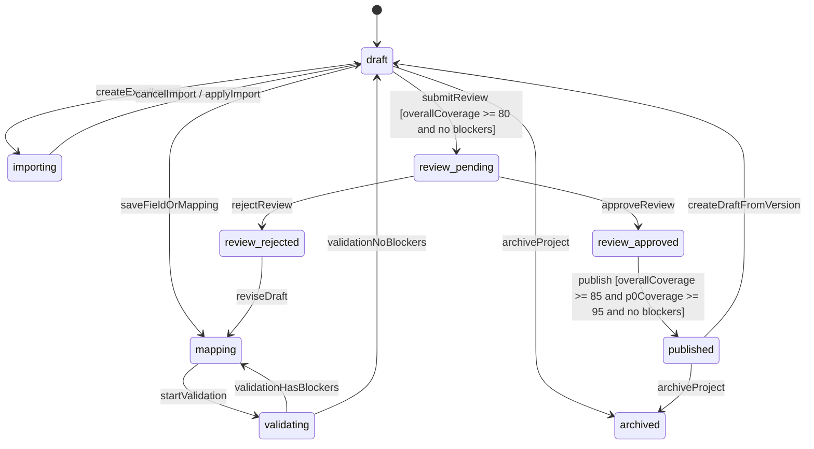

# 企业数据模型协作工作台 MVP 架构设计

> 本文用于 Architecture / OpenSpec / Comet design 阶段的设计审查输入。当前仓库尚未创建 `openspec/changes/*` active change，因此本文先沉淀架构设计和可进入正式 OpenSpec / Comet change 的条件，不伪造 Comet 阶段状态。

## 1. 设计结论

企业数据模型协作工作台 MVP 采用一个独立的 `Data Modeling Workbench` 领域上下文承载模型项目、模型对象、导入、映射、规范检查、评审、发布版本和异步导出闭环。P0 以“绩效风控指标模型复用”项目和 8 张试点表为首批业务范围，但系统顶层必须支持多个模型项目。

后端建议按 YSS DDD 多模块分层落地：

```text
Adapter REST Controller
-> Application Use Case / Command Handler
-> Domain Aggregate / Domain Service
-> Domain Gateway / Repository Interface
-> Infrastructure GatewayImpl / Repository
-> Database / File Storage / Excel Parser / Standard Asset / Audit
```

关键设计选择：

1. `ModelProject` 是项目边界、主题域、负责人、评审人、草稿版本和生命周期的聚合根。
2. 业务对象、逻辑实体、物理表、字段和映射按模型草稿版本受控，所有写入都必须校验 `draftVersion`。
3. 规范检查、覆盖率、评审和发布门禁作为领域行为，不放在前端或 Controller。
4. 发布生成不可变 `ModelVersion` 快照；已发布版本只读，后续修改必须从版本创建新草稿。
5. PostgreSQL DDL 只能作为草案导出，不提供数据库执行端点。
6. Excel 导入、DDL 草案生成、文件导出、权限判断、审计日志和标准资产读取全部通过 Gateway 隔离。
7. 正式 OpenSpec / Comet design 需要先创建 active change，再把本文拆入 proposal / design / specs / tasks。

## 2. 输入资产与约束

| 输入 | 结论 |
|---|---|
| PRD | P0 范围已冻结：多个模型项目、首个试点项目、8 张表、Excel 导入、逻辑/物理/映射、覆盖率、规范检查、单一架构师评审、发布快照、三类异步导出。 |
| 交互说明 | 页面地图、主流程、异常流程、权限状态、状态矩阵和 OpenAPI 反推清单已通过原型复审。 |
| OpenAPI Draft | 41 个路径、102 个 schema，覆盖项目、对象、导入、映射、覆盖率、规范检查、评审、发布、版本、导出、权限动作、错误码、分页和乐观锁。 |
| 工程基线/API 评审 | 阻断项已关闭，可进入架构设计；安全人工审查、契约测试落地和领域聚合边界为本阶段重点。 |

### 2.1 非目标边界

P0 不做以下能力：

1. 数据集成、ETL 编排、任务调度和运维监控。
2. 自动执行 DDL 或数据库迁移。
3. 完整指标平台、指标消费、BI 语义层和分析门户。
4. 完整血缘引擎、资产地图和数据质量平台。
5. 企业级权限中台和正式敏感分级体系。
6. 多数据库 DDL 适配；P0 只生成 PostgreSQL DDL 草案。
7. AI 自动建模或自然语言问数。

## 3. 领域边界

### 3.1 本上下文内职责

`Data Modeling Workbench` 负责：

1. 管理多个模型项目及其主题域、子域、业务边界和首批试点表范围。
2. 管理业务对象、逻辑实体、逻辑字段、物理表和物理字段。
3. 导入 Excel 字段清单并生成物理模型草稿。
4. 建立逻辑字段到物理字段的映射，并计算整体覆盖率和 P0 必填覆盖率。
5. 配置并运行规范检查，区分 blocker 和 warning。
6. 提交、评论、通过或驳回单一架构师评审。
7. 发布不可变模型版本快照。
8. 基于发布版本异步导出 PostgreSQL DDL 草案、Markdown 模型文档和 Excel 字段清单。

### 3.2 外部上下文与 Gateway

| 外部上下文 | 本系统依赖 | Gateway 边界 |
|---|---|---|
| 用户与组织权限 | 当前用户、角色、资源动作权限、评审人身份 | `UserGateway`、`PermissionGateway` |
| 公司标准资产 | 字段标准、命名词典、码表 Excel 或既有资产 | `StandardAssetGateway` |
| Excel 文件解析 | `.xls` / `.xlsx` 上传、表头别名、行列校验 | `ExcelImportGateway` |
| 文件与对象存储 | 模板下载、导出文件、过期下载 URL | `FileStorageGateway` |
| DDL 草案生成 | PostgreSQL 类型映射、建表/改表 SQL 文本 | `DdlDraftGateway` |
| 审计日志 | 关键操作、越权、发布、导出、下载记录 | `AuditLogGateway` |
| 通知/待办 | 评审待办和导出完成提醒，P0 可不实现 | `NotificationGateway`，P0 optional |

本领域不直接连接生产数据库执行 SQL，不直接访问权限中台内部表，也不把 Excel 解析、文件存储或 DDL 文本生成逻辑写入 Domain。

## 4. 聚合设计

### 4.1 聚合总览

| 聚合根 | 拥有的实体/值对象 | 核心不变量 | 主要用例 |
|---|---|---|---|
| `ModelProject` | `ThemeDomain`、`Subdomain`、`PilotTable`、`ProjectBoundary`、`OwnerRef`、`ReviewerRef`、`DraftVersion` | 项目编码唯一；主题域边界必须明确；试点表不能越界；草稿写入必须匹配 `draftVersion`；发布版本只读。 | 创建项目、更新边界、归档项目、创建版本草稿。 |
| `ModelObjectCatalog` | `BusinessObject`、`LogicalEntity`、`LogicalField`、`PhysicalTable`、`PhysicalField` | 业务对象属于项目和子域；逻辑字段属于逻辑实体；物理字段属于物理表；对象归档不得破坏已发布快照。 | 创建/更新/归档对象、字段维护、对象树查询。 |
| `ImportJob` | `ImportPreview`、`ImportPreviewTable`、`ImportPreviewField`、`ImportIssue`、`ImportSummary` | 未 applied 的导入可取消；有 blocker 不可 apply；apply 必须幂等且校验 `draftVersion`；目标表必须在项目边界内。 | 上传 Excel、预览、应用导入、取消导入。 |
| `FieldMappingSet` | `FieldMapping`、`MappingExplanation`、`CoverageSummary` | 有效映射必须连接范围内逻辑字段和物理字段；重复映射、错映射和未映射可被检查定位；覆盖率按逻辑字段计算。 | 查询映射、保存映射、批量映射、覆盖率计算。 |
| `ValidationRuleSet` | `ValidationRule`、`RuleSeverity`、`RuleScope` | 规则属于项目草稿；blocker / warning 可追溯；规则更新需要 `draftVersion`。 | 查询/更新规则配置。 |
| `ValidationRun` | `ValidationIssue`、`ValidationSummary` | 检查基于某个草稿版本和规则集版本；运行结果不可被修改，只能重新运行。 | 发起规范检查、查询检查结果。 |
| `ModelReview` | `ReviewDiffItem`、`ReviewComment`、`ReviewDecision`、`ReviewSnapshotRef` | 提交评审前整体覆盖率 >= 80%，且无 blocker；只有指定架构师可通过/驳回；驳回必须有原因。 | 提交评审、查询评审、评论、审批。 |
| `ModelVersion` | `VersionSnapshot`、`PublishNote`、`CoverageSnapshot`、`ValidationSnapshot` | 发布前整体覆盖率 >= 85%，P0 必填覆盖率 >= 95%，且无 blocker；快照不可变。 | 发布版本、查询版本、从版本创建草稿。 |
| `ExportTask` | `ExportRequest`、`ExportFileRef`、`FailureReason`、`ExpireAt` | 导出绑定发布版本；失败重试创建新任务；过期 URL 不复用；DDL 只生成草案。 | 创建导出、查询任务、重试导出。 |

### 4.2 聚合划分说明

`ModelProject` 不直接持有所有字段和映射明细，避免项目聚合过大。项目边界、主题域和生命周期由 `ModelProject` 维护；模型对象、映射、检查、评审、版本和导出各自形成可独立事务的聚合，并通过 `projectId`、`draftVersion`、`versionId` 和快照引用建立一致性。

跨聚合一致性采用 Application 编排和 Domain Service 校验：

1. `CoverageDomainService` 读取逻辑字段与有效映射，计算覆盖率。
2. `ValidationDomainService` 按规则集运行检查，输出 blocker / warning。
3. `ReviewGateDomainService` 判定是否可提交评审。
4. `PublishGateDomainService` 判定是否可发布版本。
5. `VersionSnapshotDomainService` 生成不可变发布快照。

## 5. 状态机

### 5.1 模型项目 / 草稿生命周期

OpenAPI 暴露的 `ModelProjectStatus` 是 UI 查询状态。领域内部建议拆成 `ProjectLifecycleState` 和 `DraftWorkState`，避免把展示枚举直接当数据库状态机。



关键守卫：

| 转移 | 守卫 |
|---|---|
| `draft/importing/mapping -> review_pending` | 项目和主题域边界完整；整体映射覆盖率 >= 80%；没有 blocker 级规范问题；提交人有提交权限；`draftVersion` 未冲突。 |
| `review_pending -> review_approved` | 当前用户是指定单一数据架构师；评审版本未冲突；必须保留评审结论和时间。 |
| `review_pending -> review_rejected` | 当前用户是指定单一数据架构师；驳回原因必填。 |
| `review_approved -> published` | 整体映射覆盖率 >= 85%；P0 必填字段覆盖率 >= 95%；没有 blocker；发布说明必填；DDL 只作为草案生成。 |
| `published -> draft` | 通过 `POST /api/v1/modeling/versions/{versionId}/drafts` 创建新草稿；发布快照不可修改。 |

### 5.2 导入任务状态

```text
uploaded -> parsing -> preview_ready -> applied
                         |             -> cancelled
                         -> failed
```

导入状态规则：

1. `uploaded` / `parsing` 阶段不允许 apply。
2. `preview_ready` 且无 blocker 时允许 apply。
3. `preview_ready` 且有 warning 时允许带继续说明 apply。
4. `preview_ready` 且有 blocker 时 apply 返回 422。
5. `applied` 后不可 cancel。
6. apply 必须携带幂等键和 `draftVersion`。

### 5.3 规范检查状态

```text
queued -> running -> succeeded
                  -> failed
```

检查结果绑定 `projectId`、`draftVersion`、`ruleSetVersion` 和 `validationRunId`。结果不可变；草稿变更后需要重新运行检查。

### 5.4 评审状态

```text
pending -> approved
        -> rejected
```

评审绑定提交时的草稿版本、diff、覆盖率摘要和检查结果。驳回后原评审记录保留，草稿回到可修改状态；再次提交生成新的 `reviewId` 或新的 review revision，具体实现可在 Design Review 后确定。

### 5.5 导出任务状态

```text
queued -> running -> succeeded -> expired
                  -> failed -> queued(new exportId via retry)
```

导出任务绑定 `versionId`。重试不能复用原 `exportId`，必须创建新任务并保留原失败原因。

## 6. YSS DDD 分层设计

### 6.1 Adapter 层

职责：

1. 实现 OpenAPI Draft 中的 REST Controller。
2. 处理 HTTP 参数、multipart 上传、统一响应包装 `SingleResult<T>` / `PageResult<T>`。
3. 校验基础请求格式和必填参数，不承载业务门禁。
4. 注入当前用户上下文、幂等键、`draftVersion` 和权限动作展示。
5. 将 Application 错误转换为统一 `ApiError`、`FieldError` 和 HTTP 状态码。

禁止：

1. Controller 直接访问 Repository。
2. Controller 计算覆盖率、发布门禁或评审权限。
3. Controller 生成 DDL SQL 文本。
4. Controller 返回无权限用户不应看到的主题域、表、字段数据。

### 6.2 Application 层

Application 是事务边界和用例编排层。建议按能力域拆 Command / Query Handler：

| 用例 | 输入契约 | 领域调用 | 输出 |
|---|---|---|---|
| `ListModelProjectsQuery` | `GET /projects` | 权限过滤、项目摘要查询 | `PageResult_ModelProjectSummary` |
| `CreateModelProjectCommand` | `POST /projects` | `ModelProject.create` | 项目详情 |
| `UpdateModelProjectCommand` | `PATCH /projects/{projectId}` | `ModelProject.updateBoundary` | 项目详情 |
| `ArchiveModelProjectCommand` | `POST /projects/{projectId}/archive` | `ModelProject.archive` | 项目详情 |
| `ManageModelObjectCommand` | 对象和字段创建/更新/归档路径 | `ModelObjectCatalog` | 对象详情或字段详情 |
| `CreateExcelImportCommand` | `POST /imports` | `ImportJob.create` + `ExcelImportGateway` | `ImportJob` |
| `GetImportPreviewQuery` | `GET /imports/{importId}/preview` | `ImportJob.preview` | `ImportPreview` |
| `ApplyImportPreviewCommand` | `POST /imports/{importId}/apply` | `ImportJob.apply` + `ModelObjectCatalog` | `ImportApplyResult` |
| `SaveFieldMappingCommand` | `PUT /mappings/{mappingId}`、`POST /mappings/batch` | `FieldMappingSet.save` + `CoverageDomainService` | 映射结果和覆盖率 |
| `GetCoverageSummaryQuery` | `GET /projects/{projectId}/coverage` | `CoverageDomainService.calculate` | `CoverageSummary` |
| `UpdateValidationRuleSetCommand` | `PUT /validation-rules` | `ValidationRuleSet.update` | 规则集 |
| `StartValidationRunCommand` | `POST /validations` | `ValidationDomainService.run` | `ValidationRun` |
| `SubmitModelReviewCommand` | `POST /reviews` | `ReviewGateDomainService.check` + `ModelReview.submit` | `ReviewDetail` |
| `DecideModelReviewCommand` | `POST /reviews/{reviewId}/decision` | `ModelReview.decide` | `ReviewDecisionResult` |
| `CheckModelPublishableCommand` | `POST /publish-check` | `PublishGateDomainService.check` | `PublishCheckResult` |
| `PublishModelVersionCommand` | `POST /versions` | `ModelVersion.publish` + `VersionSnapshotDomainService` | `ModelVersionSummary` |
| `CreateDraftFromVersionCommand` | `POST /versions/{versionId}/drafts` | `ModelProject.createDraftFromVersion` | `DraftCreationResult` |
| `CreateExportTaskCommand` | `POST /versions/{versionId}/exports` | `ExportTask.create` + `DdlDraftGateway` / file gateway | `ExportTask` |
| `RetryExportTaskCommand` | `POST /exports/{exportId}/retry` | `ExportTask.retryAsNewTask` | 新 `ExportTask` |

Application 层必须统一处理：

1. 权限校验和动作可用性。
2. 幂等键校验。
3. `draftVersion` 乐观锁。
4. 事务提交后的审计日志。
5. 异步任务派发。

### 6.3 Domain 层

Domain 层包含聚合、实体、值对象、领域服务和领域事件。推荐对象：

| 类型 | 名称 |
|---|---|
| 聚合根 | `ModelProject`、`ModelObjectCatalog`、`ImportJob`、`FieldMappingSet`、`ValidationRuleSet`、`ValidationRun`、`ModelReview`、`ModelVersion`、`ExportTask` |
| 实体 | `ThemeDomain`、`Subdomain`、`BusinessObject`、`LogicalEntity`、`LogicalField`、`PhysicalTable`、`PhysicalField`、`FieldMapping`、`ValidationIssue`、`ReviewComment` |
| 值对象 | `ProjectBoundary`、`TableCode`、`FieldCode`、`PostgresType`、`CoverageMetric`、`CoverageThresholds`、`DraftVersion`、`ReviewDecision`、`PublishNote`、`ExportType` |
| 领域服务 | `CoverageDomainService`、`ValidationDomainService`、`ReviewGateDomainService`、`PublishGateDomainService`、`VersionSnapshotDomainService` |
| 领域事件 | `ProjectCreated`、`ImportApplied`、`MappingChanged`、`ValidationCompleted`、`ReviewSubmitted`、`ReviewApproved`、`ReviewRejected`、`VersionPublished`、`ExportTaskCreated` |

Domain 层禁止依赖 Controller、DTO、MyBatis Mapper、JPA Entity、Excel 解析库、对象存储 SDK、权限中台 SDK 或任何 Infrastructure 实现。

### 6.4 Infrastructure 层

Infrastructure 实现 Domain Gateway 和 Repository：

| 类型 | 实现边界 |
|---|---|
| Repository Impl | MyBatis / JPA / JDBC 等数据持久化实现，向 Domain 暴露聚合或只读投影。 |
| Excel Gateway Impl | 解析 Excel、表头别名、类型转换候选和错误行定位。 |
| Standard Asset Gateway Impl | 读取字段标准、命名词典和码表资产。 |
| DDL Draft Gateway Impl | 基于物理模型生成 PostgreSQL DDL 草案文本，不执行 SQL。 |
| File Storage Gateway Impl | 上传导出文件、生成下载 URL、处理过期策略。 |
| Permission Gateway Impl | 查询当前用户对项目、评审、发布、导出的动作权限。 |
| Audit Log Gateway Impl | 记录关键操作和安全事件。 |

### 6.5 Bootstrap 层

Bootstrap 负责应用启动、配置装配、异步任务执行器、事务管理、Gateway 实现绑定和 OpenAPI 文档暴露。不得在 Bootstrap 中写业务判断。

## 7. Repository / Gateway 边界

### 7.1 Repository 接口

Repository 接口定义在 Domain 或 Application 依赖的端口层，实现在 Infrastructure。

| Repository | 主要方法 |
|---|---|
| `ModelProjectRepository` | `findById`、`findDetail`、`save`、`nextDraftVersion`、`existsProjectCode`、`pageSummaries` |
| `ModelObjectCatalogRepository` | `findTree`、`saveBusinessObject`、`saveLogicalEntity`、`savePhysicalTable`、`saveLogicalField`、`savePhysicalField`、`archiveObject` |
| `ImportJobRepository` | `save`、`findById`、`markApplied`、`markCancelled`、`findPreview` |
| `FieldMappingRepository` | `pageMappings`、`findByProject`、`saveMapping`、`batchSaveMappings` |
| `ValidationRuleSetRepository` | `findByProjectId`、`save` |
| `ValidationRunRepository` | `save`、`findById`、`findLatestByProject` |
| `ModelReviewRepository` | `save`、`findById`、`findPendingByProject` |
| `ModelVersionRepository` | `save`、`findById`、`pageByProject`、`findSnapshot` |
| `ExportTaskRepository` | `save`、`findById`、`markRunning`、`markSucceeded`、`markFailed`、`markExpired` |

### 7.2 Gateway 接口

| Gateway | Domain/Application 可见能力 | 禁止事项 |
|---|---|---|
| `PermissionGateway` | `checkAction(user, resource, action)`、`buildActionSet(...)` | 不在 Controller 临时拼权限。 |
| `ExcelImportGateway` | `parse(fileRef, templateAliasProfile)`、`detectColumns(...)`、`convertType(...)` | 不把 Excel SDK 泄漏到 Domain。 |
| `StandardAssetGateway` | `matchFieldStandard(...)`、`matchCodeTable(...)`、`loadNamingDictionary(...)` | P0 不建设完整标准资产治理。 |
| `DdlDraftGateway` | `generatePostgresDraft(versionSnapshot)` | 不执行 SQL，不连接生产库。 |
| `FileStorageGateway` | `storeExportFile(...)`、`createDownloadUrl(...)`、`expireUrl(...)` | 不返回永久公共 URL。 |
| `AuditLogGateway` | `recordBusinessEvent(...)`、`recordSecurityEvent(...)` | 不遗漏越权、发布、导出、下载。 |
| `IdGenerator` | 生成项目、字段、版本、任务 ID | 不把数据库自增假设写入 Domain。 |
| `Clock` | 提供当前时间 | 测试中必须可替换。 |

## 8. OpenAPI 到 Application 用例映射

| 能力域 | OpenAPI 路径 | Application 用例 |
|---|---|---|
| 模型项目 | `GET/POST /api/v1/modeling/projects` | `ListModelProjectsQuery`、`CreateModelProjectCommand` |
| 模型项目 | `GET/PATCH /api/v1/modeling/projects/{projectId}` | `GetModelProjectQuery`、`UpdateModelProjectCommand` |
| 模型项目 | `POST /api/v1/modeling/projects/{projectId}/archive` | `ArchiveModelProjectCommand` |
| 模型对象 | `GET /api/v1/modeling/projects/{projectId}/object-tree` | `GetModelObjectTreeQuery` |
| 模型对象 | 业务对象、逻辑实体、物理表、逻辑字段、物理字段创建/更新/归档路径 | `ManageModelObjectCommand` 族 |
| Excel 导入 | `/api/v1/modeling/imports*` | `CreateExcelImportCommand`、`GetImportPreviewQuery`、`ApplyImportPreviewCommand`、`CancelImportCommand` |
| 导入模板 | `/api/v1/modeling/import-templates/excel*` | `DownloadExcelTemplateQuery`、`ListExcelTemplateAliasesQuery` |
| 字段映射 | `/api/v1/modeling/projects/{projectId}/mappings`、`/api/v1/modeling/mappings*` | `ListFieldMappingsQuery`、`SaveFieldMappingCommand`、`BatchSaveFieldMappingsCommand` |
| 覆盖率 | `GET /api/v1/modeling/projects/{projectId}/coverage` | `GetCoverageSummaryQuery` |
| 规范检查 | `/api/v1/modeling/projects/{projectId}/validation-rules` | `GetValidationRuleSetQuery`、`UpdateValidationRuleSetCommand` |
| 规范检查 | `/api/v1/modeling/projects/{projectId}/validations`、`/api/v1/modeling/validations/{validationRunId}` | `StartValidationRunCommand`、`GetValidationRunQuery` |
| 模型评审 | `/api/v1/modeling/projects/{projectId}/reviews`、`/api/v1/modeling/reviews/{reviewId}*` | `SubmitModelReviewCommand`、`GetModelReviewQuery`、`AddReviewCommentCommand`、`DecideModelReviewCommand` |
| 发布版本 | `/api/v1/modeling/projects/{projectId}/publish-check` | `CheckModelPublishableCommand` |
| 发布版本 | `/api/v1/modeling/projects/{projectId}/versions`、`/api/v1/modeling/versions/{versionId}` | `PublishModelVersionCommand`、`ListModelVersionsQuery`、`GetModelVersionQuery` |
| 发布版本 | `POST /api/v1/modeling/versions/{versionId}/drafts` | `CreateDraftFromVersionCommand` |
| 异步导出 | `/api/v1/modeling/versions/{versionId}/exports`、`/api/v1/modeling/exports/{exportId}*` | `CreateExportTaskCommand`、`GetExportTaskQuery`、`RetryExportTaskCommand` |

## 9. 安全审查点

以下项进入 Design Review 和后续实现前必须人工确认或标记 `TODO-HUMAN-REVIEW`：

| 审查点 | 风险 | 设计要求 |
|---|---|---|
| 认证 / 授权 | 越权查看模型项目、主题域、字段和评审内容。 | 页面无权不返回业务数据；动作无权由后端 403 拒绝；权限动作和后端校验必须同源。 |
| 单一架构师审批 | 非评审人伪造审批。 | `DecideModelReviewCommand` 必须校验 reviewer；非评审人只能看到允许查看的数据和禁用动作。 |
| DDL 草案 | 被误认为可执行迁移，或系统偷偷执行 SQL。 | OpenAPI 和实现中不得存在执行 DDL 端点；导出文件标识为草案；人工确认后才进入外部数据库变更。 |
| SQL 文本生成 | SQL 注入、错误类型映射、危险语句。 | DDL 生成只基于结构化物理模型，不拼接用户自由 SQL；生成器需要单独测试和人工 review。 |
| 文件上传 | 恶意 Excel、超大文件、公式注入。 | 限制类型、大小、行数；解析隔离；导出 Excel 对公式前缀做安全处理。 |
| 下载 URL | 发布资产泄露。 | 下载 URL 必须短期有效、绑定权限、记录下载审计。 |
| 敏感字段 | 待分级状态被误用为正式分级。 | P0 只保留敏感标记和待分级状态；正式分级体系后置。 |
| 审计日志 | 发布、审批、导出、越权不可追溯。 | 关键命令成功和失败都写审计；越权尝试写安全审计。 |
| 幂等与并发 | 重复提交评审、重复发布、覆盖他人草稿。 | 关键命令要求幂等键；草稿写入要求 `draftVersion`；冲突返回 409。 |
| 分页筛选排序 | 查询绕过权限或造成过载。 | 所有列表查询先做权限范围过滤，再分页排序；限制最大 `size`。 |

## 10. 契约测试 seam

OpenAPI Freeze 前至少要把以下契约测试固定到测试计划中：

| seam | 场景 | 预期 |
|---|---|---|
| 分页契约 | 模型项目、字段映射、版本历史列表分页、筛选、排序 | 返回 `PageResult_*`，`PageMeta` 完整，排序字段受限。 |
| 无权限 | 无查看权限访问列表或详情 | 403，不返回模型项目、主题域、表、字段数据。 |
| 动作权限 | 非评审人打开评审页 | 可查看允许数据，审批动作 `enabled=false`，直接调用审批返回 403。 |
| Excel 模板 | 缺列、别名不支持、重复字段、目标表越界、PostgreSQL 类型不支持 | 422 或预览 blocker，错误含行列定位和错误码。 |
| 导入 apply | 预览存在 blocker 时 apply | 422，不生成物理模型草稿。 |
| 导入 warning | 预览只有 warning 且带说明 apply | 成功生成草稿并记录说明。 |
| 覆盖率 | 整体覆盖率 < 80% 提交评审 | 422 `REVIEW_COVERAGE_BELOW_THRESHOLD`。 |
| 发布门禁 | 整体覆盖率 < 85% 或 P0 必填覆盖率 < 95% 发布 | 422 `PUBLISH_COVERAGE_BELOW_THRESHOLD` 或 `P0_COVERAGE_BELOW_THRESHOLD`。 |
| 规范 blocker | 存在 blocker 提交评审或发布 | 422 `VALIDATION_BLOCKING_ISSUES`。 |
| 乐观锁 | 草稿写入 `draftVersion` 冲突 | 409 `VERSION_CONFLICT`，不覆盖修改。 |
| 版本不可变 | 发布成功后查询版本详情并尝试编辑 | 版本只读；编辑入口禁用；必须通过创建草稿变更。 |
| 异步导出 | SQL / Markdown / Excel 导出状态流 | queued、running、succeeded、failed、expired 可被查询，失败重试创建新 `exportId`。 |
| DDL 安全 | 查询 OpenAPI 和调用路径 | 只有草案导出；不存在执行数据库变更的端点。 |

## 11. 后续垂直切片候选

切片必须端到端覆盖 Adapter、Application、Domain、Infrastructure、契约测试和前端可演示行为，不能按层横向拆。

| Slice | 用户价值 | API / 用例 | 核心测试 |
|---|---|---|---|
| 1. 模型项目与边界闭环 | 架构师能创建并查看多个模型项目，固定首个试点项目边界。 | 项目列表、创建、详情、更新、归档。 | 分页筛选排序、边界缺失、权限无泄露、`draftVersion` 冲突。 |
| 2. 模型对象树和字段维护 | 架构师能维护业务对象、逻辑实体、物理表和字段。 | 对象树、业务对象、逻辑实体、物理表、逻辑字段、物理字段。 | 对象归档、字段校验、发布版本只读、权限动作。 |
| 3. Excel 导入物理模型草稿 | 数仓开发能上传 Excel、预览、处理错误并生成物理模型草稿。 | imports、preview、apply、cancel、template、aliases。 | 缺列、重复字段、越界表、类型不支持、warning 继续、apply 幂等。 |
| 4. 字段映射和覆盖率 | 数仓开发能建立逻辑到物理映射并看到覆盖率和未映射字段。 | mappings、batch mappings、coverage。 | 覆盖率计算、P0 覆盖率、未映射提示、重复映射、`draftVersion` 冲突。 |
| 5. 规范检查和规则配置 | 架构师能配置 blocker / warning，开发能运行检查并定位问题。 | validation-rules、validations。 | 规则版本、blocker / warning、字段定位、运行状态、检查结果不可变。 |
| 6. 单一架构师评审 | 开发提交评审，架构师查看 diff、评论、通过或驳回。 | reviews、comments、decision。 | 80% 门禁、非评审人 403、驳回原因必填、评审记录保留。 |
| 7. 发布版本和新草稿 | 架构师发布不可变快照，并能从版本创建新草稿。 | publish-check、versions、version detail、drafts。 | 85% / 95% 门禁、快照不可变、发布说明必填、只读态。 |
| 8. 三类异步导出 | 用户从发布版本导出 SQL、Markdown、Excel 交付资产。 | exports、get export、retry export。 | 状态流、失败重试新任务、下载 URL 过期、DDL 草案不执行。 |
| 9. 安全与审计贯穿切片 | 关键动作可追溯，越权和下载有审计。 | 权限 Gateway、审计 Gateway 贯穿各命令。 | 403 无泄露、审计记录、幂等重复提交、最大分页限制。 |

建议前 8 个切片按顺序进入 `to-issues`。第 9 个不宜作为纯横向“最后补安全”，应作为每个切片的完成门禁，同时可保留一个收口型审计切片。

## 12. 需要 ADR 或人工决策的事项

| 决策 | 建议 | 是否阻断 Design Review |
|---|---|---|
| DDL 草案安全边界 | 写 ADR：系统只生成 PostgreSQL DDL 草案，不连接数据库，不提供执行或迁移端点。 | 不阻断进入 Design Review，但阻断 OpenAPI Freeze / 实现。 |
| 发布快照不可变 | 写 ADR：发布版本以快照存储，后续修改必须从版本创建新草稿。 | 不阻断 Design Review。 |
| 异步导出文件有效期 | Design Review 确认默认过期时间、下载权限和审计要求。 | 不阻断 Design Review，阻断实现。 |
| 规范检查规则表达能力 | P0 使用配置化规则列表，不引入复杂规则引擎。 | 不阻断 Design Review。 |
| Review revision 模型 | 驳回后再次提交是复用 `reviewId` 版本号还是新建 `reviewId`。 | 不阻断 Design Review，但需在 OpenAPI Freeze 前确认。 |

## 13. 风险与缓解

| 风险 | 影响 | 缓解 |
|---|---|---|
| 聚合过大导致事务复杂 | 项目、字段、映射、检查、版本数据量可能增长。 | 项目生命周期和模型对象明细拆聚合；列表使用只读投影。 |
| Excel 模板兼容范围扩张 | 导入逻辑可能被历史表头拖垮。 | P0 以标准模板为准，别名兼容有限且可配置，无法识别则阻断。 |
| 规则检查被实现成前端提示 | 门禁不可信。 | 所有提交评审和发布命令后端重新检查门禁。 |
| DDL 草案被误执行 | 安全事故或流程绕过。 | 无执行端点，文件和界面标识草案，审计导出，人工确认外置。 |
| 权限展示和后端拒绝不一致 | 前端误导或越权风险。 | 权限动作由后端统一返回，后端仍做最终拒绝。 |
| 发布后草稿与版本关系混乱 | 版本追溯失真。 | 发布快照不可变，从版本创建草稿必须保留 `sourceVersionId`。 |

## 14. 进入 Design Review 的条件

本文档满足以下条件后，可进入 Design Review：

1. 领域边界、外部上下文和 Gateway 边界已明确。
2. 聚合根、核心实体、值对象、领域服务和不变量已列出。
3. 项目 / 草稿、导入、检查、评审、导出状态机已描述，并区分 UI 状态和领域状态。
4. YSS DDD 的 Adapter、Application、Domain、Infrastructure、Bootstrap 职责和禁止事项已明确。
5. OpenAPI 路径已映射到 Application 用例。
6. 安全人工审查点已列入，包括认证授权、DDL 草案、SQL 文本、文件上传、下载 URL、审计日志和并发幂等。
7. 契约测试 seam 已覆盖工程基线评审要求的 12 类场景。
8. 后续垂直切片候选已按端到端价值拆分。
9. 仍未创建正式 OpenSpec / Comet change 的事实已记录，Design Review 不应把本文当作已完成的 Comet handoff。

## 15. 进入正式 OpenSpec / Comet design 的条件

如果团队决定使用正式 OpenSpec / Comet change 承载后续交付，需要先完成：

1. 创建 active change，例如 `openspec/changes/add-data-modeling-workbench-mvp/`。
2. 写入 `proposal.md`：引用 PRD、交互说明、OpenAPI Draft 和本文架构设计。
3. 写入 `design.md`：以本文为基础沉淀领域边界、状态机、分层、Gateway、测试 seam 和安全审查。
4. 写入 `tasks.md`：把第 11 节切片拆为可验证任务。
5. 写入 delta specs：把评审、发布、覆盖率、导入、导出、权限、错误和版本不可变行为表达为可验收场景。
6. 再运行 `comet-design` handoff；在没有 active change 前不得宣称 Comet design 已完成。

## 16. Design Review 建议清单

| 主审角色 | 必看问题 |
|---|---|
| 产品 / 架构师 | 聚合边界是否符合业务语言；8 张试点表范围是否不会外溢。 |
| 后端 | Application 用例是否能按 YSS DDD 落地；Repository / Gateway 是否足够清晰。 |
| 前端 | 权限动作、状态矩阵、错误结构和异步任务是否可消费。 |
| API | OpenAPI Draft 是否需要因状态机或 use case 调整 schema / error examples。 |
| 安全 | DDL 草案、下载 URL、文件上传、权限、审计和敏感字段后置策略是否可接受。 |
| 测试 | 契约测试 seam 和垂直切片验证命令是否足以进入 OpenAPI Freeze。 |

## 17. 后续步骤

1. 执行 Design Review，输出阻断项、建议项和是否可进入 OpenAPI Freeze / to-issues。
2. 若 Design Review 发现契约缺口，先回到 OpenAPI Draft 修正并复审。
3. 若 Design Review 通过，创建 OpenSpec / Comet active change，或直接基于本文进入 `to-issues` 垂直切片拆分。
4. OpenAPI Freeze 前补齐必要 ADR 和人工安全审查结论。
