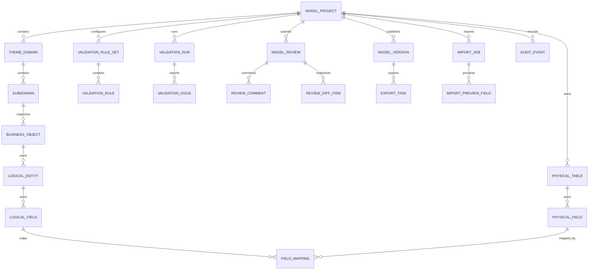

# 企业数据模型协作工作台 MVP 数据架构与元模型设计

> 本文用于 Data Architecture / Meta-Model Design 阶段。目标是在 Design Review 和 OpenAPI Freeze 前，明确企业数据模型协作工作台 MVP 的元模型、版本快照、字段映射、规范检查、导入导出、审计、查询索引、PostgreSQL 存储边界和迁移约束。本文不生成可执行数据库迁移脚本；涉及迁移、DDL、原生 SQL 的落地必须人工审查。

## 1. 设计结论

MVP 数据架构采用“草稿态归一化元数据 + 发布态不可变快照 + 异步任务与审计 append-only”的组合。

核心选择：

1. 草稿态模型对象按业务语义归一化存储：模型项目、主题域、子域、业务对象、逻辑实体、逻辑字段、物理表、物理字段、字段映射、规则配置。
2. 发布态版本使用不可变 `ModelVersion` 快照，保留发布时的逻辑模型、物理模型、映射、覆盖率、检查结果和 DDL 草案提示，后续编辑必须从发布版本创建新草稿。
3. 覆盖率是领域计算结果，不以手工字段为准；草稿态可存最近一次汇总用于列表查询，评审和发布必须保存当时的覆盖率快照。
4. 规范检查结果按 `validationRunId + draftVersion + ruleSetVersion` 形成不可变运行记录，草稿变更后需要重新运行。
5. Excel 导入预览和异步导出任务独立建模，导入预览未应用前不污染模型草稿，导出任务只绑定发布版本。
6. 审计事件 append-only，覆盖项目边界修改、导入应用、映射变更、规则更新、评审、发布、导出、越权和下载。
7. PostgreSQL 只存储工作台元数据、快照和任务状态，不连接生产库执行 DDL，不存储数仓业务事实数据。

## 2. 范围与非目标

### 2.1 数据架构范围

| 范围 | 说明 |
|---|---|
| 模型项目边界 | 多模型项目、主题域、子域、首批试点表、负责人、评审人、非目标范围。 |
| 逻辑模型 | 业务对象、逻辑实体、逻辑字段、业务语义、P0 必填、敏感标记、待分级状态。 |
| 物理模型 | 物理表、物理字段、分层、主键、分区、PostgreSQL 类型、注释。 |
| 字段映射 | 逻辑字段到物理字段的有效映射、未映射、重复映射、疑似错映射和映射说明。 |
| 覆盖率 | 整体字段映射覆盖率、P0 必填字段覆盖率、提交/发布门禁快照。 |
| 规范检查 | 规则集、规则版本、检查运行、检查问题、blocker/warning。 |
| 评审发布 | 评审记录、评论、diff、发布版本、不可变快照、从版本创建草稿。 |
| 导入导出 | Excel 导入预览和应用、SQL/Markdown/Excel 异步导出任务。 |
| 审计追溯 | 关键命令、越权、发布、导出和下载审计。 |

### 2.2 非目标

1. 不存储数仓业务事实数据，不替代 DWD/DWS 业务表。
2. 不执行数据库迁移，不连接生产库运行建表或改表。
3. 不建设完整血缘引擎和资产地图；P0 只保留模型对象和字段映射追溯。
4. 不建设正式敏感分级体系；P0 只保留敏感标记和待分级状态。
5. 不建设完整标准资产治理平台；P0 只复用字段标准、命名词典和码表 Excel。
6. 不引入复杂规则引擎；P0 使用配置化规则列表和参数。

## 3. 统一语言与数据粒度

| 术语 | 数据粒度 | 定义 | 备注 |
|---|---|---|---|
| 模型项目 | 一个业务数据模型建设目标 | 工作台顶层协作单元，包含主题域、子域、模型对象、规则、评审和版本。 | 首个试点为“绩效风控指标模型复用”。 |
| 主题域 | 模型项目内的业务边界 | 从业务视角划分的一组相关业务对象和模型资产。 | 必须有边界说明，不能无限扩展。 |
| 子域 | 主题域下的首批建模范围 | MVP 首批子域为“产品绩效收益模型”。 | 用于约束 8 张试点表。 |
| 业务对象 | 稳定业务语义对象 | 逻辑模型组织的基本语义单元。 | 不等同于物理表。 |
| 逻辑实体 | 业务对象下的逻辑结构 | 承载一组逻辑字段和关系说明。 | 可映射到一张或多张物理表。 |
| 逻辑字段 | 覆盖率计算分母 | 用于表达业务语义、P0 必填和治理标记。 | 整体覆盖率按逻辑字段计算。 |
| 物理表 | 可落地表结构草稿 | 记录表编码、分层、分区、主键和说明。 | 只用于生成 DDL 草案。 |
| 物理字段 | 物理表下字段 | 记录字段编码、PostgreSQL 类型、可空、主键、分区、注释。 | 类型映射争议需人工确认。 |
| 字段映射 | 覆盖率计算依据 | 连接逻辑字段与物理字段，并保留映射状态和说明。 | 有效映射才进入覆盖率分子。 |
| 发布快照 | 不可变版本记录 | 发布时冻结的模型结构、映射、检查、覆盖率和发布说明。 | 后续修改必须创建新草稿。 |

## 4. 概念模型



概念关系说明：

1. `ModelProject` 是生命周期和边界根，主题域、子域和首批试点表必须属于同一项目。
2. `LogicalField` 是覆盖率分母；`FieldMapping` 中状态为 `mapped` 且逻辑/物理字段均有效时进入覆盖率分子。
3. `ValidationRun` 不是草稿当前状态本身，而是某个草稿版本和规则集版本的一次检查证据。
4. `ModelVersion` 不复用草稿明细行作为“历史版本”；发布时必须形成不可变快照。
5. `ImportJob` 和 `ExportTask` 是任务记录，不是领域模型对象本身；应用导入后才生成或更新物理模型草稿。

## 5. 逻辑模型

### 5.1 模型项目与边界

| 实体 | 关键属性 | 关系 | 规则 |
|---|---|---|---|
| `ModelProject` | `projectId`、`projectCode`、`projectName`、`status`、`projectBoundary`、`nonGoalBoundary`、`ownerId`、`reviewerId`、`draftVersion`、`sourceVersionId` | 1:N `ThemeDomain`、`PilotTable`、`ImportJob`、`ValidationRun`、`ModelReview`、`ModelVersion` | `projectCode` 唯一；草稿写入必须匹配 `draftVersion`；归档不删除发布版本。 |
| `ThemeDomain` | `themeDomainId`、`projectId`、`domainCode`、`domainName`、`boundaryDescription`、`ownerId`、`status` | 1:N `Subdomain` | 边界描述是提交评审前置条件。 |
| `Subdomain` | `subdomainId`、`themeDomainId`、`subdomainCode`、`subdomainName`、`boundaryDescription`、`status` | 1:N `BusinessObject` | MVP 首批子域约束 8 张试点表。 |
| `PilotTable` | `pilotTableId`、`projectId`、`tableType`、`tableNameCn`、`targetTableCode`、`priority`、`inScope` | N:1 `ModelProject` | 导入目标表必须在 in-scope 试点表范围内。 |

### 5.2 模型对象目录

| 实体 | 关键属性 | 关系 | 规则 |
|---|---|---|---|
| `BusinessObject` | `businessObjectId`、`projectId`、`subdomainId`、`objectCode`、`objectName`、`description`、`status` | 1:N `LogicalEntity` | 业务对象不能直接等同物理表名；归档后不参与新增映射。 |
| `LogicalEntity` | `logicalEntityId`、`businessObjectId`、`entityCode`、`entityName`、`description`、`status` | 1:N `LogicalField` | 同一业务对象下实体编码唯一。 |
| `LogicalField` | `logicalFieldId`、`logicalEntityId`、`fieldCode`、`fieldName`、`dataType`、`businessMeaning`、`p0Required`、`sensitiveFlag`、`classificationStatus`、`standardFieldCode`、`codeTableCode`、`status` | 1:N `FieldMapping` | 有效逻辑字段进入整体覆盖率分母；`p0Required=true` 进入 P0 覆盖率分母。 |
| `PhysicalTable` | `physicalTableId`、`projectId`、`tableCode`、`tableNameCn`、`layer`、`partitionStrategy`、`description`、`status` | 1:N `PhysicalField` | 表编码在项目内唯一；只代表草稿设计，不代表数据库已创建。 |
| `PhysicalField` | `physicalFieldId`、`physicalTableId`、`fieldCode`、`fieldNameCn`、`postgresType`、`nullable`、`primaryKey`、`partitionKey`、`comment`、`status` | 1:N `FieldMapping` | PostgreSQL 类型不支持时必须阻断或人工确认。 |

### 5.3 字段映射与覆盖率

| 实体 | 关键属性 | 关系 | 规则 |
|---|---|---|---|
| `FieldMapping` | `mappingId`、`projectId`、`logicalFieldId`、`physicalFieldId`、`mappingStatus`、`mappingExplanation`、`confidence`、`source`、`status` | N:1 `LogicalField`、N:1 `PhysicalField` | 有效映射必须有逻辑字段、物理字段和说明；重复映射或疑似错映射不进入有效覆盖率。 |
| `CoverageSummary` | `projectId`、`draftVersion`、`overallTotal`、`overallMapped`、`overallRate`、`p0Total`、`p0Mapped`、`p0Rate`、`calculatedAt` | 可作为草稿查询缓存或评审/发布快照 | 草稿态 summary 可重算；评审/发布中的 summary 不可修改。 |

覆盖率规则：

```text
overallCoverage = 有效映射逻辑字段数 / 范围内有效逻辑字段总数
p0Coverage = 有效映射 P0 必填逻辑字段数 / 范围内 P0 必填逻辑字段总数
```

有效映射条件：

1. `FieldMapping.mappingStatus = mapped`。
2. `LogicalField.status = active`。
3. `PhysicalField.status = active` 且所属 `PhysicalTable.status = active`。
4. 映射未被规范检查判定为 blocker 级疑似错映射。

### 5.4 规范检查

| 实体 | 关键属性 | 关系 | 规则 |
|---|---|---|---|
| `ValidationRuleSet` | `ruleSetId`、`projectId`、`ruleSetVersion`、`enabled`、`draftVersion` | 1:N `ValidationRule` | 规则配置属于模型草稿；更新需要 `draftVersion`。 |
| `ValidationRule` | `ruleId`、`ruleSetId`、`ruleCode`、`ruleName`、`scope`、`severity`、`enabled`、`parameters`、`description` | N:1 `ValidationRuleSet` | `severity` 只能为 `blocker` 或 `warning`；规则参数用结构化 JSON 保存。 |
| `ValidationRun` | `validationRunId`、`projectId`、`draftVersion`、`ruleSetVersion`、`status`、`startedBy`、`startedAt`、`completedAt`、`summary` | 1:N `ValidationIssue` | 检查结果不可修改；草稿变更后旧 run 只能作为历史证据。 |
| `ValidationIssue` | `issueId`、`validationRunId`、`severity`、`issueCode`、`objectType`、`objectId`、`fieldPath`、`rowNo`、`message`、`suggestion`、`blocking` | N:1 `ValidationRun` | 需要支持页面定位和 Excel 行定位。 |

### 5.5 评审、发布和版本

| 实体 | 关键属性 | 关系 | 规则 |
|---|---|---|---|
| `ModelReview` | `reviewId`、`projectId`、`submittedDraftVersion`、`reviewVersion`、`reviewStatus`、`submittedBy`、`reviewerId`、`coverageSnapshot`、`validationRunId`、`submittedAt`、`decidedAt` | 1:N `ReviewComment`、1:N `ReviewDiffItem` | 提交前整体覆盖率 >= 80%，且无 blocker；只有 reviewer 可审批。 |
| `ReviewComment` | `commentId`、`reviewId`、`content`、`createdBy`、`createdAt` | N:1 `ModelReview` | 评论随评审保留。 |
| `ReviewDiffItem` | `diffItemId`、`reviewId`、`objectType`、`objectId`、`changeType`、`beforeValue`、`afterValue`、`impact` | N:1 `ModelReview` | diff 是提交时快照，不随草稿后续变化重写。 |
| `ModelVersion` | `versionId`、`projectId`、`versionNo`、`sourceDraftVersion`、`sourceReviewId`、`publishedBy`、`publishedAt`、`publishNote`、`coverageSnapshot`、`snapshotChecksum` | 1:1 `VersionSnapshot`、1:N `ExportTask` | 发布前整体覆盖率 >= 85%，P0 覆盖率 >= 95%，且无 blocker；发布后不可变。 |
| `VersionSnapshot` | `snapshotId`、`versionId`、`snapshotPayload`、`logicalFieldCount`、`physicalFieldCount`、`mappingCount`、`ddlDraftNotice` | 1:1 `ModelVersion` | 建议使用 JSONB 保存完整快照，同时保留关键 summary 列。 |

### 5.6 导入、导出和审计

| 实体 | 关键属性 | 规则 |
|---|---|---|
| `ImportJob` | `importId`、`projectId`、`fileRef`、`status`、`templateProfile`、`createdBy`、`createdAt`、`appliedAt`、`failureReason` | `preview_ready` 且无 blocker 才能 apply；`applied` 后不可 cancel。 |
| `ImportPreviewTable` | `previewTableId`、`importId`、`sourceTableName`、`targetTableCode`、`issueCount` | 目标表必须在试点表范围内。 |
| `ImportPreviewField` | `previewFieldId`、`importId`、`sourceFieldName`、`sourceType`、`targetFieldCode`、`postgresType`、`typeConversionStatus`、`rowNo`、`errors`、`warnings` | 预览错误需要支持行级定位。 |
| `ExportTask` | `exportId`、`versionId`、`exportType`、`status`、`options`、`fileRef`、`expiresAt`、`failureReason`、`originalExportId` | 导出绑定发布版本；失败重试创建新任务。 |
| `AuditEvent` | `auditId`、`projectId`、`actorId`、`actionKey`、`resourceType`、`resourceId`、`result`、`summary`、`traceId`、`idempotencyKey`、`createdAt` | append-only；不记录敏感大字段和完整文件内容。 |
| `IdempotencyRecord` | `idempotencyKey`、`actorId`、`resourceType`、`requestHash`、`resultRef`、`createdAt`、`expiresAt` | 防重复提交评审、发布、导出、应用导入等关键命令。 |

## 6. 物理存储模型草案

> 说明：下表是 PostgreSQL 物理存储设计草案，不是可执行迁移脚本。字段类型、索引和约束需在实现前由后端/DBA/安全负责人审查。

### 6.1 表命名建议

统一使用 `dmw_` 前缀，表达 Data Modeling Workbench 元数据。

| 表 | 粒度 | 主要用途 |
|---|---|---|
| `dmw_model_project` | 1 行 / 模型项目 | 项目边界、负责人、评审人、状态、草稿版本。 |
| `dmw_theme_domain` | 1 行 / 主题域 | 主题域边界和负责人。 |
| `dmw_subdomain` | 1 行 / 子域 | 子域边界和业务范围。 |
| `dmw_pilot_table` | 1 行 / 试点表 | 首批 8 张表范围约束。 |
| `dmw_business_object` | 1 行 / 业务对象 | 业务对象目录。 |
| `dmw_logical_entity` | 1 行 / 逻辑实体 | 逻辑模型实体。 |
| `dmw_logical_field` | 1 行 / 逻辑字段 | 覆盖率分母、字段语义和治理标记。 |
| `dmw_physical_table` | 1 行 / 物理表草稿 | 目标表结构草稿。 |
| `dmw_physical_field` | 1 行 / 物理字段草稿 | PostgreSQL 类型、约束、注释。 |
| `dmw_field_mapping` | 1 行 / 字段映射决策 | 逻辑字段到物理字段追溯。 |
| `dmw_project_metric` | 1 行 / 项目当前草稿指标 | 覆盖率、阻断数、警告数、列表查询缓存。 |
| `dmw_validation_rule_set` | 1 行 / 规则集版本 | 项目规则配置版本。 |
| `dmw_validation_rule` | 1 行 / 规则 | blocker/warning 配置和参数。 |
| `dmw_validation_run` | 1 行 / 检查运行 | 检查任务状态和摘要。 |
| `dmw_validation_issue` | 1 行 / 检查问题 | 可定位问题。 |
| `dmw_model_review` | 1 行 / 评审提交 | 评审状态、提交版本和结论。 |
| `dmw_review_comment` | 1 行 / 评论 | 评审评论。 |
| `dmw_review_diff_item` | 1 行 / diff 项 | 提交评审时的变更快照。 |
| `dmw_model_version` | 1 行 / 发布版本 | 发布元数据和不可变摘要。 |
| `dmw_version_snapshot` | 1 行 / 发布快照 | 完整发布快照 JSONB。 |
| `dmw_import_job` | 1 行 / 导入任务 | 上传、解析、预览、应用状态。 |
| `dmw_import_preview_table` | 1 行 / 导入预览表 | 导入表级预览。 |
| `dmw_import_preview_field` | 1 行 / 导入预览字段 | 导入字段级预览和行级错误。 |
| `dmw_export_task` | 1 行 / 导出任务 | SQL/Markdown/Excel 导出状态。 |
| `dmw_audit_event` | 1 行 / 审计事件 | 关键操作和安全事件。 |
| `dmw_idempotency_record` | 1 行 / 幂等键 | 防重复执行关键命令。 |

### 6.2 通用字段

所有可变业务表建议保留：

| 字段 | 说明 |
|---|---|
| `id` | 分布式 ID 或 UUID，避免依赖数据库自增。 |
| `tenant_id` | 当前单公司内部系统可预留，P0 不做多租户计费。 |
| `created_by`、`created_at` | 创建审计。 |
| `updated_by`、`updated_at` | 更新审计。 |
| `deleted` | 逻辑删除标记；模型对象优先用 `status=archived` 表达业务归档。 |
| `revision` | 行级乐观锁；项目草稿仍以 `draft_version` 作为业务级乐观锁。 |

枚举建议用 `varchar` 存储，并由应用层和契约约束合法值；P0 不建议使用 PostgreSQL enum，避免后续枚举扩展迁移成本。

### 6.3 JSONB 使用边界

| 场景 | 建议 |
|---|---|
| 规则参数 | `dmw_validation_rule.parameters` 使用 JSONB，保留结构化参数。 |
| 检查摘要 | `dmw_validation_run.summary` 使用 JSONB，同时冗余 blocker/warning 数量列。 |
| 覆盖率快照 | `coverage_snapshot` 使用 JSONB，同时冗余整体/P0 覆盖率列便于排序。 |
| 发布快照 | `dmw_version_snapshot.snapshot_payload` 使用 JSONB 保存完整结构。 |
| 导出选项 | `dmw_export_task.options` 使用 JSONB。 |
| 审计摘要 | `dmw_audit_event.summary` 使用 JSONB，但不能存完整文件内容或敏感大字段。 |

JSONB 不能替代核心草稿模型表。项目、对象、字段、映射、规则、评审、任务状态需要归一化字段和索引。

## 7. 版本快照策略

### 7.1 草稿版本

`ModelProject.draftVersion` 是项目草稿的业务级乐观锁。以下行为成功后必须递增：

1. 更新项目边界、主题域、子域或试点表范围。
2. 新增、更新、归档业务对象、逻辑实体、物理表、逻辑字段、物理字段。
3. 应用导入预览生成物理模型草稿。
4. 保存字段映射或批量映射。
5. 更新规范检查规则集。
6. 从发布版本创建新草稿。

`ValidationRun` 和 `ModelReview` 记录提交时的 `draftVersion`，用于判断检查/评审证据是否仍适用于当前草稿。

### 7.2 发布快照

发布时生成：

1. `ModelVersion`：版本号、发布人、发布时间、发布说明、源草稿版本、源评审 ID、覆盖率摘要、快照校验值。
2. `VersionSnapshot`：完整快照 payload，包含项目边界、主题域、子域、业务对象、逻辑模型、物理模型、字段映射、检查摘要、发布说明和 DDL 草案提示。
3. `AuditEvent`：记录 `publishModelVersion`。

快照 payload 建议结构：

```json
{
  "project": {},
  "themeDomains": [],
  "businessObjects": [],
  "logicalEntities": [],
  "logicalFields": [],
  "physicalTables": [],
  "physicalFields": [],
  "fieldMappings": [],
  "coverageSummary": {},
  "validationSnapshot": {},
  "ddlDraftNotice": "PostgreSQL DDL only, not executed"
}
```

快照不可变规则：

1. 发布版本详情只读。
2. 导出任务只能基于 `versionId` 创建。
3. 从版本创建草稿时，复制快照到草稿态元数据，并记录 `sourceVersionId`。
4. 不允许直接修改 `dmw_version_snapshot.snapshot_payload`；确需修复只能创建新版本或人工数据修复流程。

### 7.3 评审版本

评审建议采用“每次提交生成新 `reviewId`”作为 P0 默认策略，理由：

1. 驳回后再次提交保留独立 diff 和检查证据。
2. 前端历史评审列表和审计追溯更清晰。
3. 避免在同一个 `reviewId` 下维护复杂 revision 合并。

OpenAPI 可保留 `reviewVersion` 字段作为并发控制字段；Design Review 已确认 P0 采用“一次提交一个 reviewId”的产品规则。

## 8. 字段映射与覆盖率模型

### 8.1 映射状态

| 状态 | 是否有效映射 | 说明 |
|---|---|---|
| `mapped` | 是 | 逻辑字段已映射到有效物理字段。 |
| `unmapped` | 否 | 明确暂无物理字段映射，可保留说明。 |
| `duplicated` | 否 | 同一逻辑字段或物理字段存在重复映射争议。 |
| `suspected_mismatch` | 否 | 类型、语义或命名疑似不一致，需要人工修正。 |

### 8.2 映射不变量

1. 同一项目内，一个有效 `mapped` 决策必须引用同项目下的逻辑字段和物理字段。
2. 已归档逻辑字段或物理字段不能新增有效映射。
3. `mappingExplanation` 对手工选择、低置信度匹配、暂不映射必须必填。
4. 批量保存映射成功后必须重算 `CoverageSummary`。
5. 提交评审和发布时必须以后端重算覆盖率为准，不信任前端传入覆盖率。

### 8.3 覆盖率快照

| 使用场景 | 存储方式 | 是否可重算 |
|---|---|---|
| 模型工作台列表 | `dmw_project_metric` 当前草稿缓存 | 可重算 |
| 模型设计工作台右侧面板 | 实时计算或缓存刷新 | 可重算 |
| 评审详情 | `ModelReview.coverageSnapshot` | 不随草稿变更 |
| 发布版本 | `ModelVersion.coverageSnapshot` 和 `VersionSnapshot.snapshotPayload` | 不可修改 |

## 9. 规范检查结果模型

### 9.1 规则集版本

规则集版本随项目草稿变化而变化：

1. 创建项目时生成默认规则集。
2. 数据架构师更新规则 severity、enabled 或 parameters 后递增 `ruleSetVersion` 和项目 `draftVersion`。
3. `ValidationRun` 记录运行时的 `ruleSetVersion`。

### 9.2 检查问题定位

`ValidationIssue` 至少支持以下定位维度：

| 维度 | 示例 |
|---|---|
| `objectType` | `project`、`theme_domain`、`logical_field`、`physical_field`、`mapping`、`import_field` |
| `objectId` | 对应元数据对象 ID |
| `fieldPath` | `logicalFields[12].fieldCode` |
| `rowNo` | Excel 预览行号 |
| `issueCode` | `POSTGRES_TYPE_UNSUPPORTED`、`VALIDATION_BLOCKING_ISSUES` |
| `severity` | `blocker`、`warning` |

### 9.3 门禁关系

| 行为 | 门禁 |
|---|---|
| 应用导入预览 | 导入预览无 blocker。 |
| 提交评审 | 项目边界完整、整体覆盖率 >= 80%、没有 blocker 级检查问题。 |
| 通过评审 | 当前用户是指定评审人，评审版本未冲突。 |
| 发布版本 | 评审已通过、整体覆盖率 >= 85%、P0 覆盖率 >= 95%、没有 blocker。 |

## 10. 导入 / 导出任务模型

### 10.1 Excel 导入

导入任务状态：

```text
uploaded -> parsing -> preview_ready -> applied
                         |             -> cancelled
                         -> failed
```

导入数据边界：

1. 原始 Excel 文件保存在文件存储，数据库只保存 `fileRef`。
2. 预览表和预览字段保留结构化结果和行级错误。
3. 未 applied 的导入不写入物理模型草稿。
4. applied 成功后记录本次创建/更新的物理表、物理字段数量和项目新 `draftVersion`。
5. 已 applied 的导入不可取消，只能通过后续草稿修改或新导入修正。

### 10.2 异步导出

导出任务状态：

```text
queued -> running -> succeeded -> expired
                  -> failed -> queued(new exportId via retry)
```

导出数据边界：

1. 导出任务只允许绑定 `ModelVersion`，不绑定可变草稿。
2. `postgresql_sql` 仅生成 DDL 草案文件，不执行 SQL。
3. 导出文件保存在文件存储，数据库只保存对象 key、文件名、过期时间和下载状态。
4. 失败重试创建新 `exportId`，保留 `originalExportId`。
5. 下载 URL 必须短期有效，下载行为写入审计。

## 11. 审计与权限数据边界

### 11.1 审计事件

需要审计的关键动作：

| 动作 | 审计类型 |
|---|---|
| 创建/更新/归档模型项目 | business |
| 更新项目/主题域边界 | business |
| 应用导入预览 | business |
| 保存映射 / 批量映射 | business |
| 更新规则集 | business |
| 提交评审 / 通过 / 驳回 | business |
| 发布版本 / 从版本创建草稿 | business |
| 创建导出 / 重试导出 / 下载文件 | business + security |
| 越权访问或越权操作 | security |

审计事件只记录必要摘要，不记录完整 Excel 文件内容、完整导出文件内容或敏感大字段。

### 11.2 权限数据

权限不在本系统内建设完整权限中台。数据架构只保存业务责任人引用：

1. `ownerId`：模型项目负责人。
2. `domainOwnerId`：主题域负责人。
3. `reviewerId`：单一数据架构师评审人。
4. `createdBy` / `updatedBy` / `publishedBy` / `decidedBy`：行为主体引用。

页面动作权限由 `PermissionGateway` 计算，工作台可在查询结果中返回 `ActionPermission`，但数据库不应持久化每次页面渲染的 `actions`。

## 12. 查询、分页和索引策略

### 12.1 性能目标

PRD 目标：单模型项目在 50 个逻辑实体、200 张物理表、5000 个字段内，常规查询和检查在 5 秒内返回。

### 12.2 查询模型

| 页面 / API | 查询策略 | 建议索引 |
|---|---|---|
| 模型项目列表 | 读 `dmw_model_project` + `dmw_project_metric`，权限过滤后分页 | `(status, updated_at desc)`、`(owner_id, updated_at desc)`、`project_code unique` |
| 模型项目详情 | 按 `project_id` 读取项目、主题域、子域、试点表和 metric | 各子表 `(project_id, status)` |
| 对象树 | 按 `project_id` 分批读取业务对象、逻辑实体、物理表统计 | `business_object(project_id, subdomain_id)`、`logical_entity(project_id, business_object_id)` |
| 字段映射列表 | 以 `project_id` 为主过滤，按表、未映射、P0、问题等级筛选 | `field_mapping(project_id, mapping_status)`、`logical_field(project_id, p0_required, status)`、`physical_field(project_id, physical_table_id)` |
| 覆盖率摘要 | 优先读缓存 metric；提交/发布前强制重算 | `field_mapping(project_id, logical_field_id, mapping_status)` |
| 检查问题 | 按 `validation_run_id` 和 severity 查询 | `validation_issue(validation_run_id, severity)`、`validation_issue(object_type, object_id)` |
| 版本历史 | 按项目和发布时间倒序分页 | `model_version(project_id, published_at desc)`、`model_version(project_id, version_no)` |
| 导出任务 | 按 `export_id` 查询，按 `version_id` 列表 | `export_task(version_id, created_at desc)`、`export_task(status, expires_at)` |

### 12.3 大字段和列表策略

1. 列表页不返回完整 `VersionSnapshot.snapshotPayload`、完整 diff 或完整导入预览。
2. 详情页按需加载：评审 diff、检查问题、导入预览、版本快照分别分页或分块。
3. `snapshotPayload`、规则参数、导出选项等 JSONB 字段不作为高频筛选主条件。
4. `page` / `size` 最大值遵守 OpenAPI 的 `size <= 100`。
5. 查询必须先按权限范围过滤，再分页排序，避免先查全量再在内存过滤。

## 13. PostgreSQL 存储边界

### 13.1 PostgreSQL 存储什么

1. 工作台元数据：项目、主题域、对象、实体、字段、映射。
2. 草稿状态和乐观锁版本。
3. 规则配置和检查结果。
4. 评审、评论、diff 和发布版本摘要。
5. 发布快照 payload。
6. 导入/导出任务状态和文件引用。
7. 审计事件和幂等记录。

### 13.2 PostgreSQL 不存储什么

1. 数仓业务事实数据。
2. 生产数据库连接凭据。
3. 可直接执行的数据库迁移计划。
4. Excel 原始文件二进制和导出文件二进制。
5. 权限中台完整角色/组织模型。
6. 正式敏感分级规则库。

### 13.3 PostgreSQL 类型策略

| 数据 | 建议类型 |
|---|---|
| ID | `varchar(64)` 或 UUID；与公司分布式 ID 方案对齐。 |
| 编码 | `varchar(128)`，如项目编码、字段编码、表编码。 |
| 名称 | `varchar(256)`。 |
| 说明/发布说明/评论 | `text`，应用层限制长度。 |
| 状态/枚举 | `varchar(64)`，应用层校验枚举。 |
| 覆盖率 | `numeric(5,2)` 或以整数基点保存；避免浮点误差。 |
| 规则参数/快照/摘要 | `jsonb`。 |
| 时间 | `timestamptz`。 |

## 14. 迁移约束与人工审查

### 14.1 迁移原则

1. 本文不是数据库迁移脚本；后续 Liquibase/Flyway/SQL 模板必须由人工审查。
2. P0 建表应优先采用可扩展字段，不使用 PostgreSQL enum 绑定业务枚举。
3. 对发布快照结构演进采用 `snapshotSchemaVersion`，保证旧版本可读。
4. 增量演进优先 additive migration；删除字段或表必须有归档、回滚和数据保留方案。
5. 大字段迁移和快照结构迁移必须先在测试环境验证耗时和回滚。
6. 所有原生 SQL、数据库迁移、索引变更和 DDL 草案生成逻辑标记 `TODO-HUMAN-REVIEW`。

### 14.2 初始数据

P0 需要初始化：

1. 默认规范规则集模板。
2. Excel 标准模板和表头别名配置。
3. 首个试点项目的 8 张表范围，可通过应用初始化流程或人工导入，不建议硬编码在数据库迁移中。

### 14.3 数据保留

| 数据 | 保留策略 |
|---|---|
| 发布版本和快照 | 长期保留，不随草稿归档删除。 |
| 评审记录和评论 | 长期保留。 |
| 导入预览 | 可配置保留期；已应用导入需保留摘要和错误清单。 |
| 导出任务 | 任务记录保留，下载 URL 过期；文件可按策略清理。 |
| 审计事件 | 按公司审计要求保留，不能由普通业务操作删除。 |

## 15. OpenAPI 对齐与 Freeze 前建议

当前 OpenAPI Draft 已覆盖主要数据模型。Design Review 阻断项修复后，数据架构相关契约状态如下：

| 项 | 修复结论 | 后续状态 |
|---|---|---|
| 发布 DDL 确认 | `CreateVersionRequest.ddlDraftAcknowledged` 已加入 required，且保持 `const: true`，发布请求必须显式确认 DDL 仅草案。 | OpenAPI Freeze 可通过；实现期补契约测试。 |
| 幂等键 | `X-Idempotency-Key` 已改为 required，mutating command 均需携带幂等键。 | OpenAPI Freeze 可通过；实现期验证重复请求不重复执行。 |
| 快照校验值 | `ModelVersionSummary` 已补充 `snapshotChecksum`，`VersionSnapshot` 已补充 `snapshotSchemaVersion`。 | OpenAPI Freeze 可通过；实现期验证版本快照不可变。 |
| 评审再次提交策略 | 已确认“再次提交生成新 reviewId”，并已写入 PRD、架构和 OpenAPI 描述。 | OpenAPI Freeze 可通过；实现期验证旧 review 保留。 |
| 审计 API | P0 不需要审计查询 API；审计作为后台能力和安全验收。 | 非阻断。 |

## 16. ADR 建议

| 决策 | 是否难逆 | 是否有取舍 | 建议 |
|---|---|---|---|
| 发布快照使用 JSONB payload + summary 列 | 中 | 在结构演进灵活性和查询便利之间取舍。 | 写 ADR 或在 Design Review 结论中确认。 |
| 只生成 DDL 草案不执行数据库迁移 | 高 | 安全边界清晰，但无法一键落库。 | 必须写 ADR，OpenAPI Freeze 前人工确认。 |
| PostgreSQL 枚举用 varchar 而非 PG enum | 中 | 扩展灵活，牺牲数据库层强枚举。 | 可在数据架构文档确认，不一定单独 ADR。 |
| 评审再次提交生成新 reviewId | 中 | 历史清晰，评审列表更多。 | Design Review 已确认。 |
| 覆盖率草稿态可缓存但门禁强制重算 | 中 | 列表性能与准确性取舍。 | 建议写入契约测试和实现计划。 |

## 17. 待确认问题

| 问题 | 建议默认 | 影响 |
|---|---|---|
| 发布版本号生成规则 | P0 使用项目内递增 `v1`、`v2`。 | 影响版本历史排序和展示。 |
| 导出文件默认过期时间 | P0 默认 7 天，可配置。 | 影响 `expiresAt` 和文件清理策略。 |
| 导入预览保留期 | P0 默认 30 天，已应用导入保留摘要。 | 影响存储成本和追溯能力。 |
| 规则集模板来源 | P0 内置默认模板 + 项目级覆盖。 | 影响初始化数据和规则版本。 |
| 敏感标记枚举 | P0 保留简单状态，正式分级后置。 | 影响字段 schema 和治理入口。 |

## 18. 进入 Design Review 的条件

满足以下条件后，可进入 Design Review：

1. 本数据架构文档已被产品、架构、后端、数据治理和安全负责人纳入评审输入。
2. 概念模型、逻辑模型、物理存储表、版本快照、映射、检查、导入导出、审计和索引策略已明确。
3. PostgreSQL 存储边界已明确：只存工作台元数据，不执行生产 DDL，不存业务事实数据。
4. 发布快照不可变、草稿 `draftVersion`、评审/发布覆盖率快照、检查运行不可变等规则已确认。
5. OpenAPI Freeze 前建议项已登记，尤其是 DDL 草案确认、关键命令幂等键、快照 schema/checksum 和评审再次提交策略。
6. 数据库迁移、原生 SQL、DDL 草案生成、权限和审计均标记人工审查。
7. 后续垂直切片可基于本文拆出项目边界、对象目录、导入、映射、检查、评审发布、导出和审计能力。

## 19. 实现 Handoff

- 推荐下一步 skill：Design Review 先行；通过后进入 OpenAPI Freeze，再由 `yss-router` 选择 `yss-domain`、`yss-repository`、`yss-mybatis`、`yss-web-controller`。
- 稳定模型：`ModelProject`、`ModelObjectCatalog`、`ImportJob`、`FieldMappingSet`、`ValidationRuleSet`、`ValidationRun`、`ModelReview`、`ModelVersion`、`ExportTask`、`AuditEvent`。
- 关键行为：创建/更新项目边界、应用导入、保存映射、计算覆盖率、运行检查、提交评审、审批、发布快照、从版本创建草稿、异步导出和重试。
- Gateway 候选：`PermissionGateway`、`ExcelImportGateway`、`StandardAssetGateway`、`DdlDraftGateway`、`FileStorageGateway`、`AuditLogGateway`、`IdGenerator`、`Clock`。
- 待确认：版本号规则、导出过期时间、导入预览保留期、规则集模板来源。
- 后续持久层：领域模型和 OpenAPI Freeze 后再进入 `yss-repository` / `yss-mybatis`。
- 后续 Web 层：OpenAPI Freeze 后再进入 `yss-web-controller` / `yss-dto`。
- 人工门禁：数据库迁移脚本、DDL 草案生成、SQL 文本、安全权限、下载 URL、审计保留策略。
