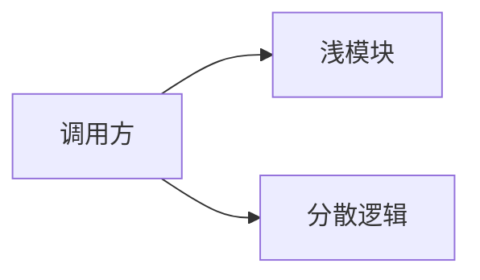

# 架构深化提案：<模块 / 概念>

## 候选项

| 字段 | 值 |
|---|---|
| 领域概念 | |
| 当前模块 | |
| 建议模块 | |
| 推荐强度 | 强烈建议 / 值得探索 / 推测性建议 |

## 当前摩擦点

说明当前结构为什么偏浅，或为什么难以维护。

使用 `codebase-design` 术语：

- Module:
- Interface:
- Seam:
- Adapter:
- Depth:
- Leverage:
- Locality:

## 调整前

## 调整后

## 建议接口

说明调用方需要了解的最小接口，包括不变量、顺序约束、错误模式和性能预期。

## 依赖策略

- 进程内依赖：
- 可本地替换依赖：
- 远程但自有依赖：
- 真正外部依赖：

## 测试策略

- 主要测试 seam：
- 需要删除或替换的测试：
- 需要新增的测试：

## ADR / 上下文影响

- [ ] 更新 `CONTEXT.md`
- [ ] 创建 ADR
- [ ] 重新打开或修订现有 ADR
- [ ] 不需要持久化文档
