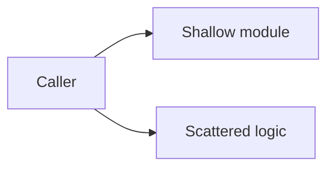
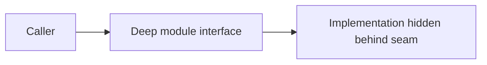

# Architecture Deepening Proposal: <Module / Concept>

## Candidate

| Field | Value |
|---|---|
| Domain concept | |
| Current module(s) | |
| Proposed module | |
| Recommendation strength | Strong / Worth exploring / Speculative |

## Current Friction

Describe why the current shape is shallow or hard to maintain.

Use the `codebase-design` vocabulary:

- Module:
- Interface:
- Seam:
- Adapter:
- Depth:
- Leverage:
- Locality:

## Before

## After

## Proposed Interface

Describe the smallest interface callers need to know, including invariants, ordering constraints, error modes, and performance expectations.

## Dependency Strategy

- In-process:
- Local-substitutable:
- Remote but owned:
- True external:

## Testing Strategy

- Primary test seam:
- Tests to delete or replace:
- Tests to add:

## ADR / Context Impact

- [ ] Update `CONTEXT.md`
- [ ] Create ADR
- [ ] Reopen or amend existing ADR
- [ ] No durable documentation needed
