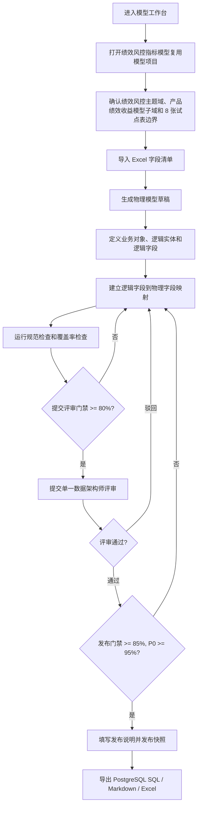

# 企业数据模型协作工作台交互说明

> 本文档用于 PRD 初稿之后、PRD 校准 / OpenAPI Draft 之前。目标是把 MVP 页面、流程、状态和 API 反推清单先定清楚，再进入原型评审。

## 1. 输入资产

| 资产 | 路径 / 链接 | 说明 |
|---|---|---|
| PRD 初稿 | `docs/requirements/2026-07-01-data-modeling-workbench-prd.md` | 当前产品范围基线 |
| 需求澄清稿 | `docs/requirements/2026-07-01-data-modeling-workbench-grilling.md` | MVP 边界和 8 张试点表确认项 |
| 竞品分析 | `docs/discovery/reports/2026-07-01-data-modeling-market-competitive-analysis.md` | 阿里、网易、华为、火山方案参考 |
| 竞品功能矩阵 | `docs/discovery/reports/2026-07-01-data-modeling-competitive-matrix.md` | P0 / P1 / P2 功能取舍 |
| 领域术语 | `CONTEXT.md` | 模型项目、主题域、业务对象、逻辑模型、物理模型、模型映射、发布快照、DDL 草案等 |
| 线框原型 | 本文档第 5 节 | Markdown 低保真原型 |
| Excalidraw 主流程图 | `docs/design/diagrams/data-modeling-workbench-mvp-flow.excalidraw` | MVP 主流程、门禁、驳回和回退路径 |
| Excalidraw 交互图 | `docs/design/diagrams/data-modeling-workbench-interaction-map.excalidraw` | 页面、抽屉、弹窗、导出中心和跳转关系 |
| 现有 API 草案 | 暂无 | 需要由本文档反推 OpenAPI Draft |

## 2. 竞品界面与交互参考

| 竞品 | 可借鉴交互 | 不照搬的部分 | 落到我们 MVP 的设计选择 |
|---|---|---|---|
| 阿里 Dataphin / DataWorks | 用数据板块、主题域、业务对象、逻辑表和指标组织建模对象；建模能力嵌入研发入口。 | 不照搬完整数据开发、调度、服务、地图、安全和 Copilot 大平台。 | 页面先按“模型项目 -> 主题域 -> 子域 -> 业务对象 -> 逻辑实体 / 物理表”组织；预留研发治理入口但不做。 |
| 网易 EasyDesign / 关系建模 | 主题域、多级主题、表分层、工单式新建 / 修改表、规范检测、建设评估。 | 不做重工单，不做建设评估大盘。 | 采用轻量评审流，保留“提交评审 / 驳回 / 通过 / 发布”动作，并在模型详情中常驻规范检查结果。 |
| 华为 DataArts Studio | 数据架构模块覆盖主题设计、逻辑建模、关系建模、维度建模、审核发布、导入导出、发布历史、版本对比和预览 SQL。 | 不做自动同步数据库，不做复杂 ER 画布优先。 | 采用“逻辑模型 -> 物理模型映射 -> 检查 -> 审核发布 -> 导出”的步骤条；发布前提供 PostgreSQL DDL 草案预览。 |
| 火山 DataLeap | 研发治理套件中的历史版本、Git 版本、发布包、数据地图、质量规则和指标平台。 | 不做任务发布包、全链路血缘和指标平台。 | 借鉴“版本化发布包”概念，P0 用发布快照 + 导出中心承接。 |

设计取舍：

1. 第一屏是工作台，不做营销页或概览大屏。
2. 采用企业工具常见的密集表格、树、页签、抽屉、弹窗和右侧检查面板。
3. 核心交互围绕首个模型项目的 8 张试点表建模闭环，但工作台信息架构必须支持多个模型项目。
4. 不把 ER 画布作为 MVP 主界面，先用表格和映射关系承载结构化协作。
5. 所有发布、DDL 草案、数据库相关动作都显示“草案 / 人工确认”边界。
6. 权限、导入、导出和流程恢复在 P0 采用固定决策，避免进入 OpenAPI Draft 时出现双轨契约。

## 3. 页面地图

| 页面 / 面板 | 入口 | 主要用户 | 目标 | 出口 / 下一步 |
|---|---|---|---|---|
| 模型工作台 | 主导航：数据建模 | 数据架构师、数仓开发工程师 | 查询多个模型项目、查看项目状态、进入试点项目 | 模型项目详情 / 新建模型项目 |
| 模型项目详情 | 模型项目列表行 / 新建后进入 | 数据架构师 | 明确项目边界、主题域边界、首批 8 张表、负责人和当前阶段 | 导入表结构 / 模型设计 |
| 既有表导入向导 | 模型项目详情操作 | 数仓开发工程师 | 上传 Excel，预览字段，校验并生成物理模型草稿 | 模型设计工作台 |
| 模型设计工作台 | 模型项目详情 / 导入完成 | 数据架构师、数仓开发工程师 | 维护逻辑模型、物理模型、字段映射和覆盖率 | 规范检查 / 提交评审 |
| 字段编辑抽屉 | 模型设计表格操作 | 数据架构师、数仓开发工程师 | 新增或编辑逻辑字段 / 物理字段 | 模型设计工作台 |
| 映射编辑抽屉 | 映射表格操作 | 数仓开发工程师 | 建立或调整逻辑字段到物理字段映射 | 模型设计工作台 |
| 规范检查面板 | 模型设计右侧常驻 / 手动检查 | 双方 | 展示阻断、警告、覆盖率和定位入口 | 修复字段 / 提交评审 |
| 模型评审页 | 提交评审后 / 待办入口 | 数据架构师 | 查看 diff、检查结果、评论并审批 | 驳回 / 通过 |
| 发布确认弹窗 | 评审通过后点击发布 | 数据架构师 | 确认覆盖率、发布说明、DDL 草案边界和快照冻结 | 发布成功 / 导出中心 |
| 版本历史与导出中心 | 模型项目详情页签 | 双方 | 查看发布快照、diff、导出 SQL / Markdown / Excel | 下载交付资产 |

## 4. 用户流程

### 4.1 主流程



### 4.2 异常流程

| 触发条件 | 系统行为 | 用户恢复方式 |
|---|---|---|
| 项目 / 主题域边界缺失 | 禁止进入提交评审；在模型项目详情顶部展示阻断提示 | 补充项目边界、主题域边界、负责人、首批表范围 |
| Excel 模板不匹配 | 导入向导停留在预览前，展示缺失列和示例模板入口 | 下载模板或整理 Excel 后重新上传 |
| Excel 中存在重复字段 | 在导入预览中标红重复字段；允许下载错误清单 | 调整字段名后重新导入 |
| PostgreSQL 类型无法识别 | 在字段行展示类型转换错误 | 手动选择目标 PostgreSQL 类型 |
| 提交评审覆盖率低于 80% | 阻断提交；右侧检查面板定位未映射字段 | 补充映射或调整字段范围 |
| 发布整体覆盖率低于 85% | 阻断发布；发布弹窗显示门禁原因 | 回到映射工作台补齐 |
| P0 必填字段覆盖率低于 95% | 阻断发布；突出显示 P0 必填字段缺口 | 补齐 P0 字段映射 |
| 单一架构师驳回 | 状态变为“驳回待修改”；保留评论和 diff | 提交人修改后再次提交 |
| 已发布版本被打开 | 进入只读态；编辑、保存、发布禁用 | 新建草稿变更 |
| 草稿版本冲突 | 展示冲突提示和最新更新时间 | 刷新到最新草稿后重新编辑 |
| DDL 导出 | 明确标识为草案，不提供执行按钮 | 人工确认后进入外部数据库变更流程 |

### 4.3 取消、返回、重试和草稿保留规则

| 场景 | 取消 / 返回 | 重试 | 草稿保留 |
|---|---|---|---|
| 导入向导上传前 | 返回模型项目详情，不产生导入记录 | 重新选择文件 | 不保留 |
| 导入向导解析后未生成草稿 | 取消时提示“放弃本次导入预览”，确认后删除临时 importId | 可重新上传，新的文件替换当前导入预览 | 仅保留临时 importId，不写入模型草稿 |
| 导入预览有阻断错误 | 禁用生成草稿，允许下载错误清单后返回 | 重新上传修正后的 Excel | 不写入模型草稿 |
| 导入预览有警告 | 允许继续，必须填写继续说明 | 可返回上传步骤重新导入 | 生成草稿时记录 warning 和说明 |
| 字段编辑抽屉 | 无修改时直接关闭；有修改时二次确认“保存草稿 / 放弃修改 / 继续编辑” | 保存失败后保留输入并可重试 | 点击保存后写入当前 draftVersion |
| 映射编辑抽屉 | 无修改时直接关闭；有修改时二次确认“保存映射 / 放弃修改 / 继续编辑” | 保存失败后保留输入并可重试 | 点击保存后写入当前 draftVersion |
| 提交评审 | 提交前取消不改变模型状态 | 提交失败可在检查面板修复后重试 | 提交成功后形成 reviewId，草稿进入待评审 |
| 评审驳回 | 驳回前取消不改变评审状态 | 驳回失败保留原因并可重试 | 驳回成功后模型回到驳回待修改 |
| 发布确认 | 发布前取消不生成版本 | 发布失败保留发布说明并可重试 | 发布成功后生成不可变快照，原草稿关闭 |
| 异步导出 | 关闭页面不取消导出任务 | 失败后点击重试会创建新的 exportId | 导出任务属于发布版本，不修改模型草稿 |
| 草稿版本冲突 | 用户可取消并继续查看本地页面 | 可刷新最新草稿后重新编辑 | P0 不做自动合并；放弃本地修改后以最新 draftVersion 为准 |

## 5. Markdown 低保真原型

### 5.1 模型工作台

```text
企业数据模型协作工作台
-------------------------------------------------------------------------------
[关键字: 模型项目/主题域/表名/字段] [状态 v] [负责人 v] [评审状态 v] [覆盖率 < >] [查询] [重置]    [+ 新建模型项目]

| 模型项目                   | 主题域   | 首批子域           | 状态       | 整体覆盖率 | P0覆盖率 | 检查结果 | 最近版本 | 操作 |
|---------------------------|----------|--------------------|------------|------------|----------|----------|----------|------|
| 绩效风控指标模型复用       | 绩效风控 | 产品绩效收益模型   | 草稿       | 78%        | 92%      | 3阻断    | -        | 进入/检查 |
| 客户统一视图模型           | 客户域   | 客户基础信息模型   | 规划中     | -          | -        | -        | -        | 进入 |
| 交易行为分析模型           | 交易域   | 交易流水基础模型   | 规划中     | -          | -        | -        | -        | 进入 |

空态：暂无模型项目。若有创建权限，显示 [+ 新建模型项目]；否则显示无权限说明。
```

### 5.2 模型项目详情

```text
< 返回工作台     模型项目：绩效风控指标模型复用                 [编辑边界] [导入表结构] [进入模型设计]
-------------------------------------------------------------------------------
项目负责人：张三   主题域负责人：赵六   评审人：李四   当前状态：草稿
主题域：绩效风控   首批子域：产品绩效收益模型
项目边界：绩效风控 3.0 既有表、指标平台表模型与数据中台目标表之间的模型复用、字段映射和交付资产生成
主题域边界：绩效、收益、基准、资产类、证券收益等模型资产
非目标：全量绩效迁移 / 完整指标平台 / 风险因子 / 归因算法 / 自动数据库迁移

步骤： 1 项目与主题域边界  ->  2 导入表结构  ->  3 字段映射  ->  4 规范检查  ->  5 评审  ->  6 发布导出

首批 8 张表
| 类型           | 表中文名                   | 中台目标表                  | 导入 | 映射覆盖率 | 检查 |
|----------------|----------------------------|-----------------------------|------|------------|------|
| 产品绩效事实   | 每日产品净值收益表         | T_DWS_AS_PD_INFO_I          | 已导入 | 82%        | 1阻断 |
| 产品绩效事实   | 每日产品及基准收益率表     | T_DWS_AS_PD_BM_YIELD_I      | 已导入 | 86%        | 通过 |
| 资产类绩效事实 | 每日产品资产类持仓收益表   | T_DWS_AS_PD_AC_INFO_I       | 未导入 | -          | - |
...
```

### 5.3 既有表导入向导

```text
导入已有表结构
-------------------------------------------------------------------------------
步骤 1 上传文件  ->  步骤 2 预览字段  ->  步骤 3 标准匹配  ->  步骤 4 生成草稿

步骤 1 上传文件
[选择 Excel 文件]  支持 .xls / .xlsx，建议使用公司字段清单模板
[下载模板] [查看示例]

步骤 2 预览字段
| 源表中文名 | 源字段中文名 | 源字段名 | 源类型       | 目标表名              | 目标字段名 | PostgreSQL 类型 | 校验 |
|------------|--------------|----------|--------------|-----------------------|------------|-----------------|------|
| 每日产品...| 业务日期     | BIZ_DATE | VARCHAR2(8)  | T_DWS_AS_PD_INFO_I    | BIZ_DATE   | varchar(8)      | 通过 |
| 每日产品...| 流水号       | ID       | NUMBER(20)   | T_DWS_AS_PD_INFO_I    | ID         | numeric(20,0)   | 警告 |

底部操作：[上一步] [保存导入草稿] [生成物理模型草稿]
```

### 5.4 模型设计工作台

```text
绩效风控指标模型复用 / 绩效风控 / 产品绩效收益模型     状态：草稿       [保存] [运行检查] [提交评审]
-------------------------------------------------------------------------------
左侧对象树                 中央工作区：映射表格                                      右侧检查面板
---------------------     ---------------------------------------------------     -----------------
模型项目                   [逻辑模型] [物理模型] [字段映射] [版本历史]             覆盖率
  绩效风控主题域            筛选：[表] [未映射] [P0必填] [阻断问题]                整体：78% / 提交线80%
    产品绩效收益模型
    产品                   | 逻辑实体 | 逻辑字段 | P0 | 物理表 | 物理字段 | 类型 | 状态 | 操作 |       P0：92% / 发布线95%
    产品收益               | 产品收益 | 业务日期 | 是 | T_DWS... | BIZ_DATE | varchar(8) | 已映射 | 编辑 |
    资产类收益             | 产品收益 | 产品内码 | 是 | T_DWS... | PD_ID    | varchar(30)| 已映射 | 编辑 |       阻断问题 3
    证券收益               | 产品收益 | 收益率   | 是 | -        | -        | numeric    | 未映射 | 建立 |       - P0字段未映射：收益率
    日期维度               | 日期维度 | 业务日期 | 是 | T_DWD... | BIZ_DATE | varchar(8) | 已映射 | 编辑 |       - 类型不兼容：ID
    证券主数据             | 证券     | 证券代码 | 否 | T_DWD... | SEC_CD   | varchar(50)| 已映射 | 编辑 |       - 注释缺失：3个

底部批量操作：[批量映射] [导出未映射清单] [查看 diff]
```

### 5.5 字段编辑抽屉

```text
字段编辑
-------------------------------------------------------------------------------
字段类型：[逻辑字段 / 物理字段]

基础信息
字段中文名 *        [收益率                         ]
字段名 *            [YIELD                          ]
数据类型 *          [numeric(26,8)                  ]
是否 P0 必填        [x]
是否可空            [ ]
主键 / 分区         [主键: 否] [分区: 否]

业务语义
业务含义            [产品在业务日期下的收益率...      ]
敏感标记            [未标记 v]
待分级状态          [待确认 v]
码表 / 字典          [选择码表]

校验提示
- 字段名符合命名规则
- 缺少字段注释，将产生警告

[取消] [保存字段]
```

### 5.6 映射编辑抽屉

```text
建立字段映射
-------------------------------------------------------------------------------
逻辑字段：产品收益.收益率  P0必填

候选物理字段
| 物理表                    | 字段名 | 中文名 | 类型          | 匹配度 | 操作 |
|---------------------------|--------|--------|---------------|--------|------|
| T_DWS_AS_PD_INFO_I        | YIELD  | 收益率 | numeric(26,8) | 高     | 选择 |
| T_DWS_AS_PD_BM_YIELD_I    | YIELD  | 收益率 | numeric(26,8) | 中     | 选择 |

映射说明：[必填，说明为什么选择该字段或为什么暂不映射]

[取消] [保存映射]
```

### 5.7 模型评审页

```text
模型评审：绩效风控指标模型复用 / 绩效风控 / 产品绩效收益模型
-------------------------------------------------------------------------------
提交人：王五       提交时间：2026-07-01 18:30       评审人：李四       状态：待评审

质量摘要
整体覆盖率：84%  达到提交线 80%
P0 覆盖率：96%  达到发布线 95%
检查结果：0 阻断 / 2 警告

[变更 diff] [规范检查] [字段映射] [评论]

变更 diff
| 对象 | 变更类型 | 变更前 | 变更后 | 影响 |
|------|----------|--------|--------|------|
| 逻辑字段：收益率 | 新增 | - | numeric(26,8) | P0字段 |
| 映射：收益率     | 新增 | - | T_DWS_AS_PD_INFO_I.YIELD | 覆盖率 +1 |

评论区
李四：请补充收益率统计口径说明。

底部操作：[驳回并要求修改] [通过评审]
```

### 5.8 发布确认弹窗

```text
发布模型版本
-------------------------------------------------------------------------------
即将发布：绩效风控指标模型复用 / 绩效风控 / 产品绩效收益模型

发布门禁
整体覆盖率：86% / 发布线 85%       通过
P0 覆盖率：96% / 发布线 95%        通过
阻断问题：0                         通过

发布说明 *
[首批产品绩效收益模型，纳入 8 张表...]

发布后将生成不可变发布快照。PostgreSQL DDL 仅为草案，不会自动执行数据库迁移。

[取消] [确认发布]
```

### 5.9 版本历史与导出中心

```text
版本历史与导出
-------------------------------------------------------------------------------
| 版本 | 状态   | 发布人 | 发布时间           | 覆盖率 | P0覆盖率 | 操作 |
|------|--------|--------|--------------------|--------|----------|------|
| v1   | 已发布 | 李四   | 2026-07-01 19:00   | 86%    | 96%      | 查看快照/导出 |

导出资产
[导出 PostgreSQL DDL 草案] [导出 Markdown 模型文档] [导出 Excel 字段清单]

DDL 草案预览
CREATE TABLE ...

提示：DDL 草案必须经人工确认后进入外部数据库变更流程。
```

## 6. 页面细节

### 6.1 模型工作台

| 区域 | 内容 / 组件 | 交互说明 |
|---|---|---|
| 查询区 | 关键字、状态、负责人、评审状态、覆盖率范围 | 查询条件变更后刷新表格；重试不丢筛选条件。 |
| 模型项目表格 | 模型项目、主题域、首批子域、状态、整体覆盖率、P0 覆盖率、检查结果、最近版本、操作 | 覆盖率低于门禁时用状态色和文案标识。 |
| 主操作 | 新建模型项目 | 无创建权限时不展示或禁用并给出原因。 |

### 6.2 模型项目详情

| 区域 | 内容 / 组件 | 交互说明 |
|---|---|---|
| 头部信息 | 模型项目名、主题域、子域、项目负责人、主题域负责人、评审人、状态 | 项目或主题域边界不完整时顶部常驻阻断提示。 |
| 项目与主题域边界 | 项目包含范围、主题域边界、非目标范围 | 用于防止模型项目和主题域无限扩展。 |
| 步骤条 | 项目与主题域边界、导入表结构、字段映射、规范检查、评审、发布导出 | 当前阶段由数据驱动，不允许手动跳过门禁。 |
| 8 张表范围 | 表类型、表中文名、中台目标表、导入状态、覆盖率、检查状态 | 点击表进入过滤后的模型设计工作台。 |

### 6.3 既有表导入向导

| 区域 | 内容 / 组件 | 交互说明 |
|---|---|---|
| 上传 | Excel 文件、模板下载、示例说明 | P0 使用模型工具标准模板；兼容现有字段标准 Excel 的表头别名；支持 `.xls` / `.xlsx`；上传后进入异步解析。 |
| 预览 | 源表、源字段、源类型、目标表、目标字段、PostgreSQL 类型、校验结果 | 错误行不可直接生成草稿；警告行可带说明继续。 |
| 标准匹配 | 字段标准、命名词典、码表匹配结果 | P0 先展示匹配结果，不要求完整标准库维护。 |
| 生成草稿 | 导入摘要、错误清单、确认按钮 | 成功后生成物理模型草稿并跳转模型设计工作台。 |

### 6.4 模型设计工作台

| 区域 | 内容 / 组件 | 交互说明 |
|---|---|---|
| 左侧对象树 | 模型项目、主题域、子域、业务对象、逻辑实体 | 只显示首批范围内对象；后续子域折叠展示。 |
| 中央页签 | 逻辑模型、物理模型、字段映射、版本历史 | 字段映射为 MVP 主工作区。 |
| 映射表格 | 逻辑实体、逻辑字段、P0 标记、物理表、物理字段、类型、映射状态 | 支持按未映射、P0 必填、阻断问题过滤。 |
| 右侧检查面板 | 整体覆盖率、P0 覆盖率、阻断、警告、定位入口 | 检查结果可点击定位到表格行。 |
| 底部 / 顶部操作 | 保存、运行检查、提交评审 | 低于提交门禁时提交按钮禁用并显示原因。 |

### 6.5 评审、发布和导出

| 区域 | 内容 / 组件 | 交互说明 |
|---|---|---|
| 评审页 | diff、检查结果、覆盖率、评论、审批操作 | 单一数据架构师可通过 / 驳回；驳回必须填写原因。 |
| 发布弹窗 | 发布门禁、发布说明、DDL 草案边界 | 未达到发布门禁时不可确认发布。 |
| 版本历史 | 版本号、发布人、发布时间、发布说明、覆盖率 | 发布版本只读。 |
| 导出中心 | SQL 文本、Markdown、Excel | P0 统一异步导出；完成后下载；失败可重试并创建新任务。 |

### 6.6 权限策略

P0 权限采用“页面无权不泄露数据、关键流程动作禁用并给原因、后端兜底拒绝”的统一策略。

| 权限场景 | 前端行为 | API 行为 | 适用示例 |
|---|---|---|---|
| 页面无查看权限 | 展示无权限页，不展示模型项目、主题域、表和字段数据 | 返回 403 或 `canView=false`，响应不得包含受限业务数据 | 无权进入模型工作台、无权查看某模型项目 |
| 操作不属于当前角色或业务状态 | 展示按钮但置灰，并显示禁用原因 | 详情 / 列表返回 `actions[].enabled=false` 和 `disabledReason` | 非评审人打开评审页、低于覆盖率门禁、已发布版本编辑 |
| 入口型动作长期无权限 | 不展示入口，避免误导 | 列表 / 详情不返回该 action | 无创建权限时隐藏“新建模型项目”；无导入权限时隐藏“导入表结构”入口 |
| 越权直接调用接口 | 前端展示统一无权限错误 | 后端返回 403 + `PERMISSION_DENIED`，不改变状态 | 伪造评审通过、伪造发布、伪造导出 |

`actions` 建议统一结构：

```json
{
  "action": "submitReview",
  "visible": true,
  "enabled": false,
  "disabledReason": "整体映射覆盖率 78%，未达到提交评审门禁 80%"
}
```

### 6.7 Excel 导入模板策略

P0 以模型工具标准模板作为唯一规范模板，同时提供现有公司 Excel 表头别名兼容。用户可以下载标准模板，也可以上传现有 Excel；系统在导入预览阶段把可识别表头映射到标准字段。无法映射到标准字段的 Excel 被视为模板不匹配，需要人工整理后重新上传。

标准模板必填列：

| 标准列 | 说明 | 缺失行为 |
|---|---|---|
| 源表中文名 | 既有表中文名 | 阻断导入 |
| 源表名 | 既有表英文名 / 代码 | 阻断导入 |
| 源字段中文名 | 既有字段中文名 | 阻断导入 |
| 源字段名 | 既有字段英文名 / 代码 | 阻断导入 |
| 源字段类型 | Oracle / PostgreSQL / Excel 中记录的原始类型 | 阻断导入 |
| 目标表名 | 首批 8 张表范围内的中台目标表 | 越界时阻断导入 |
| 目标字段名 | 目标物理字段名 | 为空时作为待补字段生成警告，不生成有效映射 |

标准模板可选列：

| 标准列 | 说明 |
|---|---|
| 字段注释 | 用于物理字段注释和规范检查 |
| 是否可空 | 用于物理字段约束 |
| 是否主键 | 用于 DDL 草案 |
| 是否分区 | 用于 DDL 草案 |
| 分层 | DWD / DWS 等模型分层 |
| P0 必填 | 用于 P0 覆盖率计算 |
| 标准字段编码 | 用于公司级字段标准匹配 |
| 码表编码 | 用于码表资产复用 |
| 敏感标记 | P0 保留治理入口 |

### 6.8 异步导出策略

P0 所有交付资产统一异步导出，包括 PostgreSQL DDL 草案、Markdown 模型文档和 Excel 字段清单。即使小文件可以快速生成，前端仍按任务状态展示，避免同步 / 异步两套交互。

| 状态 | 界面行为 | 说明 |
|---|---|---|
| queued | 展示“已加入导出队列” | 创建 exportId 后进入队列 |
| running | 展示进度或生成中 | 用户可离开页面 |
| succeeded | 展示下载按钮、生成时间和过期时间 | 下载地址只对应发布快照 |
| failed | 展示失败原因和重试按钮 | 重试创建新的 exportId |
| expired | 展示已过期和重新生成入口 | 不复用过期下载地址 |

## 7. 状态矩阵

| 页面 / 组件 | 状态 | 触发条件 | 界面行为 | API / 数据要求 | 验收点 |
|---|---|---|---|---|---|
| 模型工作台 | 加载中 | 首次进入或筛选变化 | 表格 skeleton，查询条件保持可用 | 列表请求 pending | 用户看到进度且布局不跳动 |
| 模型工作台 | 空数据 | 无模型项目 | 展示空态；有权限时显示新建入口 | 空分页结果 | 可创建或调整筛选 |
| 模型工作台 | 筛选空 | 筛选后无结果 | 展示“无匹配结果”和重置按钮 | 空分页结果 | 不误导为系统无数据 |
| 模型工作台 | 无权限 | 无查看权限 | 显示无权限，不展示受限数据 | 权限状态 / 403 | 不泄露主题域信息 |
| 模型工作台 | 错误 | 列表请求失败 | 展示重试按钮，不清空筛选条件 | 标准错误结构 | 重试保留上下文 |
| 模型项目详情 | 边界不完整 | 缺项目边界、主题域边界、负责人或首批表范围 | 顶部阻断提示，禁用提交评审 | 项目完整性字段 | 用户知道缺什么 |
| 模型项目详情 | 只读 | 打开已发布版本 | 禁用编辑，允许查看版本和导出 | 状态、版本号 | 已发布版本无法被修改 |
| 导入向导 | 上传中 | 文件上传 / 解析 | 展示进度，禁止重复提交 | 上传任务状态 | 不重复生成草稿 |
| 导入向导 | 取消导入 | 用户取消已解析但未应用的导入 | 二次确认后删除临时 importId，返回模型项目详情 | importStatus=cancelled | 不产生模型草稿 |
| 导入向导 | 模板不匹配 | 缺少必需列 | 展示缺失列、模板下载 | 字段级导入错误 | 用户可修正 Excel |
| 导入向导 | 预览有警告 | 类型需要人工确认 | 标黄警告，允许继续并记录说明 | warning severity | 警告不阻断 |
| 导入向导 | 预览有阻断 | 重复字段、空字段名、目标表越界 | 标红阻断，禁用生成草稿 | error severity | 阻断不可绕过 |
| 模型设计 | 草稿脏状态 | 用户修改字段或映射未保存 | 保存按钮高亮，离开确认 | draftVersion | 不丢编辑内容 |
| 字段 / 映射抽屉 | 取消编辑 | 有未保存修改时点击取消或关闭 | 二次确认保存草稿 / 放弃修改 / 继续编辑 | dirty flag + draftVersion | 用户不会误丢修改 |
| 模型设计 | 覆盖率低于 80% | 尝试提交评审 | 禁用提交或提交后阻断 | coverageSummary | 明确展示差距 |
| 模型设计 | P0 覆盖率低于 95% | 尝试发布 | 发布弹窗阻断 | p0Coverage | P0 缺口可定位 |
| 模型设计 | 字段级错误 | 检查返回 field path | 表格行和右侧面板同时显示错误 | fieldErrors[].path | 用户能定位修复 |
| 模型设计 | 并发冲突 | 草稿被他人修改 | 展示刷新 / 放弃本地修改 | conflict code + latestVersion | 不覆盖他人变更 |
| 评审页 | 待评审 | 提交成功 | 显示 diff、检查结果、通过 / 驳回 | reviewStatus | 架构师可完成评审 |
| 评审页 | 驳回 | 架构师驳回 | 状态变为驳回待修改，评论保留 | rejectionReason | 提交人能继续修改 |
| 评审页 | 无评审权限 | 非评审人打开 | 审批按钮禁用，评论可按权限控制 | permission actions | 不允许越权审批 |
| 发布弹窗 | 门禁通过 | 覆盖率和阻断项达标 | 可填写发布说明并确认 | publishCheck | 发布前再次确认 |
| 发布弹窗 | 门禁失败 | 覆盖率或阻断项不达标 | 禁用确认，展示原因 | publishCheck | 不生成发布快照 |
| 发布弹窗 | 发布中 | 调用发布接口 | 按钮 loading，防重复提交 | request id | 不重复发布 |
| 发布弹窗 | 发布失败 | 发布接口失败 | 保留发布说明，展示重试和取消 | publish error + request id | 不生成半成品版本 |
| 版本历史 | 无版本 | 尚未发布 | 展示空态和当前草稿状态 | 空版本列表 | 不显示导出入口 |
| 版本历史 | 导出生成中 | 用户点击导出 | 展示任务状态 | exportTask | 用户可等待或稍后下载 |
| 版本历史 | 导出成功 | 导出任务完成 | 展示下载按钮、生成时间和过期时间 | exportTask.status=succeeded | 下载资产属于发布快照 |
| 版本历史 | 导出失败 | 生成 SQL / Markdown / Excel 失败 | 展示错误和重试入口 | export error | 可重试 |
| 版本历史 | 导出过期 | 下载地址超过有效期 | 隐藏下载按钮，展示重新生成入口 | exportTask.status=expired | 不使用过期链接 |

## 8. OpenAPI 反推清单

### 8.1 列表、筛选和权限

| 界面需求 | API 影响 | 说明 |
|---|---|---|
| 模型工作台分页 | `GET /api/v1/modeling/projects` | 支持 page、size、keyword、status、owner、reviewStatus、coverageRange。 |
| 页面级权限 | 列表和详情返回 actions / permissions | 包含 canView、canEdit、canImport、canSubmitReview、canReview、canPublish、canExport；动作结构包含 visible、enabled、disabledReason。 |
| 模型项目详情 | `GET /api/v1/modeling/projects/{projectId}` | 返回项目边界、主题域、负责人、评审人、子域、当前状态、覆盖率摘要。 |

### 8.2 模型项目、主题域和模型对象

| 界面需求 | API 影响 | 说明 |
|---|---|---|
| 新建模型项目 | `POST /api/v1/modeling/projects` | 请求包含项目名称、编码、项目边界、主题域、非目标范围、负责人、评审人。 |
| 更新项目 / 主题域边界 | `PATCH /api/v1/modeling/projects/{projectId}` | 需要 draftVersion / optimistic token。 |
| 业务对象树 | `GET /api/v1/modeling/projects/{projectId}/object-tree` | 返回主题域、子域、业务对象、逻辑实体、统计数量。 |
| 逻辑字段维护 | `POST/PATCH /api/v1/modeling/logical-fields` | 需要字段级校验响应。 |
| 物理字段维护 | `POST/PATCH /api/v1/modeling/physical-fields` | 包含 PostgreSQL 类型、主键、分区、可空。 |

### 8.3 Excel 导入

| 界面需求 | API 影响 | 说明 |
|---|---|---|
| 上传 Excel | `POST /api/v1/modeling/imports` | multipart 上传，返回 importId。 |
| 导入预览 | `GET /api/v1/modeling/imports/{importId}/preview` | 返回源表、字段、目标表、类型转换、错误和警告。 |
| 生成草稿 | `POST /api/v1/modeling/imports/{importId}/apply` | 生成物理模型草稿；需要幂等 requestId。 |
| 取消导入 | `POST /api/v1/modeling/imports/{importId}/cancel` | 删除未应用的临时导入记录；已 apply 的导入不可取消。 |
| 下载模板 | `GET /api/v1/modeling/import-templates/excel` | 返回模型工具标准模板文件和兼容表头说明。 |
| 表头别名 | `GET /api/v1/modeling/import-templates/excel/aliases` | 返回现有公司 Excel 表头到标准列的别名映射。 |

### 8.4 映射、检查和覆盖率

| 界面需求 | API 影响 | 说明 |
|---|---|---|
| 字段映射表 | `GET /api/v1/modeling/projects/{projectId}/mappings` | 支持 themeDomainId、subdomainId、tableId、unmapped、p0Required、issueSeverity 筛选。 |
| 保存映射 | `PUT /api/v1/modeling/mappings/{mappingId}` 或批量保存 | 请求包含逻辑字段、物理字段、映射说明。 |
| 覆盖率摘要 | `GET /api/v1/modeling/projects/{projectId}/coverage` | 返回 projectCoverage、themeDomainCoverage、overallCoverage、p0Coverage、thresholds、missingFields。 |
| 运行检查 | `POST /api/v1/modeling/projects/{projectId}/validations` | 返回 validationRunId。 |
| 检查结果 | `GET /api/v1/modeling/validations/{validationRunId}` | 错误结构必须支持 field path、severity、code、message、suggestion。 |

### 8.5 评审、发布、版本和导出

| 界面需求 | API 影响 | 说明 |
|---|---|---|
| 提交评审 | `POST /api/v1/modeling/projects/{projectId}/reviews` | 后端再次校验 80% 门禁。 |
| 评审详情 | `GET /api/v1/modeling/reviews/{reviewId}` | 返回 diff、检查结果、覆盖率、评论、操作权限。 |
| 评审结论 | `POST /api/v1/modeling/reviews/{reviewId}/decision` | decision=approve/reject，reject 必填原因。 |
| 发布检查 | `POST /api/v1/modeling/projects/{projectId}/publish-check` | 后端再次校验 85% / P0 95% 门禁。 |
| 发布模型 | `POST /api/v1/modeling/projects/{projectId}/versions` | 请求包含发布说明、draftVersion；响应包含 versionId、versionNo、publishedAt、publishedBy。 |
| 版本历史 | `GET /api/v1/modeling/projects/{projectId}/versions` | 分页返回发布快照摘要。 |
| 导出资产 | `POST /api/v1/modeling/versions/{versionId}/exports` | exportType=postgresql_sql / markdown / excel；统一异步，返回 exportId。 |
| 导出任务查询 | `GET /api/v1/modeling/exports/{exportId}` | 返回 status=queued/running/succeeded/failed/expired、下载地址、错误、过期时间。 |
| 重试导出 | `POST /api/v1/modeling/exports/{exportId}/retry` | 创建新的 exportId，复用原导出参数。 |

### 8.6 错误结构与状态码

| 错误码 | 场景 | 前端行为 |
|---|---|---|
| `PROJECT_BOUNDARY_INCOMPLETE` | 模型项目或主题域边界缺失 | 顶部阻断提示 |
| `IMPORT_TEMPLATE_MISMATCH` | Excel 模板缺列 | 导入向导展示缺失列 |
| `IMPORT_COLUMN_ALIAS_UNSUPPORTED` | Excel 表头无法映射到标准列 | 展示标准模板下载和不支持表头清单 |
| `IMPORT_DUPLICATE_FIELD` | Excel 重复字段 | 预览行级错误 |
| `POSTGRES_TYPE_UNSUPPORTED` | 类型无法转换 | 字段行要求人工选择 |
| `REVIEW_COVERAGE_BELOW_THRESHOLD` | 提交评审整体覆盖率 < 80% | 阻断提交 |
| `PUBLISH_COVERAGE_BELOW_THRESHOLD` | 发布整体覆盖率 < 85% | 阻断发布 |
| `P0_COVERAGE_BELOW_THRESHOLD` | P0 必填字段覆盖率 < 95% | 阻断发布并定位 P0 字段 |
| `VALIDATION_BLOCKING_ISSUES` | 存在阻断级检查问题 | 阻断提交 / 发布 |
| `VERSION_CONFLICT` | 草稿版本冲突 | 展示刷新 / 放弃 |
| `PERMISSION_DENIED` | 无权限操作 | 禁用操作或展示无权限 |
| `EXPORT_TASK_FAILED` | 异步导出失败 | 展示失败原因和重试入口 |
| `EXPORT_TASK_EXPIRED` | 下载地址过期 | 展示重新生成入口 |
| `DDL_DRAFT_ONLY` | 试图执行 DDL | 前端不提供执行入口，后端也拒绝执行 |

## 9. PRD 校准记录

| 原型发现 | 需要回填 PRD 的内容 | 状态 |
|---|---|---|
| 覆盖率需要明确计算口径 | 增加“整体覆盖率 = 已有效映射的范围内逻辑字段数 / 范围内逻辑字段总数；P0 覆盖率按 P0 必填逻辑字段计算”。 | 已回填 PRD |
| Excel 导入需要模板约束 | 增加导入模板字段、缺列、重复字段、类型转换错误的验收标准。 | PRD 校准已确认 |
| 发布导出需要异步任务 | 增加导出任务状态：queued、running、succeeded、failed、expired。 | PRD 校准已确认 |
| 工作台存在多个模型项目 | PRD 需要增加模型项目作为顶层协作单元，绩效风控指标模型只是首个试点项目。 | 已在 PRD 中覆盖 |
| 项目 / 主题域边界需要产品字段 | 增加项目包含范围、主题域边界、非目标范围、首批表清单、负责人、评审人。 | 已在 PRD 中部分覆盖 |
| 已发布版本只读需要显式状态 | 增加已发布版本只读、草稿变更另起版本的验收标准。 | 已回填 PRD |
| 单一架构师审批仍需无权限态 | 增加非评审人打开评审页的只读 / 禁用行为。 | PRD 校准已确认 |
| DDL 草案安全边界需要前后端双重约束 | PRD 已写不自动执行，OpenAPI Draft 仍需避免任何执行端点。 | 已确认 |

## 10. 前端验收

1. 模型工作台、模型项目详情、导入向导、模型设计工作台、评审页、发布弹窗、版本历史与导出中心均有 loading、empty、error、readonly、no-permission、conflict 或明确不适用说明。
2. 所有阻断门禁都能在页面上定位原因：项目边界、主题域边界、Excel 导入、覆盖率、P0 字段覆盖率、规范检查。
3. 映射覆盖率在模型设计工作台和评审页均可见。
4. 发布弹窗必须再次展示 85% / 95% 门禁结果和“DDL 仅为草案”的人工确认提示。
5. 导出中心必须明确区分 SQL 文本、Markdown、Excel 三类资产。
6. 无权限用户不得看到受限数据；关键流程动作禁用并展示原因；入口型动作可隐藏；越权调用由后端 403 拒绝。
7. 页面可以按垂直切片拆分演示：模型项目创建、主题域边界、Excel 导入、字段映射、规范检查、评审发布、导出资产。

## 11. 决策与未决问题

| 类型 | 内容 | 负责人 | 状态 |
|---|---|---|---|
| 已确认 | 工作台支持多个模型项目，绩效风控指标模型是首个 P0 试点项目。 | 产品 | 已确认 |
| 已确认 | P0 首批采用 8 张试点表。 | 产品 | 已确认 |
| 已确认 | 提交评审整体覆盖率门禁 80%。 | 产品 | 已确认 |
| 已确认 | 发布整体覆盖率门禁 85%，P0 必填字段覆盖率 95%。 | 产品 | 已确认 |
| 已确认 | 单一数据架构师审批。 | 产品 | 已确认 |
| 已确认 | DDL 只生成 PostgreSQL 草案，不自动执行。 | 产品 / 安全 | 已确认 |
| 已确认 | 正式敏感分级后置，P0 保留敏感标记和待分级状态。 | 产品 / 治理 | 已确认 |
| 已确认 | 权限采用“页面无权不泄露数据、关键流程动作禁用并给原因、入口型动作可隐藏、后端兜底拒绝”。 | 产品 / 安全 | 已确认 |
| 已确认 | P0 所有 SQL、Markdown、Excel 交付资产统一异步导出。 | 产品 / 架构 | 已确认 |
| 已确认 | Excel 导入以模型工具标准模板为准，同时兼容现有公司 Excel 表头别名；无法识别时阻断并要求人工整理。 | 产品 / 数仓 | 已确认 |
| 非目标 | 完整指标平台、血缘、BI 语义层、调度、ETL、自动数据库迁移。 | 产品 | 已确认 |

## 12. 演进路线

| 阶段 | 目标 | 页面演进 | 不做 |
|---|---|---|---|
| P0.1 模型项目与导入闭环 | 让多个模型项目可被工作台承载，并让试点项目的 8 张表进入工作台 | 工作台、模型项目详情、Excel 导入向导 | ER 画布、指标平台、数据库直连 |
| P0.2 映射与规范检查 | 完成逻辑字段、物理字段、映射和覆盖率门禁 | 模型设计工作台、字段编辑抽屉、检查面板 | 复杂规则引擎、自动修复 |
| P0.3 评审发布与导出 | 完成单一架构师审批、发布快照、三类导出 | 评审页、发布弹窗、版本历史、导出中心 | 自动执行 DDL、多级审批 |
| P1 标准资产增强 | 字段标准、命名词典、码表 Excel 复用更完整 | 标准匹配页、字段标准维护入口 | 企业级标准治理平台 |
| P1 / P2 资产治理扩展 | 影响分析、指标增强、研发治理衔接 | 发布影响面板、指标页签、数据开发关联入口 | 完整血缘、BI 消费、AI 自动建模 |

## 13. 是否可进入 PRD 校准 / OpenAPI Draft

4 个原型评审阻断项已在本文档中补齐，并已通过 `prototype-review` 复审。PRD 校准已完成，可进入 OpenAPI Draft。

下一步：

1. 基于第 8 节创建 `docs/api/specs/data-modeling-workbench.yaml` OpenAPI Draft。
2. OpenAPI Draft 通过 API / 前后端 / 架构评审后，再进入工程基线和垂直切片拆分。
3. 并行准备组件故事和 mock 数据集。
