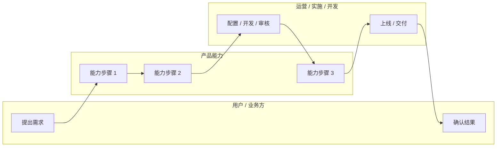

# [主题] 竞品深度分析报告

> AI 辅助生成，人工审核补充。
> 建议配套产物：`competitive-matrix-template.md` 用于横向功能矩阵，本模板用于深度分析和 Spec 前置输入。
> 使用 `grill-with-docs` 时，请把稳定术语同步沉淀到 `CONTEXT.md`，只有出现难以回滚、非显而易见且存在真实取舍的决策时才新增 ADR。

## 0. 文档信息

| 项 | 内容 |
|---|---|
| 调研主题 | [例如：数据中台数据建模] |
| 调研日期 | [YYYY-MM-DD] |
| 调研对象 | [竞品 A] / [竞品 B] / [竞品 C] |
| 调研人 | [姓名 / Agent] |
| 资料边界 | [公开官网 / 官方文档 / 白皮书 / 访谈 / 试用环境] |
| 可信度说明 | [哪些信息已验证，哪些信息待验证] |
| 关联矩阵 | [链接到对应竞品功能矩阵] |

## 1. 调研背景

### 1.1 业务背景

[说明为什么现在要调研这个主题，它关联的业务目标、用户问题或产品方向是什么。]

### 1.2 调研问题

1. [竞品如何定义该领域能力？]
2. [竞品如何组织功能对象、角色和流程？]
3. [用户如何完成从输入到落地的完整闭环？]
4. [哪些能力值得进入我们的 MVP，哪些应延后？]

### 1.3 范围与非目标

| 类型 | 内容 |
|---|---|
| 本次包含 | [竞品范围、能力范围、用户范围] |
| 本次不包含 | [暂不分析的竞品、能力、商业模式或技术细节] |

## 2. 关键结论

### 2.1 一句话结论

[用一段话说明整体判断。]

### 2.2 竞品分化

| 竞品 | 核心判断 | 对我们的启示 |
|---|---|---|
| [竞品 A] | [定位 / 强项 / 弱项] | [可学习或应规避的点] |
| [竞品 B] | [定位 / 强项 / 弱项] | [可学习或应规避的点] |
| [竞品 C] | [定位 / 强项 / 弱项] | [可学习或应规避的点] |

### 2.3 产品机会

1. [机会点 1]
2. [机会点 2]
3. [机会点 3]

## 3. 竞品矩阵摘要

> 完整矩阵建议放在独立文件中，本节只保留高层摘要。

| 维度 | [竞品 A] | [竞品 B] | [竞品 C] |
|---|---|---|---|
| 核心定位 | | | |
| 目标用户 | | | |
| 核心流程 | | | |
| 关键能力 | | | |
| 差异化亮点 | | | |
| 公开资料成熟度 | 高 / 中 / 低 | 高 / 中 / 低 | 高 / 中 / 低 |

## 4. 逐家深剖

### 4.1 [竞品 A]

#### 4.1.1 定义与定位

[该竞品如何定义本领域能力，它解决的核心问题是什么。]

#### 4.1.2 功能设计

| 模块 | 功能点 | 说明 |
|---|---|---|
| [模块] | [功能点] | [功能说明] |

#### 4.1.3 使用 / 落地流程

1. [步骤 1]
2. [步骤 2]
3. [步骤 3]

#### 4.1.4 优势与不足

优势：

- [优势 1]
- [优势 2]

不足 / 待验证：

- [不足或风险 1]
- [公开资料不足处]

### 4.2 [竞品 B]

#### 4.2.1 定义与定位

[同上。]

#### 4.2.2 功能设计

| 模块 | 功能点 | 说明 |
|---|---|---|
| [模块] | [功能点] | [功能说明] |

#### 4.2.3 使用 / 落地流程

1. [步骤 1]
2. [步骤 2]
3. [步骤 3]

#### 4.2.4 优势与不足

优势：

- [优势 1]
- [优势 2]

不足 / 待验证：

- [不足或风险 1]
- [公开资料不足处]

### 4.3 [竞品 C]

#### 4.3.1 定义与定位

[同上。]

#### 4.3.2 功能设计

| 模块 | 功能点 | 说明 |
|---|---|---|
| [模块] | [功能点] | [功能说明] |

#### 4.3.3 使用 / 落地流程

1. [步骤 1]
2. [步骤 2]
3. [步骤 3]

#### 4.3.4 优势与不足

优势：

- [优势 1]
- [优势 2]

不足 / 待验证：

- [不足或风险 1]
- [公开资料不足处]

## 5. 功能拆解

| 功能域 | 子功能 | [竞品 A] | [竞品 B] | [竞品 C] | 我们的建议 |
|---|---|---|---|---|---|
| [功能域] | [子功能] | ✅ / ⚠️ / ❌ / ❓ | ✅ / ⚠️ / ❌ / ❓ | ✅ / ⚠️ / ❌ / ❓ | P0 / P1 / P2 / 不做 |

图例：✅ 明确支持；⚠️ 部分支持或资料不完整；❌ 未支持；❓ 公开资料不足。

## 6. 流程泳道图

## 7. 能力评分

评分说明：1 分弱，5 分强。评分应说明依据，避免只给主观分。

| 能力 | [竞品 A] | [竞品 B] | [竞品 C] | 评分依据 |
|---|---:|---:|---:|---|
| [能力 1] |  |  |  | [依据] |
| [能力 2] |  |  |  | [依据] |
| [能力 3] |  |  |  | [依据] |

## 8. Grilling 问题清单

> 本节用于把竞品分析继续压成 Spec 前的产品边界。明确的问题可进入 Spec；稳定术语进入 `CONTEXT.md`；重大取舍再考虑 ADR。

1. 首要用户是谁？是否只能先服务一个角色？
2. 第一高频场景是什么？是新建、改造、迁移、治理，还是消费？
3. 最小闭环从哪里开始，到哪里结束？
4. 哪些对象必须是一等对象，哪些只是属性或配置？
5. 哪些能力进入 MVP，哪些能力明确不做？
6. 成功验收如何度量？用户如何知道能力产生了价值？
7. 哪些流程需要审核、版本、回滚或影响分析？
8. 有哪些公开资料不足，必须通过访谈、试用或厂商确认？

## 9. 机会点

| 机会点 | 用户痛点 | 竞品现状 / 缺口 | 实现难度 | 优先级 |
|---|---|---|---|---|
| [机会点] | [痛点] | [缺口] | 高 / 中 / 低 | P0 / P1 / P2 |

## 10. MVP 建议

### 10.1 MVP 目标

[用一段话说明 MVP 要帮助哪个用户，在什么场景下，完成什么最小闭环。]

### 10.2 MVP 功能范围

| 模块 | MVP 能力 | 验收标准 |
|---|---|---|
| [模块] | [能力] | [可验证标准] |

### 10.3 暂不进入 MVP

1. [能力 / 场景 1]
2. [能力 / 场景 2]
3. [能力 / 场景 3]

### 10.4 推荐产品路线

第一阶段：[目标与范围]

第二阶段：[目标与范围]

第三阶段：[目标与范围]

## 11. 建议下一步

1. [补充调研 / 用户访谈 / 厂商验证]
2. [进入 grill-with-docs 继续澄清的问题]
3. [生成 Spec]
4. [判断是否需要 OpenAPI / 垂直切片 issue]

## 12. 参考资料

| 来源 | 链接 | 类型 | 可信度 | 备注 |
|---|---|---|---|---|
| [来源名称] | [URL] | 官方文档 / 产品页 / 白皮书 / 访谈 | 高 / 中 / 低 | [备注] |
