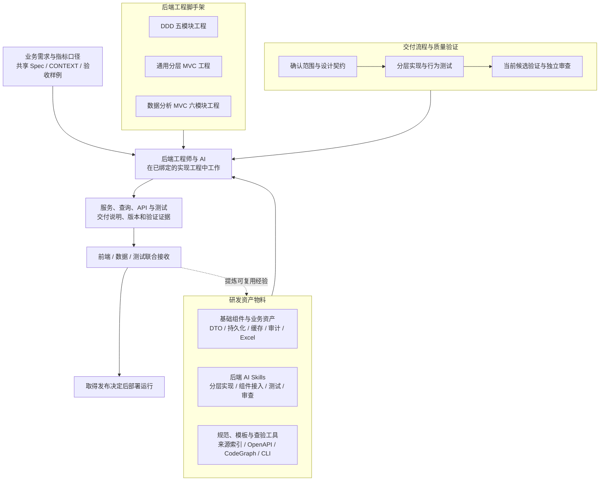

# 后端研发资产库全景清单与落地分析

> 数据分析类项目 SDD（规格驱动开发）后端研发体系、工程资产与人机协作指引<br>
> 适用对象：后端、架构、数据开发、前端、测试、研发负责人、全栈工程师与 FDE。<br>
> 编制日期：2026-10-10（Asia/Shanghai）。<br>
> 文档性质：基于两份参考文档与当前本地资产编制的分析介绍及落地建议；具体项目的业务范围、工程选择和发布决定仍由对应项目确认。

后端研发资产库将已有的服务组件、工程骨架、研发规范、AI Skills、契约模板和验证工具组织起来，使工程师与 AI 能围绕同一份需求，完成服务设计、数据访问、接口实现和交付验证。数据分析类项目还需要把指标口径、数据权限、统计精度、加工时效和结果对账纳入这条链路。

当前 YSS 已具备后端组件库、分层开发 Skills、DDD 与 MVC 脚手架入口、OpenAPI 治理和验证工具。落地时的关键工作是为每个项目选定架构与平台，绑定真实实现工程，按任务选择资产，并用当前候选的测试和独立审查证明行为。组件源码存在、工程生成成功和业务交付完成，分别需要不同证据。

本文参照《数据分析类项目 SDD 研发体系实施方案》的“基础资产 → 角色装配 → 工作目录 → 交付验证”结构，沿用前端汇报文档的“资产全景、清单、工具、工序、更新、场景”阅读顺序，补充后端特有的分层、事务、持久化和运行边界。[S1]、[S2]

## 阅读导航

| 读者希望了解什么 | 建议阅读 |
|---|---|
| 后端体系是什么、已有多少资产、还缺什么 | 第 01、02、12 章 |
| 某项后端能力应选哪些组件和 Skills | 第 03、04 章 |
| 工程怎么组织、DDD 与 MVC 如何选 | 第 05 章 |
| 如何与 AI 协作并完成一次交付 | 第 06、07、08 章 |
| 如何升级已有工程、处理分析业务难点 | 第 09、10 章 |
| 团队怎么试点与推广 | 第 11 章 |
| 查全部模块、来源和核对范围 | 附录 A、B、C |

---

## 01 资产体系全景与建设价值

### 1.1 后端研发的三项生产要素

后端体系由“研发资产物料、后端工程脚手架、交付流程与质量验证”构成。标准模板规定成果应包含什么，Skill 指导工程师与 AI 如何完成任务，组件与工程骨架提供可复用实现，验证记录说明本次交付实际满足了哪些要求。



图中三类脚手架是可识别的工程路线。实际可生成组合取决于架构 Profile、精确平台版本、组件证据和当前合同，不表示三类路线已经全部取得生产认证。[S5]、[S6]

| 生产要素 | 代表资产 | 对后端研发的作用 | 输出 |
|---|---|---|---|
| 研发资产物料 | `yss-component-*`、后端 Skills、来源索引、工程规范 | 复用已有能力，核对真实接口、装配入口和限制 | 明确的组件组合与使用方式 |
| 后端工程脚手架 | DDD、分层 MVC、数据分析六模块；POM、Wrapper、启动入口 | 固定工程结构、依赖方向和构建入口 | 可验证的机械工程骨架 |
| 交付流程与质量验证 | Spec、API 契约、任务记录、行为测试、独立审查 | 将需求、实现和验收对应起来 | 当前候选的交付证据 |

### 1.2 数据分析项目为何需要专门的后端资产体系

数据分析服务常同时承担查询接口、指标计算、导入导出、加工结果读取和调度协作。问题往往出现在边界：指标公式相同但统计期间不同，页面按钮受控但导出 API 越权，SQL 能执行但批量字段错位，HTTP 返回成功但后台任务未完成。

资产体系需要帮助团队解决以下具体问题。

| 常见问题 | 资产体系提供的手段 | 验收时观察什么 |
|---|---|---|
| 每个服务重复实现响应、异常与分页 | 复用 DTO、异常和 API wire 规范 | 相同错误与分页语义在真实 HTTP 响应中一致 |
| AI 生成不存在的方法、错误的依赖或跨层代码 | 读取匹配平台的 Skill、源码索引和当前源代码 | 依赖可解析、代码可编译、调用与模块边界正确 |
| 报表查询与业务指标定义脱节 | 引用同一指标标识、口径版本和验收样例 | 固定样本能够独立复算与对账 |
| 查询、导出、缓存绕过数据权限 | 将身份、授权与过滤规则贯穿各入口 | 越权调用、跨机构查询和缓存命中均受到约束 |
| 构建成功被误认为可上线 | 分别记录构建、行为、集成、审查和运行验证 | 发布前能够说明已验证范围与剩余风险 |
| 升级模板时覆盖业务成果 | 区分治理资产同步、组件升级和工程迁移 | 差异可审阅，冲突可处理，现有成果可保留 |

### 1.3 后端资产库的范围

后端资产包括可执行组件，也包括父 POM、BOM、脚手架模板、Maven Wrapper、规范、Skill、来源索引、参考架构、测试样例和迁移记录。按角色建立索引即可，已有权威资产保留其维护位置。

项目内的业务代码、数据作业和业务规格属于该项目成果。经过筛选、脱离项目偶然条件并完成适用验证后，才能沉淀为跨项目资产。涉及具体客户字段、权限规则或数据内容的成果，不应直接复制到通用组件库。

---

## 02 后端在 SDD 体系中的职责与协作边界

### 2.1 后端工作入口与交付责任

后端接收已确认的需求、架构、API 和数据设计，将其转化为服务行为。数据分析项目中，后端需要理解指标口径和数据来源，并与数据开发共同确认查询结果的含义、可用时点及异常表现。[S1]

| 上下游角色 | 提供给后端的输入 | 后端需要反馈或交付的内容 |
|---|---|---|
| 需求与业务负责人 | 目标、范围、指标定义、业务权限、验收样例 | 规则缺口、可实现性问题、可观察验收结果 |
| 架构 | 架构选择、平台、容量和一致性要求、外部依赖 | 模块设计、依赖配方、事务与失败处理依据 |
| 产品设计与前端 | 用户操作、状态、筛选、分页、导出和异常需求 | 冻结 API、字段形状、错误语义、权限拒绝及异步状态 |
| 数据开发 | 源到目标映射、加工模型、增量、调度和质量规则 | 数据读取契约、批次或版本需求、查询与补数协作接口 |
| 测试 | 独立验收样例、边界场景和测试计划 | 可执行候选、测试 seam、环境说明和验证证据 |
| 发布与运行负责人 | 运行环境、部署窗口、监控和恢复要求 | 制品、配置差异、迁移顺序、健康与告警信号、回滚限制 |

各项目应登记具体负责人。表中的角色说明用于分工，不代表已经指派某个人或启用了参考方案中的全部角色。

### 2.2 服务研发与数据开发如何配合

| 内容 | 后端主要责任 | 数据开发主要责任 | 共同接收条件 |
|---|---|---|---|
| 指标口径 | 在 API、查询和权限中正确消费口径 | 按口径加工和存储数据 | 引用同一指标标识与版本，样本结果一致 |
| 数据模型 | 定义服务读取方式、查询条件与所需索引反馈 | 定义加工模型、源目标映射与增量规则 | 主键、关联基数、期间与数据类型一致 |
| 数据时效 | 对外表达数据截至时间与不可用状态 | 提供加工批次、完成时间与失败信息 | API 能区分“无数据”和“尚未加工完成” |
| 调度 | 接入调度契约和状态反馈，约束重复触发 | 设计作业依赖、重试和补数 | 重跑不重复计数，失败能定位并恢复 |
| 结果对账 | 提供可追踪的筛选、权限、查询结果 | 提供可信源范围、加工结果和差异解释 | 对同一范围独立复算，保留差异处置记录 |

现有数据质量契约、调度 SDK 和 DuckDB 模块分别覆盖部分接口或计算能力，不能由这些模块的存在推导出完整 ETL 平台、指标平台、血缘系统或数据质量执行引擎。

### 2.3 一份需求、多份专项成果

业务词汇以项目根目录唯一的 `CONTEXT.md` 为准。指标目录可以独立维护，但同一规则应有唯一权威定义。后端技术设计、OpenAPI、SQL、缓存 key 和测试样例通过标识及版本引用该规则。

“本月收入”“机构”“业务日期”等名称一旦具有稳定含义，应在需求或上下文中确认。开发阶段不能通过字段名、旧代码或 SQL 自行改变业务含义。发现设计与数据样本冲突时，先返回对应需求或设计负责人处理。

---

## 03 后端组件资产全景与选型分析

### 3.1 当前资产底数和技术基线

本次重新核对了组件仓 Git 跟踪的 POM，并解析默认 `<modules>` 聚合关系。统计不包含 `.scratch/` 中的临时消费者夹具，也不包含 `target/`、缓存和历史构建产物。

| 统计项 | 本次核对值 | 含义 |
|---|---:|---|
| 正式 Maven 模块 | 73 | 每个 Git 跟踪的 `pom.xml` 计一项 |
| JAR 模块 | 57 | 包含组件、SDK、示例及占位模块 |
| 父 POM、BOM 与聚合 POM | 15 | 提供构建、依赖管理或聚合结构 |
| Maven 插件 | 1 | 独立构建工具资产 |
| 进入默认根构建链 | 67 | 由当前根 POM 的 modules 递归可达 |
| 独立或未接入默认构建链 | 6 | 不代表已删除，也不代表可直接接入 |

73 项是资产数量，不能解释为 73 个生产可用组件。完整模块台账见附录 A；能力介绍参考既有详细盘点，并补充本次结构与治理核对结果。[S3]、[S4]

组件仓当前根 POM 声明的基线如下。这是本地 `branch-3.0.0` 的基线，不是对公开最新版本的推荐。

| 项目 | 当前声明 |
|---|---|
| Java | 17 |
| Spring Boot | 3.5.16 |
| Spring Cloud | 2025.0.3 |
| Spring Cloud Alibaba | 2025.0.0.0 |
| 组件父链 | `com.yss.cloud:yss-cloud-microservice:3.0.0-SNAPSHOT` |
| 组件 BOM | `com.yss.cloud:yss-components-bom:3.0.0-SNAPSHOT` |
| Maven Wrapper 分发版本 | 3.9.11 |
| 主要命名空间 | Spring Boot 3 的 Jakarta；`javax.sql` 等 Java SE API 保留原包 |

组件家族不必与根版本相同，例如缓存家族存在独立版本；标签 Feign、valuation 等资产也存在不同 groupId。消费时应核对准确 GAV（groupId、artifactId、version）及 effective POM，不能对所有组件统一填同一版本。[S3]、[S4]

### 3.2 基础契约与用户上下文

| 能力 | 代表资产 | 作用 | 适用场景与接入边界 |
|---|---|---|---|
| 统一响应与分页 | `yss-component-dto` | 提供 `Result`、`SingleResult`、`MultiResult`、`PageResult` 等协议资产 | 沿用项目已批准的响应体系；真实 JSON 字段由 wire 契约与 HTTP 测试核验 |
| 异常与错误映射 | `yss-component-exception` | 汇总异常处理、错误语义和 Web 响应 | 区分输入失败、业务拒绝、依赖异常与未知错误；保留服务端原因，客户端响应脱敏 |
| 参数校验 | `yss-component-validation-jsr303` 与平台 Validation 能力 | 提供或衔接 Bean Validation 相关依赖与扩展 | Boot 2、Boot 3 的准入与命名空间不同；不能把旧组件名称当成跨代支持证明 |
| 可信用户上下文 | `yss-component-userinfo-starter` | 为服务获取已认证用户信息提供入口 | 用户上下文不等于完整身份认证、数据授权或多租户隔离 |
| 国际化 | i18n 的 `client/core/feign/starter` 家族 | 组织消息、语言上下文、本地或远程消费 | 本地服务与远程调用分别选型；异常、校验和 Excel 的语言链路需联合验证 |

参数校验负责边界输入，业务层负责业务规则。例如，字段不能为空可由 Bean Validation 检查，“当前状态不能撤回”需要用例或领域行为检查。不能仅通过 DTO 注解代替状态规则、权限和事务校验。

当前组件仓正在进行校验、异常、i18n 与 Excel 相关工作区修改。因此，细粒度错误结构、默认语言和新扩展能力应以该任务最终候选为准，本文不将未提交候选写成已发布能力。

### 3.3 数据访问、查询与迁移

| 能力 | 代表资产 | 可复用内容 | 需要项目补齐的内容 |
|---|---|---|---|
| 持久化公共能力 | `yss-component-persistence-common` | 数据源及持久化公共封装 | 实际数据库、连接池、事务管理器和命名数据源职责 |
| MyBatis 路线 | `yss-component-mybatis-mapper`、`yss-component-mybatis-starter` | Mapper、XML 及已有访问合同 | 当前工程真实 Mapper 约定、查询、参数与方言验证 |
| MyBatis-Plus 路线 | `yss-component-mybatis-plus-starter` | Repository 基础能力与框架集成 | PO、持久化转换、索引、并发和受权查询 |
| 程序化 JDBC | `yss-component-jdbc` | JDBC/Hutool 访问、批量 SQL 工具 | 连接关闭、事务、标识符白名单和逐行字段映射验证 |
| 内嵌分析 | `yss-component-duckdb` | DuckDB 查询和文件分析相关资产 | 文件沙箱、资源关闭、类型精度、容量和目标运行平台验证 |
| 数据库变更 | `yss-component-liquibase-starter` | Liquibase 依赖封装 | 业务 changelog、DDL、执行顺序、数据库兼容与恢复方案 |
| 动态 Mapper | `yss-component-mapper-dynamic` | 独立的动态映射资产 | 该模块未进入默认构建链；需独立核验来源、资源生命周期和消费者 |

默认命名数据源集合不等于动态路由，也不自动提供跨库事务。Liquibase 依赖存在不表示已具备业务迁移脚本或可逆迁移能力。复杂查询可以使用适合场景的读取模型，但数据库列、内部 PO 与对外 DTO 仍需保持边界。

新工程采用哪个持久化路线，由当前架构 Profile 和批准输入决定。不能因为组件库同时包含 MyBatis、MyBatis-Plus、JDBC 与 DuckDB，就把它们全部装进每个服务。

### 3.4 缓存与分布式 ID

| 能力 | 代表资产 | 使用方式 | 必须明确的边界 |
|---|---|---|---|
| Spring Cache 统一入口 | `yss-component-spring-cache`、`yss-component-cache-starter` | 通过当前受管入口消费查询、更新与清理能力 | 缓存名、key、TTL、空值、失效和事务时点 |
| Redis、Caffeine、Hazelcast | 对应三个后端模块 | 按已确认配置选择后端 | 不能从模块存在推导默认两级缓存、跨节点失效或自动降级 |
| Redis 故障策略 | 当前 Boot 3 受管缓存路线 | 可识别 `fail-fast/bypass/fallback` 契约 | 具体启用依赖匹配版本；本地 fallback 存在跨节点不一致窗口 |
| JetCache | `yss-component-jetcache` | 独立的缓存使用路线 | LOCAL/REMOTE/BOTH、同步与刷新须核对实际配置和入口 |
| 分布式发号 | `yss-component-distributed-id` | 按确认策略接入 Segment 或 Snowflake 等能力 | Segment 的数据源与分配表；Snowflake 的 worker 与时间策略 |
| Leaf REST | `yss-cloud-leaf-rest` | 独立服务端资产 | 不能混用历史 Feign/gRPC 接入说明；版本与部署需要单独核验 |

缓存优先解决“哪些结果允许复用、何时失效、谁可以读取”。报表缓存 key 应覆盖影响结果的机构、权限范围、指标版本、数据版本、期间和筛选条件，具体维度由业务决定。缓存组件不自动补齐这些业务维度。

分布式 ID 解决标识分配。HTTP 层还需处理 JavaScript 安全整数边界、字符串序列化与前端类型。数据库主键策略和 API ID 类型分别确认，不能只完成后端发号就认为整条链路安全。[S8]、[S9]、[S10]

### 3.5 集成、运行保障与文件处理

| 能力 | 代表资产 | 提供的资产 | 使用限制 |
|---|---|---|---|
| 调度集成 | anti-scheduler API、适配器及 SDK | 调度调用契约与特定平台适配 | 逐个核对平台；ElasticJob 当前为占位；Dolphin 相关模块未纳入默认构建链 |
| 消息发送 | `yss-component-message-starter` | Spring Cloud Stream/StreamBridge 相关封装 | 不自动提供业务幂等、跨库消息事务或可靠消费协议 |
| 邮件 | `yss-component-mail-starter` | SMTP 调用资产 | 需配置实际 SMTP、附件限制、结果处理与敏感内容策略 |
| 技术日志 | `yss-component-log-starter` | 日志或 AOP 相关封装 | 日志字段、脱敏、关联标识和保留要求由项目确认 |
| 业务审计 | `yss-component-audit-log` | 审计注解、摘要、异步发布和订阅器入口 | 当前可见基础发布为尽力投递；可靠审计需持久化与接收端确认协议 |
| 弹性保护 | `yss-component-resilience4j-starter` | Resilience4j 相关依赖与异常适配 | 超时、熔断、限流、重试和降级须逐链路确认 |
| Excel MVC | `yss-component-excel-mvc` | Servlet MVC 导入导出与程序化读取/写入入口 | 不等于 WebFlux 实现，也不保证所有入口都具有相同内存和公式防护行为 |
| 文件区域处理 | `yss-component-valuation` | 文件区域导入与 Excel SQL 工具 | 组件名称不能解释为完整财务估值引擎 |

外部系统故障可能在客户端、框架和业务层被重复重试。接入时应统一明确超时、重试次数与幂等前提，避免一次请求被多层重试放大。熔断或降级响应也不能伪装成完整的最新数据结果。

### 3.6 通用业务能力与安全资产

| 能力域 | 当前资产 | 如何复用 | 需要避免的误解 |
|---|---|---|---|
| 字典 | `dictionary-client/dictionary/dictionary-starter/dictionary-feign` | 区分本地服务端、共享契约与远程消费 | 全部同时引入可能出现类、Bean 或扫描冲突；缓存隔离须单独确认 |
| 目录 | `dir-client/dir-common/dir/dir-starter` | 复用目录契约、树处理与服务装配 | 启用扫描不等于已经具备端点权限、并发一致性与无环保证 |
| 标签 | `tag-client/tag-core/tag-repository/tag-feign/tag-starter` | 区分业务核心、持久化和调用端 | 不能忽略各模块 groupId、版本与职责差异 |
| 数据质量 | `quality-common/quality-feign` | 使用规则、任务和结果契约，调用远端服务 | 当前资产不能证明仓内存在完整规则执行引擎 |
| 配置密文 | `yss-component-config-secrets` | 作为已有配置协议与迁移分析资产 | 当前资料明确生产前提缺失，不能复制测试 provider 用于生产 |
| 遗留算法与调试 | `yss-component-security-algorithm` 及 Maven 插件 | 用于既有使用盘点、兼容诊断与迁移 | 新生产接入受限；算法存在、插件可调用不等于生产准入 |

安全资产应单列准入状态。密钥来源、版本、轮换、撤销、存量密文和 JWT 消费者兼容，需要外部托管方案及独立安全依据。组件库里的测试密钥、临时 provider 和调试输出不应转成生产配置。[S11]

### 3.7 两层复用：基础组件与业务资产

后端也可以采用前端文档中的两层复用思路：基础组件处理通用技术问题，业务资产复用特定业务域已确认的规则或调用契约。[S2]

| 层次 | 可以沉淀什么 | 维护原则 |
|---|---|---|
| 通用技术组件 | 响应、异常、缓存、持久化、文件处理、集成封装 | 不携带某客户的字段、机构层级或指标公式 |
| 业务域资产 | 稳定指标定义、领域规则、业务 SDK、受控数据查询模式、对账样例 | 先确认业务所有权、兼容范围与验证；按需提炼，不为复用强建新模块 |
| 项目实现 | 当前项目的用例、接口、权限、SQL、迁移和配置 | 写入已登记工程，按本项目契约交付 |

对于包含业务行为的共享库，复用前需评估多个项目能否接受相同规则及变更节奏。共享 Jar 中的调用契约与可执行规则应清楚区分，不能借共享 DTO 将一个服务的持久化模型泄露给其他服务。

### 3.8 资产登记与维护字段

资产目录用于帮助团队作出消费决定。登记时保留权威维护位置，通过索引关联组件仓、制品仓、文档和 Skills；已有清单可扩展这些信息，不要求另建资产数据库。[S1]

| 字段 | 应记录的内容 |
|---|---|
| 身份与类别 | 稳定标识、组件/模板/Skill/参考/工具等类别 |
| 用途与角色 | 解决的问题、适用场景和使用角色 |
| 来源与版本 | 仓库、路径、完整来源 SHA、GAV 或受控文档版本 |
| 平台与兼容 | Java、Boot、架构、数据库或外部设施及准确支持范围 |
| 接入方式 | 依赖、装配入口、配置、必要设施与示例 |
| 维护责任 | 实际负责人、问题受理与版本维护位置 |
| 准入与限制 | 允许新接入、仅迁移、弃用、占位或有条件使用的依据 |
| 验证与消费者 | 测试/集成证据的范围、时间、候选及真实消费工程 |
| 更新与恢复 | 兼容窗口、迁移方式、回滚点与不可逆影响 |

“源码存在、进入构建、被 BOM 管理、制品可获取、存在测试、本次通过验证、允许新接入”分别记录。一个字段不能替代其他字段，也不能仅凭资产名称判断成熟度。

---

## 04 后端 AI Skills 与规范资产

### 4.1 Skill 的作用与使用原则

Skill 将现有工程规范、组件使用方式和验证要求组织为任务入口。它帮助 AI 判断何时读取设计、去哪里查源码、允许修改哪些文件，以及用什么证据交付。Skill 内容不能替代实际依赖、当前源代码、业务决定或运行测试。

模板源的权威技能目录为 `.agents/skills`，`.codex/skills` 等目录是生成投影。消费项目应通过当前 Profile 支持的分发机制使用对应入口，按任务解析必要技能与命中的条件依赖，无需每次加载全部后端技能。[S7]

### 4.2 分析、工程接入和分层实现 Skills

| 类别 | Skill | 何时使用 | 主要产出或约束 |
|---|---|---|---|
| 生命周期 | `yss-product-lifecycle` | 任务入口、阶段、资产依赖与交接不清晰 | 核验当前路径、责任和进入条件 |
| 技术设计 | `yss-technical-design` | 将需求转成后端架构与工程设计 | 承接已确认输入，选择对应 DDD/MVC 设计分支 |
| DDD 战术设计 | `yss-tactical-design` | 需要聚合、不变量、状态机与一致性设计 | 当前领域设计及可审查的行为边界 |
| 业务词汇 | `domain-modeling` | 稳定术语、责任边界或 ADR 需要维护 | 与唯一 CONTEXT 和当前决定一致 |
| 实现工程接入 | `implementation-repo-onboarding` | 绑定已有工程或准备新工程 | 明确仓库、分支、构建、写范围和回滚点 |
| 跨仓实施路由 | `cross-repo-implementation-routing` | 变更同时影响治理、CLI 或实现仓 | 明确各仓责任及交付顺序 |
| 实现合同 | `yss-implementation-contract-compiler` | 正式 Slice 或脚手架合同需要编译 | 从当前批准输入解析工作单元及最小技能组合；编译不批准 |
| API 治理 | `yss-openapi-governance` | API Draft、校验、Freeze 与派生交接 | 维护 OAS 3.1 YAML 事实源及当前契约证据 |
| API 独立审查 | `yss-openapi-draft-review` | API 草案需要语义审查 | 核对需求覆盖、请求响应、错误和测试 seam |
| DDD 脚手架 | `yss-ddd-scaffold-generator` | 新建已确认的 DDD 工程 | 五模块机械骨架及实际 Maven 验证 |
| MVC 脚手架 | `yss-layered-mvc-scaffold-generator` | 新建分层 MVC 或数据分析工程 | 按 Profile 生成模块，不生成业务规则 |
| 用例实现 | `yss-application` | 事务、用例编排、幂等和跨聚合协作 | 按 DDD Application 或 MVC service/core 的职责实现 |
| 领域实现 | `yss-domain` | 已确认 DDD 内的行为、不变量与状态机 | Domain 行为及 Gateway 边界；MVC 不加载该技能 |
| 持久化实现 | `yss-repository` | PO、Repository、Mapper 和持久化转换 | 按工程路线实现存储边界 |
| Web 接口 | `yss-web-controller` | 实现已冻结的 endpoint | HTTP 入出、模型转换、响应与异常适配 |
| DTO 与 wire | `yss-dto` | 响应包装、分页与序列化设计或排障 | 复用既有协议，避免内部字段泄露 |

### 4.3 组件接入与专项 Skills

| 任务 | Skill | 重点核对 |
|---|---|---|
| Mapper、Repository、数据库访问 | `yss-mybatis` | 匹配平台的 starter、基础接口和真实 SQL |
| 缓存读写与一致性 | `yss-cache` | key 隔离、失效、序列化、区域策略和故障行为 |
| Segment/Snowflake 与主键注入 | `yss-distributed-id` | 策略、设施、worker、事务与精度边界 |
| 已认证用户信息 | `yss-userinfo` | 可信来源、缺失用户、线程和异步上下文 |
| 参数校验与校验错误 | `yss-validation` | 平台命名空间、边界注解、消息与错误映射 |
| 统一异常 | `yss-exception` | 稳定错误语义、日志原因与对外脱敏 |
| 审计摘要与投递 | `yss-audit-log` | AOP 入口、上下文、订阅器、失败和可靠性范围 |
| Excel 导入导出 | `yss-excel-mvc` | 文件选择、读取入口、行数、错误和内存边界 |
| 依赖故障保护 | `yss-resilience4j` | 具体调用链的超时、限流、熔断和降级 |
| 遗留安全组件诊断或迁移 | `yss-security-algorithm` | 新接入限制、托管密钥、兼容与轮换 |
| Spring Boot 2 → 3 | `yss-up-springboot3` | Java、依赖、Jakarta、自动装配与消费者验证 |
| 组件源码变化后维护索引 | `yss-skill-source-index-refresh` | 精确平台线、固定来源、摘要与 freshness |

调度、邮件、消息、字典和数据质量等资产，本表未为其编造同名专用 Skill。实际任务应由适用的工程、应用或研究入口定位该资产的当前源码与文档。

### 4.4 编码、测试与审查配套 Skills

| Skill | 职责 |
|---|---|
| `alibaba-java-code-style` | 按已采纳的 YSS 架构与数据库基线应用 Java 编码建议，不另选分层 |
| `lombok` | 核对对象身份、相等性、构造器与注解处理，不机械给所有对象加 `@Data` |
| `mapstruct` | 在确有模型转换时使用，核对处理器 binding、Spring 注入与生成代码 |
| `tdd` | 对业务规则、事务、权限、幂等和失败行为先形成失败测试，再实现 |
| `diagnosing-bugs` | 用可复现现象和证据推进诊断，区分原因与假设 |
| `codebase-design` | 讨论模块接口、职责、依赖与结构变更 |
| `code-review` | 独立审查当前差异、适用规范和真实验证证据 |
| `yss-backend-spec-review` | 审计既有 Java 后端与 YSS 规范、批准业务 Spec 的符合性 |
| `java-backend-commit` | 在已获提交授权时协助组织后端原子提交 |
| `i-have-adhd` | 组织具体、完整的中文文档与交付表达，不持有业务批准 |

技能清单说明已有入口及职责，实际安装、依赖闭包和可用状态仍由当前项目解析。Skill 能被发现，不等于本次工程基线或组件准入已通过。

### 4.5 标准模板与参考文档资产

后端工作同时消费共享模板与专项规范。模板提供内容结构，项目填写自己的规则、工程和证据；复制模板不能自动取得批准或变更状态。

| 现存模板 | 后端使用时点与作用 |
|---|---|
| [Spec 模板](/Users/zhudaoming/Projects/yss-spec-project-template/.template-spec/templates/spec-template.md) | 需求规格编制或阅读，确认业务行为、验收与未决项 |
| [Spec Delta 模板](/Users/zhudaoming/Projects/yss-spec-project-template/.template-spec/templates/spec-delta-template.md) | 已冻结需求的增量变化，记录新增、修改、删除及受影响场景 |
| [实现工程登记模板](/Users/zhudaoming/Projects/yss-spec-project-template/.template-spec/templates/implementation-repo-registry-template.md) | 绑定工程、仓库身份、CI、命令、写范围和恢复依据 |
| [OpenAPI YAML 模板](/Users/zhudaoming/Projects/yss-spec-project-template/.template-spec/templates/openapi-spec-template.yaml) | 起草真实契约；空 paths 只提供骨架，不能作为冻结接口 |
| [ADR 模板](/Users/zhudaoming/Projects/yss-spec-project-template/.template-spec/templates/adr-template.md) | 记录已经讨论的架构取舍、理由与影响 |
| [架构检查模板](/Users/zhudaoming/Projects/yss-spec-project-template/.template-spec/templates/build-architecture-checklist-template.md) | 将当前架构、数据、API 与风险约束映射到实现检查 |
| [垂直切片 Ticket 模板](/Users/zhudaoming/Projects/yss-spec-project-template/.template-spec/templates/vertical-slice-ticket-template.md) | 正式切片范围和验收引用；当前执行状态消费已配置 Tracker |
| [验证记录模板](/Users/zhudaoming/Projects/yss-spec-project-template/.template-spec/templates/verification-record-template.md) | 记录本次验证范围、实际结果、有效性与未覆盖内容 |
| [审查报告模板](/Users/zhudaoming/Projects/yss-spec-project-template/.template-spec/templates/review-report-template.md) | 汇总独立审查的定位、影响、依据与处置 |
| [发布说明模板](/Users/zhudaoming/Projects/yss-spec-project-template/.template-spec/templates/release-note-template.md) | 说明交付变化、迁移、运行风险与恢复；不授予发布权限 |

合格日常任务按政策在同一 Ticket/PR 维护必要信息，不因本表列出正式模板就为其生成全部资产。架构与组件 ADR 用作已知决定来源；历史方案或测试样例作为参考时保留原适用条件，不能替代当前项目选择。

---

## 05 后端工程脚手架与目录结构

### 5.1 三类工程路线的比较

工程结构应匹配业务复杂度及当前基线。数据分析项目可以采用分层 MVC，也可能包含需要 DDD 的业务规则；不能仅凭“报表项目”决定架构。

| 路线 | 典型适用问题 | 标准模块 | 需要关注的取舍 |
|---|---|---|---|
| DDD：`target-domain-model` | 聚合不变量、复杂状态机、领域行为与一致性边界 | `domain/application/infrastructure/adapter/bootstrap` | 需要真实领域设计；不为简单查询伪造富模型 |
| 通用 MVC：`layered-mvc-service` | 常规服务、清晰事务脚本、CRUD 与查询 | 核心 `server/service/repository`；按能力增加模块 | service 拥有用例规则与事务，避免 Controller/Repository 承担编排 |
| 数据分析 MVC：`mvc-data-analysis-v1` | 查询服务、指标接口、外部集成与共享调用契约 | 固定 `server/core/client/repository/adapter/feign-client` | core 是用例层，不能成为 Web、数据库和领域代码的混合容器 |

**当前状态说明：**本次读取的架构注册表中，三类生成式 Profile 均为 `draft`；两个既有 Maven 工程适配 Profile 为 `supported`。平台目录登记的 Boot 2/JDK 8 与 Boot 3/JDK 17 兼容组合仍为 `blocked`。因此，本文介绍这些路线的结构与设计用途，不将它们宣称为当前全部可直接生成的认证组合。正式使用应重新读取平台检查结果与当前证据。[S5]、[S6]、[S17]

既有适配 Profile 的 `supported` 说明适配协议有支持依据，不等于任意已有项目的数据库、组件、业务和生产环境均通过认证。

### 5.2 DDD 五模块结构

以下展示目标模块职责；业务目录仅为结构示意，具体名称来自当前 CONTEXT 和设计。

```text
<service>/
├── pom.xml
├── mvnw / mvnw.cmd / .mvn/
├── <service>-domain/
│   └── 领域模型、值对象、领域行为、领域事件、Gateway 接口
├── <service>-application/
│   └── 内部 Command / Query / Result、用例服务、事务与协作
├── <service>-infrastructure/
│   └── PO、Repository、Mapper/XML、Gateway 实现、持久化转换
├── <service>-adapter/
│   └── Web Controller、HTTP DTO、边界转换和适配入口
├── <service>-bootstrap/
│   └── 启动入口、应用配置与装配
└── .yss/scaffold-generation.json
```

Domain 不依赖 Controller、Mapper 或持久化实现。内部命令与结果属于 Application，HTTP DTO 属于 Web 边界，数据库 PO 属于 Infrastructure。领域规则放在具有业务含义的行为中；事务编排和跨聚合流程由 Application 协调。

通过 Gateway 倒置持久化依赖，不代表可以把所有数据库方法逐个复制成领域接口。只有领域或用例确实需要的能力才应形成稳定边界。[S12]

### 5.3 通用分层 MVC 结构

```text
<service>/
├── pom.xml
├── mvnw / mvnw.cmd / .mvn/
├── <service>-server/          # 启动、Controller、Web 配置与边界转换
├── <service>-service/         # 内部用例模型、规则、事务与幂等
├── <service>-repository/      # PO、Mapper、SQL、数据库访问与转换
├── <service>-adapter/         # 可选：外部系统适配
├── <service>-client/          # 可选：公开调用契约
├── <service>-feign-client/    # 可选：client 的 Feign 实现
└── .yss/scaffold-generation.json
```

Controller 调用 service，不直接访问 Repository。repository 不反向依赖 service、server 或 client。adapter 负责外部集成，不能把 Repository 当成对外调用层。

公开 client 只在有明确消费者时增加；私有 HTTP DTO 可以留在 server。MVC 不补造 Domain、领域 Gateway 或多余的 Manager 层。复杂业务风险在设计中评估，不能用层数替代正确性。[S6]、[S13]

### 5.4 数据分析 MVC 六模块结构

```text
<analysis-service>/
├── pom.xml
├── mvnw / mvnw.cmd / .mvn/
├── <analysis-service>-server/        # HTTP、启动、异常适配与 DTO 转换
├── <analysis-service>-core/          # 内部查询/结果、用例规则、事务与编排
├── <analysis-service>-client/        # 已确认的公开 DTO 与调用契约
├── <analysis-service>-repository/    # PO、Mapper、查询 SQL 与持久化转换
├── <analysis-service>-adapter/       # 外部数据或服务适配
├── <analysis-service>-feign-client/  # 消费 client 的 Feign 调用实现
└── .yss/scaffold-generation.json
```

该 Profile 固定六个模块。server 在公开 DTO 与 core 内部模型之间转换；core 不依赖 client DTO、Spring Web 或生产数据库驱动。这样能够分别演进 HTTP 协议、用例和存储结构。

一个指标查询通常依次完成：HTTP 参数与身份核验 → 内部查询模型 → 权限和口径处理 → Repository 或 Adapter 读取 → 内部结果 → 响应转换。调度、缓存和导出按真实需求加入对应步骤，不预先创建空接口和空实现。

当前资料对该 Profile 的平台描述存在差异：架构说明仍保留 Boot 2/Java 8 表述，生成器入口已强调统一平台绑定。项目选型应核验注册表、平台目录、实现与当前合同，不能仅凭某一段说明放行。[S6]、[S13]

### 5.5 角色工作目录与实现工程的关系

角色目录承载任务入口、资料引用与交接；代码写入绑定的实现工程。参考方案中的 `roles/backend` 是建议布局，不是当前全部项目已经具备的生成结果。[S1]

```text
<project-workspace>/
├── CONTEXT.md                    # 唯一业务词汇来源
├── <需求与契约登记目录>/          # Spec、设计、API 和当前引用
├── roles/backend/                # 建议的后端角色入口
│   ├── README.md                 # 当前任务、输入与交付方式
│   ├── inputs/                   # 上游资产引用或受控快照
│   ├── references/               # 规范、组件与架构来源
│   ├── outputs/                  # 已约定的专项成果或交接说明
│   └── evidence/                 # 当前任务检查记录
└── apps/backend/
    ├── <service-a>/              # 已登记的真实工程根
    └── <service-b>/              # 按需登记的另一工程
```

`apps/backend/` 是容器，具体工程根为 `apps/backend/<project>/`。若实现工程位于外部仓库，则绑定实际路径；若采用 Git submodule，则核对 gitlink、初始化状态与分支。不能把空子模块当空目录生成工程，也不能因为角色分组而自动拆成多个仓库。[S14]

研发资产可以集中索引，代码无需集中复制。业务资产库如果已有独立工程，登记并复用即可；项目没有共享需求时，不增加业务公共 Jar。

### 5.6 新建骨架与已有工程的使用方式

| 情况 | 正确动作 | 必须保留的边界 |
|---|---|---|
| 全新工程 | 在已确认、尚不存在的目标目录受控生成 | 先具备当前设计、平台、写范围和批准合同 |
| 已有工程首次接入治理 | 绑定真实工程，评估 `attach` 计划 | 保留业务文件、现有 Git 与 CONTEXT |
| 已有原生治理实例更新 | 评估 `sync` 计划 | 处理受管文件差异和冲突 |
| 旧 CLI 管理实例迁移 | 使用 `migrate` 对应协议 | 不混用首次接管与原生同步 |
| DDD/MVC 转换或 Boot 升级 | 单独建立迁移工作单元 | 不能通过重新生成覆盖现有工程 |

当前脚手架生成器为 `initialize-only`，已有目标、覆盖式生成、旧工程迁移和模板升级不属于它的执行范围。新骨架只包含机械工程内容；H2 用于指定验证或显式本地 Profile，生产数据库尚未绑定。空骨架验证不能替代生产方言测试。[S12]、[S13]

---

## 06 AI 协作工具与真实资产查验

### 6.1 后端工具的分工

前端参考文档提供了专用组件 MCP 的七项工具。当前后端资料没有证明存在与之等价的、已交付的统一后端组件 MCP，因此后端文档采用已有 CLI、来源索引、源码检索和工程构建入口说明接入方式。[S2]

| 工具或入口 | 回答的问题 | 使用时点 |
|---|---|---|
| `yss` CLI | 当前项目身份、可用技能、生命周期与受管资产计划 | 进入项目、解析技能、查看路由或评估同步时 |
| Skill 来源索引 | 组件对应哪个平台和源码，规则来自哪里 | 提供精确组件接入代码与配置前 |
| CodeGraph | 符号在哪里、调用链和影响范围是什么 | 已有 `.codegraph/` 的仓库优先查询；无需每次更新索引 |
| 文件与配置检索 | POM、SQL、装配资源、文档是否存在 | 图谱未覆盖的配置和文档，或未索引仓库 |
| 根目录 `./mvnw` | 实际依赖、编译、测试与打包是否成功 | 工程验证和 CI |
| OpenAPI 锁定工具链 | YAML 是否满足规则，契约是否当前 | Draft 校验、审查、Freeze 和契约测试 |

代码图谱用于定位，不能替代编译或运行验证。发现索引漂移时按工具提示读取当前内容；不因写一份介绍文档触发全仓重新索引。

### 6.2 Skill 发现与按需装配

以下示例依据本机 `yss 1.3.5` 的帮助核对，只用于说明操作方式。本次未在目标项目执行安装、同步或升级。路径应替换为已经确认身份的项目根。

```bash
# 查看当前项目 Profile 支持的 Skill 标识与注册信息
yss skills list --root /path/to/project --details --json

# 核验本任务需要的入口及依赖
yss skills resolve yss-application yss-repository yss-web-controller \
  --agent-runtime codex --root /path/to/project --json

# 仅在 resolve 显示 missing 且需要补装时生成计划
yss skills ensure yss-application yss-repository yss-web-controller \
  --root /path/to/project --plan --out /path/to/new-skill-plan.json

# 审阅计划并在授权范围内应用后，重新 resolve
yss skills --root /path/to/project \
  --apply --plan-file /path/to/new-skill-plan.json
```

| 解析结果 | 下一动作 |
|---|---|
| `ready` | 读取返回的实际 `entryPath` 与本任务引用，按当前任务执行 |
| `missing` | 评估补装计划，应用后重新解析；目录出现不等于就绪 |
| `blocked` | 处理身份、漂移、版本或冲突；不能自动覆盖现有文件 |

列表中的安装声明不证明入口当前可读。工程师与 AI 还应核对实际入口内容、组件来源和命中的条件依赖，避免全量安装或仅凭技能名称执行。

### 6.3 防止 AI 臆造后端能力的工作顺序

1. 先读取项目身份、CONTEXT、任务验收和真实工程基线。
2. 选择当前任务需要的 YSS Skill，确认架构及平台分支。
3. 核对组件准确坐标、当前源码、公开方法、装配资源与配置条件。
4. 检查已有消费者和调用链，优先沿用工程已经采用的模式。
5. 在允许路径中实现，执行行为测试与根 Wrapper 验证。
6. 记录实际命令、退出码、候选与证据，交由独立审查。

从旧 assets 快照复制代码、通过名字猜配置前缀、为解决编译错误随意更换 starter，均可能引入平台或协议漂移。AI 无法核对的精确能力应作为缺口记录，不能用通用经验补成“已支持”。

---

## 07 从需求到后端交付的研发工序

### 7.1 先判任务路径

当前策略区分 Spec 实例中的合格日常任务与正式治理任务。日常路径要求目标、验收、单一实现仓、当前完整基线、技能、验证命令和回滚依据齐全，并且不命中迁移、跨仓、平台转换、权限变化、发布或不明确 API 等排除风险。专职 backend Profile 不能仅凭任务小就宣称支持 Spec 日常路径。[S15]

| 路径 | 适用条件 | 记录方式与交付要求 |
|---|---|---|
| `daily` | 启用政策且有支持能力的 Spec 实例，满足全部条件 | 需求与验收 → 技术技能 → 实现 → 测试 → 独立审查；维护同一 Ticket/PR |
| `governed` | 已绑定正式任务、新工程、命中排除风险或不能证明日常资格 | 按现有生命周期消费当前阶段和批准合同，执行适用检查与会签 |
| 只读分析与文档编制 | 查询资产、解释结构、整理资料 | 不因调查新建 Ticket、checkpoint 或批准，也不启动产品回归 |

已有正式任务不得降级。API 日常兼容范围也必须按唯一政策判定，不能将“新增字段”“修改错误码”自行当作安全扩展。

### 7.2 正式业务交付的六步闭环

| 步骤 | 核心动作 | 主要输入 | 后端输出及进入下一步的依据 |
|---|---|---|---|
| 1. 理解需求与验收 | 核对业务场景、指标、权限、数据时效和失败行为 | Spec、CONTEXT、固定样本、业务约束 | 可判断的验收与缺口；关键规则已确认 |
| 2. 确认设计与工程 | 选择架构、平台、工程绑定与存储方案 | 当前架构、数据探查、已有工程 | 技术设计、API/数据影响结论、当前工程与平台依据 |
| 3. 校验并冻结契约 | 设计 API、模型和交接边界，锁定工具验证与独立审查 | OAS 3.1 YAML Draft、wire profile、设计 | 当前 Freeze 与适用批准；无影响时保留有依据的评估 |
| 4. 按任务分层实现 | 使用适用 Skill 实现行为与必要机械代码 | 当前批准 Slice、已核验输入与允许路径 | 实现与行为测试；不扩大规则、API 或写范围 |
| 5. 验证与独立审查 | 根 Wrapper 构建，核验 HTTP、数据库和受影响集成 | 当前候选、测试与契约 | 实际结果、独立审查结论、阻断问题处置 |
| 6. 后端交接与联合接收 | 交付制品、API、配置、数据依赖与恢复说明 | 已验证候选和证据 | 后端交付记录；联合验收和发布分别继续确认 |

顺序表达输入依赖，不要求所有人串行工作。API Freeze 后前端和后端可按同一版本并行实现；数据探查和测试样例应尽早反馈设计。

### 7.3 API 契约的后端责任

OpenAPI 3.1 YAML 是 API 设计事实源。先 Draft、锁定工具校验、独立审查与 Freeze，再实现和契约测试。运行时自动生成的接口文档可用于对照实现，不能反向替代设计批准。[S16]

| 契约内容 | 后端需要明确什么 | 验证重点 |
|---|---|---|
| endpoint | 路径、方法、调用目的与权限前提 | 正确注册，真实 HTTP 路径一致 |
| 请求 | 筛选、分页、排序、必填、可空与边界 | 非法值被拒绝；内部参数不开放给客户端 |
| 响应 | 具体 endpoint 的字段形状和包装 | 序列化 fixture 与实际 HTTP 响应一致 |
| ID 与金额 | 字符串或数值类型、格式、精度与单位 | 前端接收和回传不丢精度，金额不以浮点误算 |
| 错误 | HTTP 状态、业务 code、提示与可恢复条件 | 输入错误、业务失败和系统异常按合同区分 |
| 文件 | Content-Type、文件名、错误响应、同步/异步模式 | 成功文件可读取；失败不会被误存为损坏文件 |
| 任务 | 状态、重复请求、取消、失败和重试语义 | HTTP 接收成功不被解释为业务任务已完成 |

若项目采用 YSS 分页协议，公开字段及包装消费 `yss-dto` 的唯一 wire profile。内部 `offset/needTotalCount/tempTotalCount` 不开放为客户端输入；Java 泛型文字也不是可执行的 OpenAPI schema。[S10]

### 7.4 事务、幂等与外部副作用

事务边界位于用例层：DDD Application，通用 MVC service，数据分析 MVC core。需要说明哪些数据库写入必须一起成功，以及缓存、消息、审计和外部 HTTP 调用在何时发生。

`@Transactional` 不会自动把不同数据库、SMTP、远程 API 和消息系统变成同一事务。跨边界一致性需要明确采用提交后执行、持久化发件箱、幂等消费、补偿或其他已经选定的方案，并测试失败与恢复路径。

幂等需要说明重复判定键、有效范围、并发冲突、已完成结果如何返回、失败是否允许重试，以及输入相同与语义相同的区别。不能把前端按钮禁用、分布式 ID 或一次事务成功当作服务端幂等证明。

### 7.5 后端交接清单

| 交接项 | 至少应让接收方知道什么 |
|---|---|
| 交付版本 | 工程、分支、候选 SHA、制品版本与适用配置 |
| API | Freeze 引用、变更影响、请求响应样例及契约测试 |
| 数据 | 表/模型依赖、口径版本、数据可用时点与迁移要求 |
| 外部设施 | 数据库、Redis、调度、消息或文件存储的必要配置与访问条件 |
| 验证 | 实际命令、退出码、测试范围、独立审查及未覆盖内容 |
| 运行 | 健康检查、日志关联、监控信号、告警与异常负责人 |
| 恢复 | 旧版本、配置和数据兼容条件，回滚或向前修复步骤 |

业务契约和完成状态沿用现有记录，不额外维护另一套可编辑正文。后端交付完成仅说明后端范围已满足接收条件；前端、ETL、联合验收和发布仍有各自要求。

---

## 08 后端质量验证与验收依据

### 8.1 验证必须对应真实风险

后端验证围绕公开行为、数据正确性和恢复能力选择。当前任务不命中的设施或场景无需强行启动，但已命中的关键行为不能用结构扫描代替。

| 验证层次 | 回答的问题 | 代表方法 |
|---|---|---|
| 模型与静态检查 | POM、依赖与模块方向是否合法 | Maven validate、依赖树、已配置的架构/风格检查 |
| 行为单测 | 规则、计算、状态和失败是否符合需求 | 固定输入/输出、不变量、拒绝和恢复测试 |
| HTTP 契约测试 | wire shape、校验、权限与错误是否一致 | 实际 mapper、Controller seam、HTTP 样例 |
| 持久化集成 | 事务、SQL、约束和方言是否正确 | 匹配目标数据库的集成测试与执行计划 |
| 受影响外部集成 | 超时、重试、缓存失效和接收端行为是否正确 | 必要的真实设施或明确范围的替身测试 |
| 数据对账 | 同一口径下结果是否可独立复算 | 固定样本、可信来源、期间和差异记录 |
| 运行与容量 | 并发、内存、连接池与恢复是否满足约定 | 代表性负载、故障演练和观测 |
| 独立审查 | 设计、实现和证据是否支持结论 | 不同实施者身份的 Reviewer 审查当前候选 |

### 8.2 根目录 Maven Wrapper 验证

新脚手架受控验证要求在生成工程根实际执行以下三条命令，并逐条记录退出码与日志。三条都通过时获得空骨架验证等级，不能据此宣布业务功能已验收。

```bash
./mvnw validate
./mvnw test
./mvnw package
```

已有工程的功能变更应消费登记的真实验证命令。多模块定向测试可使用根 Wrapper 的 `-pl/-am`，但必须明确模块与传递依赖范围，不能将局部通过改写成全仓通过。

若工程已经配置 Checkstyle、Spotless、P3C、架构检查或 Failsafe，应执行本任务命中的入口。`package` 未必触发绑定到 `verify` 的集成测试；`./mvnw verify` 也只有在插件真实绑定、测试没有跳过且报告来自本次运行时，才能证明对应检查已执行。

### 8.3 业务验收场景

| 场景 | 需要覆盖的结果 |
|---|---|
| 正常查询 | 口径、数据范围、排序与分页正确；摘要与列表语义一致 |
| 空结果与未就绪 | 空结果表达符合契约；数据尚未就绪具有不同状态或可解释反馈 |
| 输入失败 | 缺失、非法枚举、日期区间、超界分页与排序字段被正确拒绝 |
| 身份和数据权限 | 未认证、无权限、跨机构与直接调用 API 受到约束 |
| 事务失败 | 必须原子完成的写入回滚，外部副作用不产生无法解释的部分成功 |
| 重复与并发 | 重复提交、重复消费、同时更新和重跑具有明确结果 |
| 导入导出 | 文件格式、中文名、空文件、恶意内容、部分失败与中断行为正确 |
| 数据精度 | 长 ID、金额、比例、空值、负数与舍入符合口径 |
| 依赖故障 | 超时、缓存不可用、远端异常与恢复按协议发生 |
| 数据修正 | 迟到数据、删除、更正与补数后结果和缓存一致 |

### 8.4 Fresh Verification 与证据有效性

一次验证记录应关联工程、完整候选 SHA 或明确工作区差异、输入版本、命令、退出码、运行时间、报告路径、范围和未覆盖内容。源码、规则、契约、参数或环境变化时，受影响证据需要重新核验。

测试源码、历史测试数量、日志中的“成功”文字和旧 Surefire 报告不能代替本次实际执行。验证失败要保留真实现象与后续恢复依据；没有运行的检查明确记录未执行。

| 已有证据 | 能支持的结论 | 仍不能证明什么 |
|---|---|---|
| POM 与模块解析 | 资产和静态构建关系存在 | 制品已发布、业务正确、生产兼容 |
| 空骨架 validate/test/package | 该骨架在声明环境的构建验证 | 首业务切片与真实数据库 |
| H2 测试 | 指定测试环境中的行为 | MySQL、PostgreSQL、Oracle 等目标方言 |
| 本地外部设施测试 | 指定拓扑、版本与负载下的结果 | 生产容量、所有拓扑或 SLA |
| 当前独立审查 | 该候选范围的专业审查结论 | 未经授权的提交、合并、发布或生产变更 |

### 8.5 Git 与发布边界

按任务组织可审阅、可恢复的原子变更，避免混入无关工作。参考前端文档的粒度原则可以用于后端，但当前项目提交、推送、合并和发布仍需消费既有用户授权；不能因为检查通过就自动执行。[S2]、[S14]

发布前还需要核对制品来源、版本与摘要、部署配置、数据库变更顺序、监控、恢复条件及发布决定。涉及数据改写时，恢复可能依赖备份或向前修复，不能承诺简单回退 Jar 就能还原数据。

---

## 09 资产版本更新与同步指引

### 9.1 四类更新分别处理

| 更新对象 | 内容 | 合适的入口与验证 |
|---|---|---|
| CLI 程序 | 更新本机 `yss` 可执行程序 | `yss upgrade` 对应协议；核对来源和安装结果 |
| 项目治理模板与 Skills | 受管文档、技能、锁与规则 | 原生实例 `sync`；旧实例 `migrate`；先看差异计划 |
| 后端组件依赖 | Parent、BOM、starter、SDK | 更新项目 POM 与依赖配方，检查 effective POM 和消费行为 |
| 工程/数据库迁移 | 架构、Boot/Java、DDL、数据与配置 | 单独设计迁移范围、兼容窗口和恢复依据 |

CLI 升级不等于项目模板或组件升级；模板同步也不负责替换业务源码。后端不采用前端“全量依赖一次拉到 latest”的操作方式。

### 9.2 组件与 BOM 更新流程

1. 记录当前工程、父链、BOM、直接依赖和实际解析版本。
2. 查看目标组件的兼容范围、准入状态、装配变化和迁移要求。
3. 选定精确版本及配方，评估 API、数据库、配置和调用方影响。
4. 修改最小必要 POM 与配置，核对 effective POM 和 runtime 依赖树。
5. 执行受影响模块、消费工程、HTTP 和必要外部设施验证。
6. 完成独立审查后，按已有授权提交、发布和部署。

以下是 Maven 模型检查示例，需使用工程已锁定的插件与登记配置；本次没有执行这些构建命令。

```bash
# 结果写入工程外已经准备好的目录
./mvnw help:effective-pom -Doutput=/path/to/evidence/effective-pom.xml

# 根据目标插件版本选择工程已支持的输出格式
./mvnw dependency:tree -Dscope=runtime
```

声明 `SNAPSHOT` 不能固定实际字节。正式交付需保留实际解析的 timestamped SNAPSHOT 或不可变版本、POM/JAR 摘要和来源记录。只有模块声明与本地编译，不能证明制品仓可获取或消费工程用了新字节。

### 9.3 Skills 与项目受管资产同步

原生 YSS 项目可以先生成同步计划。以下示例是使用说明，不代表本次执行了更新。

```bash
yss sync --root /path/to/project \
  --plan --out /path/to/new-sync-plan.json

# 在处理计划中的冲突并确认授权范围后应用
yss sync --root /path/to/project \
  --apply --plan-file /path/to/new-sync-plan.json
```

首次接管普通工程使用 `yss attach --profile backend ... --plan` 对应协议，已管理实例不能重复用 attach 替代 sync。缺历史基线、定制冲突或输入漂移时，先处理计划诊断；不能通过强制覆盖清除业务资产。

模板源维护只修改 canonical `.agents/skills`，再由仓库同步脚本生成投影与锁；项目消费者不应各自编辑所有投影。组件源码变化后，还需刷新对应平台的来源索引并核验 freshness。

### 9.4 API 与前端消费者同步

API 变化先回到影响评估与契约治理。取得新的当前 Freeze 后，后端更新实现与契约测试，前端按其脚手架运行已登记的 Orval 生成链路，数据与测试同步受影响规则。生成客户端成功并不能证明后端序列化或错误行为一致。

兼容窗口需覆盖服务端和调用方的部署顺序。字段删除、类型变化、分页默认值变化或错误语义变化，不能仅靠更新生成代码完成迁移。

### 9.5 回滚范围

| 改动 | 恢复时需要核对 |
|---|---|
| 文档、Skills 与模板受管文件 | 受管基线、差异、用户定制和当前业务成果 |
| 组件版本 | 旧制品是否仍可获取，配置、序列化和调用方是否兼容 |
| 缓存格式或 key | 灰度版本、双读或清理策略，旧新节点混跑行为 |
| 数据库 schema 与数据 | 旧应用兼容、备份、反向变更或向前修复是否可执行 |
| 密钥与密文 | 旧 key 是否仍可读，轮换/撤销和存量数据恢复条件 |
| 消息与后台任务 | 已发生副作用、幂等记录、补偿及重复执行范围 |

---

## 10 数据分析业务场景的后端实践

本章给出设计与验收方法，场景名称、字段和状态均为说明性示例。容量、超时、误差和时效阈值应由实际项目确认，不在介绍文档中预设。

### 10.1 场景一：多维报表查询与动态筛选

**问题：**大量筛选、动态排序和跨表关联容易使 SQL 失控，造成注入、慢查询、重复计数或分页不稳定。

**处理方式：**HTTP 只接受冻结字段；用例层处理口径与权限；Repository 组织参数化查询。排序列、分组列、表名等不能用普通值占位符保护的标识符，使用明确映射和白名单。分页排序同时包含足以稳定区分记录的字段。

**验收重点：**无筛选、组合筛选、空结果、重复关联、分页边界、非法排序、日期区间与跨机构查询。对代表性大数据量检查执行计划、耗时、连接占用和结果规模，不能只测试十行数据。

**可用资产：**`yss-application`、`yss-repository`、`yss-mybatis`、DTO/wire 规范；具体 SQL 与指标规则由项目实现。

### 10.2 场景二：长整型 ID、金额与比例精度

**问题：**长 ID 在 JSON/JavaScript 链路丢失精度，或金额与比例在浮点运算、汇总和舍入中发生偏差。

**处理方式：**按 API 契约选择 ID 的字符串表示，后端验证格式并转换；金额计算使用精确十进制模型，明确单位、scale、舍入与舍入时点。金额在 API 中是 decimal 字符串还是数值，由目标契约和消费者能力确认。

前端拦截器只能保护尚未丢失精度的原始数据。如果普通 JSON 数值已被解析为不精确的 Number，后续转 BigInt 或字符串不能恢复末位。BigInt 适用于整数，不直接解决带小数金额；后端正确序列化与契约类型是整条链路的起点。

**验收重点：**19 位 ID 的请求往返、零值、负值、大金额、小数、汇总顺序、比率边界与空值。验收预期来自业务口径，不能以格式化后的展示值代替计算真值。

**可用资产：**分布式 ID、`yss-dto`、OpenAPI wire profile 和端到端序列化测试。[S10]

### 10.3 场景三：Excel 导入与海量导出

**问题：**文件参数选择错误、全量保存在内存、错误文件被下载成 Excel、导出中断后无恢复依据，或者用户上传内容在电子表格中被解释为公式。

**处理方式：**区分 HTTP 注解入口与显式批次读取/写入入口，核对它们的真实内存行为。导入需要明确文件字段、大小、格式、行数、字段映射、逐行校验、错误报告和事务范围；导出需要明确权限、筛选快照、分页/游标、文件格式、Content-Type 与文件名。

已有 Excel MVC 的部分入口会保留整份结果，不能因底层库支持流式读写就宣称所有入口都具有常量内存行为。公式注入防护也应核对实际写入路径。当前组件仓的 Excel 校验候选尚有未提交修改，最终接入按候选和真实测试核验。[S3]

**异步选择：**导出规模超过实际服务承载能力时，可以设计异步任务与文件存储；任务状态、取消、有效期、鉴权和清理均由项目设计，组件不会自动生成这些业务能力。

**验收重点：**中文名、空文件、非法表头、部分错误、多个文件、敏感字段、公式内容、客户端中断、临时文件清理与代表性峰值内存。

### 10.4 场景四：数据权限贯穿查询、缓存与导出

**问题：**页面隐藏按钮，后端仍允许直接调用；列表过滤正确，导出或缓存却返回其他机构的数据。

**处理方式：**从可信认证上下文获得身份，在服务端确认操作与数据范围。机构、租户或账套不能仅信任客户端传值。查询、汇总、钻取、导出、后台任务和缓存共享同一权限语义，并核对异步场景的上下文传播或权限快照策略。

**验收重点：**无用户、无操作权限、非法范围、权限变更、任务执行期间身份变化、同查询跨用户缓存命中。审计失败处理应与业务安全要求一致，不能用记录日志代替阻止越权。

**可用资产：**`yss-userinfo` 提供用户上下文入口；真正授权仍由项目安全层、数据规则和验收实现。

### 10.5 场景五：缓存正确性与加工完成后的失效

**问题：**页面拿到旧批次结果，或相同参数在不同机构之间共享缓存。数据补数完成后，缓存仍保留更正前数值。

**处理方式：**明确结果稳定条件、缓存版本和失效路径。必要时将指标口径版本、数据批次或快照版本纳入 key。数据库提交、数据作业完成和缓存更新各有时点，需要明确跨角色通知协议。

本地 fallback 可能维持可读性，也可能产生节点间差异。对于要求强一致的结果，需要先确认是否允许这种窗口，再决定故障策略。原生 RedisTemplate 等非受管入口不自动获得受管缓存的故障与恢复行为。[S8]

**验收重点：**新增、修改、删除、补数、权限变化、Redis 故障、多节点失效、恢复清理和序列化升级。

### 10.6 场景六：审计可靠性与业务事务

**问题：**操作已成功，但进程崩溃、队列满或远端失败导致审计未送达；远端返回 HTTP 成功但尚未持久化。

**处理方式：**先由业务确认哪些审计允许尽力投递，哪些必须与业务结果一致。当前可见基础 `YssAuditPublishService` 使用有界内存队列和异步订阅，不能保证持久可靠送达。要求可靠时，应选定经过验证的持久化发件箱或其他可靠机制，并核验实际接入版本。

可靠方案至少说明事件标识、与业务写入的事务关系、发送重试、租约/并发、接收端幂等、持久化确认、异常事件处置和监控。只有发送端不丢或收到 ACK，还不能证明接收端最终持久化成功。

**验收重点：**业务回滚、提交后崩溃、队列饱和、接收端超时、重复投递、接收端提交前崩溃、重启恢复与运维处置。涉及可靠性升级时走对应正式风险边界。

**可用资产：**`yss-audit-log`、应用事务设计、当前基础审计源码；本文不将其他隔离试验成果推定为当前主工程已发布能力。

### 10.7 场景七：调度、重跑、迟到数据与补数

**问题：**重复调度重复统计，部分批次成功后重跑漏算或重复，迟到数据无法更新既有报表。

**处理方式：**统一定义业务期间、数据批次、运行实例和口径版本，明确增量依据、删除与更正规则、上游依赖、重跑范围、截止时间和恢复负责人。失败状态与已完成状态需要可定位，不以“已调用启动接口”表示作业完成。

**验收重点：**上游失败、调用超时、重复触发、中途失败、迟到数据、历史修正和跨期间补数。对同一业务范围重跑，结果与独立复算一致；实际调度平台的状态、超时和取消需联调。

**可用资产：**对应调度 API/SDK/适配器；作业、补数和对账规则属于项目与数据开发成果。[S1]

### 10.8 场景八：JDBC 批量写入与内嵌分析资源

**问题：**多行 Map 的字段迭代顺序不同，数据可能写入错误列；临时文件、连接池或内嵌数据库资源没有释放；动态路径超出允许范围。

**处理方式：**SQL 列序与每行取值使用同一显式字段序列，验证缺列、额外列、null、空批次和错误行。表名、列名与文件路径进入信任边界校验；文件读写和清理都必须约束在允许根目录，不能只校验创建路径。

当前 JDBC 批量工具源码按首行字段生成 SQL，并从各行 values 取参，因此调用方不能假设工具会自动按列重新对齐。DuckDB 资产和既有盘点也有历史使用限制；新增能力应核对当前实现、类型模型和资源生命周期后使用。

**验收重点：**不同字段顺序、失败回滚、跨库访问、连接关闭、路径越界、重复清理、并发任务和磁盘空间。将一个内嵌分析组件用于长期生产查询，还需单独确认持久化、并发、容量和恢复策略。

### 10.9 场景九：稳定错误、多语言与可诊断结果

**问题：**同一错误在校验、业务异常、Excel 和远端调用中形成不同响应；语言上下文丢失；系统内部细节被直接暴露。

**处理方式：**冻结稳定错误 code 与 HTTP 语义，提示文本按当前语言解析，日志保留脱敏关联信息和内部原因。跨线程或远程传递语言与身份时明确传播协议与清理时点，避免上下文串用。

**验收重点：**DTO 校验、嵌套对象、业务拒绝、未知异常、异步任务、Excel 错误报告及多语言切换。当前校验增强候选的具体 violation 结构，应由该任务最终 API 与测试确定，本文不复制未冻结字段。

---

## 11 团队落地与推广建议

### 11.1 用一个真实业务切片验证完整链路

建议选择一个同时包含“数据读取或加工结果、后端 API、前端页面”的代表性切片。可考虑机构维度的指标查询与导出，但具体业务、口径、数据规模和性能要求由试点负责人确认。[S1]

该切片应能验证：需求可判断、工程可绑定、资产可消费、接口可冻结、数据可对账、权限可验证、失败可恢复、后端可交接。无需先建设全角色生成器或全部业务公共库再开始试点。

### 11.2 分批形成可接收成果

| 批次 | 核心任务 | 可接收成果 | 完成依据 |
|---|---|---|---|
| 1. 资产与基线 | 登记组件、Skills、模板、工程和维护责任 | 可定位的资产索引与当前基线 | 来源、版本、用途、准入和缺口清楚 |
| 2. 工程与协作入口 | 选择试点路线，绑定已有工程或受控生成 | 后端工作入口、工程登记与必要资产 | 没有覆盖成果；构建和身份核验有证据 |
| 3. 真实切片 | 明确业务口径，冻结 API，完成实现与验证 | 后端候选、测试、对账、独立审查和交接 | 阻断问题关闭，当前证据支持后端范围 |
| 4. 联合接收与运行 | 前端、数据、测试接收；完成发布准备 | 联合验收、部署和恢复依据 | 实际环境与发布决定满足约定 |
| 5. 提炼与推广 | 复盘共性问题，回写资产和规范 | 经验证的组件改进、Skill 或参考样例 | 有复用条件、责任人、版本和验证方法 |

此表为建议实施顺序，不是已经执行的项目排期。不填写缺少依据的工期或人效提升比例。

### 11.3 角色与维护责任建议

| 责任 | 主要工作 |
|---|---|
| 后端负责人 | 确认工程实现边界、依赖选型、交付版本和运行风险 |
| 架构负责人 | 确认架构与平台、模块边界、容量和一致性取舍 |
| 组件维护者 | 维护组件来源、版本、公开契约、兼容与消费者验证 |
| Skill/模板维护者 | 维护 canonical 规则、投影、锁、来源索引和验证入口 |
| 数据负责人 | 确认数据模型、加工时效、增量、补数与对账依据 |
| 独立审查者与测试 | 审查当前候选，独立核验行为和验收证据 |
| 业务与发布负责人 | 确认业务口径、业务验收、发布与异常处置责任 |

人员可以兼任角色，但同一成果的实施与独立审查身份应分开。全栈工程师与 FDE 跨角色工作时，仍读取该角色输入、规范和接收条件；不能因兼任省略交接和审查。

### 11.4 试点评估指标

| 观察维度 | 可以采集什么 | 如何解释 |
|---|---|---|
| 准备成本 | 工程绑定、技能装配与环境恢复耗时 | 对比相似任务和同一环境，不混入排队时间 |
| 契约返工 | 字段、分页、错误和权限不一致的次数 | 区分需求变化、设计遗漏与实现偏离 |
| 数据正确性 | 对账差异、重复/遗漏及口径修正 | 保存输入范围与原因，不能只记录差异数 |
| 交付质量 | 独立审查发现、验收失败、上线缺陷 | 按严重性和影响范围观察 |
| 复用效果 | 实际消费组件、模板或 Skills 的任务 | 有消费证据，避免以安装数量计算复用率 |
| 运行与恢复 | 峰值内存、查询耗时、依赖故障和恢复 | 对应实际负载及确认阈值 |

效率指标与质量指标一起看。节约的准备和验证时间应有基线，不能用减少测试数量本身证明研发体系改善。

---

## 12 当前能力、缺口与建设优先级

### 12.1 当前落地状态

| 内容 | 本次能够确认的事实 | 尚不能得出的结论 |
|---|---|---|
| 后端组件库 | 73 项正式 Maven 资产，67 项默认构建链，组件家族与台账可定位 | 73 项全部生产可用、已发布或全场景兼容 |
| 规范与 AI Skills | canonical 技能、分层路由、来源索引和条件依赖入口存在 | 每个项目已安装、读取或按规范交付 |
| DDD/MVC 生成器 | 入口、模块定义与验证协议存在 | 当前三类 draft Profile 全部可直接生成 |
| 平台兼容 | 有精确平台候选及组件绑定规则 | 目录中 blocked 组合已经解除阻断 |
| 既有工程适配 | 注册了两个 supported Maven 适配 Profile | 任意既有工程均已通过产品或生产认证 |
| 日常交付 | Spec 政策与本机 CLI 帮助具有对应能力 | backend Profile 自动获得该路径或正式任务可降级 |
| 统一后端组件 MCP | 本次输入未提供已交付依据 | 存在七项后端 MCP 工具或与前端同等服务 |
| 完整多角色生成体系 | SDD 方案描述了建设方向与建议结构 | 全部角色目录、资产锁和工作流已经实现 |
| 数据平台能力 | 存在数据质量契约、调度与分析相关模块 | 完整 ETL、指标、血缘或质量执行平台已经具备 |

### 12.2 建设优先级建议

**优先闭合直接影响交付的事实和证据。** 核对平台组合阻断项，固定父 POM/BOM/组件来源，补齐真实消费工程的构建、启动与契约证据。对于已有项目，先确认实际架构和依赖，不强行重新生成。

**随后验证一个真实切片。** 贯穿指标定义、数据模型、权限、API、实现、对账和独立审查，记录本次到底复用了什么、发现了哪些边界。校验、异常、i18n 和 Excel 相关候选需在对应任务关闭后再确定接入版本。

**再完善资产维护和角色装配。** 对现有索引补充维护者、准入、使用入口、迁移与证据引用。多角色目录、统一装配清单和业务资产沉淀按试点需要逐步补齐，不复制多份权威规则。

**工具增强依据真实使用量决定。** 如果组件查询频繁且现有索引难以满足需求，再评估统一查验工具；本次不要求新增后端 MCP、资产数据库或所有场景的公共框架。

### 12.3 与前端版本的对应关系

| 前端资产与工序 | 后端对应内容 |
|---|---|
| YSS UI 组件、Hooks、Token | 后端基础组件、持久化、缓存、审计和集成能力 |
| 页面生成与专项 Skills | 分层实现、组件接入、事务、校验与错误 Skills |
| 组件 MCP 查询 | 当前源码/来源索引、CodeGraph、CLI 与 POM 查验 |
| Vue3 微应用脚手架 | DDD、通用 MVC、数据分析 MVC 工程路线 |
| Orval、mutator 与前端 DTO | OpenAPI Freeze、Controller、wire DTO、序列化与错误契约 |
| 页面模块化与还原验收 | 后端依赖方向、行为/契约/数据库测试与结果对账 |
| type-check/lint/build | 根 Wrapper、已配置静态检查、行为测试、集成与打包 |
| 视觉与交互接收 | API 行为、数据正确性、权限、一致性与恢复接收 |

前后端共享需求和 API 事实源，分别维护各自实现与验证。参考文档中的前端命令、样式规则、自动提交描述和生产就绪称谓，不直接成为后端执行指令或后端验收结论。

---

## 附录 A：正式 Maven 资产完整台账

以下台账由本次 Git 跟踪的 73 个 POM 生成，标明真实坐标、包装与默认聚合关系。表中“默认”只说明静态进入根 modules，“独立”只说明不在默认聚合中；两者均不表示发布、准入或运行验证结果。父项不能自动证明子项的消费版本，最终解析以目标工程 effective POM 为准。

| 编号 | 模块 artifactId | groupId | 声明版本 | 包装 | 构建链 | 来源 |
|---|---|---|---|---|---|---|
| 01 | `yss-cloud-microservice` | `com.yss.cloud` | `3.0.0-SNAPSHOT` | pom | 默认 | [POM](/Users/zhudaoming/Documents/yss-project/yss-cloud-microservice/pom.xml) |
| 02 | `yss-components-bom` | `com.yss.cloud` | `3.0.0-SNAPSHOT` | pom | 默认 | [POM](/Users/zhudaoming/Documents/yss-project/yss-cloud-microservice/yss-components-bom/pom.xml) |
| 03 | `yss-datamiddle-bom` | `com.yss.datamiddle` | `3.0.0-SNAPSHOT` | pom | 独立 | [POM](/Users/zhudaoming/Documents/yss-project/yss-cloud-microservice/yss-datamiddle-bom/pom.xml) |
| 04 | `yss-datamiddle-parent` | `com.yss.datamiddle` | `3.0.0-SNAPSHOT` | pom | 独立 | [POM](/Users/zhudaoming/Documents/yss-project/yss-cloud-microservice/yss-datamiddle-parent/pom.xml) |
| 05 | `yss-microservice-components` | `com.yss.cloud` | `3.0.0-SNAPSHOT` | pom | 默认 | [POM](/Users/zhudaoming/Documents/yss-project/yss-cloud-microservice/yss-microservice-components/pom.xml) |
| 06 | `yss-component-anti-corrosion` | `com.yss.cloud` | `3.0.0-SNAPSHOT` | pom | 默认 | [POM](/Users/zhudaoming/Documents/yss-project/yss-cloud-microservice/yss-microservice-components/yss-component-anti-corrosion/pom.xml) |
| 07 | `dm-scheduler-sdk` | `com.yss.cloud` | `2.1.0-SNAPSHOT` | jar | 默认 | [POM](/Users/zhudaoming/Documents/yss-project/yss-cloud-microservice/yss-microservice-components/yss-component-anti-corrosion/yss-component-anti-scheduler/dm-scheduler-sdk/pom.xml) |
| 08 | `dolphinscheduler-sdk` | `com.yss.cloud` | `3.2.1-release` | jar | 独立 | [POM](/Users/zhudaoming/Documents/yss-project/yss-cloud-microservice/yss-microservice-components/yss-component-anti-corrosion/yss-component-anti-scheduler/dolphinscheduler-sdk/pom.xml) |
| 09 | `yss-component-anti-scheduler` | `com.yss.cloud` | `3.0.0-SNAPSHOT` | pom | 默认 | [POM](/Users/zhudaoming/Documents/yss-project/yss-cloud-microservice/yss-microservice-components/yss-component-anti-corrosion/yss-component-anti-scheduler/pom.xml) |
| 10 | `xxljob-sdk` | `com.yss.cloud` | `2.4.1` | jar | 默认 | [POM](/Users/zhudaoming/Documents/yss-project/yss-cloud-microservice/yss-microservice-components/yss-component-anti-corrosion/yss-component-anti-scheduler/xxljob-sdk/pom.xml) |
| 11 | `yss-component-anti-scheduler-api` | `com.yss.cloud` | `3.0.0-SNAPSHOT` | jar | 默认 | [POM](/Users/zhudaoming/Documents/yss-project/yss-cloud-microservice/yss-microservice-components/yss-component-anti-corrosion/yss-component-anti-scheduler/yss-component-anti-scheduler-api/pom.xml) |
| 12 | `yss-component-anti-scheduler-dmscheduler` | `com.yss.cloud` | `3.0.0-SNAPSHOT` | jar | 默认 | [POM](/Users/zhudaoming/Documents/yss-project/yss-cloud-microservice/yss-microservice-components/yss-component-anti-corrosion/yss-component-anti-scheduler/yss-component-anti-scheduler-dmscheduler/pom.xml) |
| 13 | `yss-component-anti-scheduler-dolphin` | `com.yss.cloud` | `3.0.0-SNAPSHOT` | jar | 独立 | [POM](/Users/zhudaoming/Documents/yss-project/yss-cloud-microservice/yss-microservice-components/yss-component-anti-corrosion/yss-component-anti-scheduler/yss-component-anti-scheduler-dolphin/pom.xml) |
| 14 | `yss-component-anti-scheduler-elasticjob` | `com.yss.cloud` | `3.0.0-SNAPSHOT` | jar | 默认 | [POM](/Users/zhudaoming/Documents/yss-project/yss-cloud-microservice/yss-microservice-components/yss-component-anti-corrosion/yss-component-anti-scheduler/yss-component-anti-scheduler-elasticjob/pom.xml) |
| 15 | `yss-component-anti-scheduler-xxljob` | `com.yss.cloud` | `3.0.0-SNAPSHOT` | jar | 默认 | [POM](/Users/zhudaoming/Documents/yss-project/yss-cloud-microservice/yss-microservice-components/yss-component-anti-corrosion/yss-component-anti-scheduler/yss-component-anti-scheduler-xxljob/pom.xml) |
| 16 | `yss-component-audit-log` | `com.yss.cloud` | `3.0.0-SNAPSHOT` | jar | 默认 | [POM](/Users/zhudaoming/Documents/yss-project/yss-cloud-microservice/yss-microservice-components/yss-component-audit-log/pom.xml) |
| 17 | `yss-component-cache-parent` | `com.yss.cloud` | `3.1.0-SNAPSHOT` | pom | 默认 | [POM](/Users/zhudaoming/Documents/yss-project/yss-cloud-microservice/yss-microservice-components/yss-component-cache-parent/pom.xml) |
| 18 | `yss-component-cache-starter` | `com.yss.cloud` | `3.1.0-SNAPSHOT` | jar | 默认 | [POM](/Users/zhudaoming/Documents/yss-project/yss-cloud-microservice/yss-microservice-components/yss-component-cache-parent/yss-component-cache-starter/pom.xml) |
| 19 | `yss-component-caffeine-cache` | `com.yss.cloud` | `3.1.0-SNAPSHOT` | jar | 默认 | [POM](/Users/zhudaoming/Documents/yss-project/yss-cloud-microservice/yss-microservice-components/yss-component-cache-parent/yss-component-caffeine-cache/pom.xml) |
| 20 | `yss-component-hazelcast-cache` | `com.yss.cloud` | `3.1.0-SNAPSHOT` | jar | 默认 | [POM](/Users/zhudaoming/Documents/yss-project/yss-cloud-microservice/yss-microservice-components/yss-component-cache-parent/yss-component-hazelcast-cache/pom.xml) |
| 21 | `jetcache-standalone-example` | `com.yss.cloud` | `3.1.0-SNAPSHOT` | jar | 独立 | [POM](/Users/zhudaoming/Documents/yss-project/yss-cloud-microservice/yss-microservice-components/yss-component-cache-parent/yss-component-jetcache/examples/standalone/pom.xml) |
| 22 | `yss-component-jetcache` | `com.yss.cloud` | `3.1.0-SNAPSHOT` | jar | 默认 | [POM](/Users/zhudaoming/Documents/yss-project/yss-cloud-microservice/yss-microservice-components/yss-component-cache-parent/yss-component-jetcache/pom.xml) |
| 23 | `yss-component-redis-cache` | `com.yss.cloud` | `3.1.0-SNAPSHOT` | jar | 默认 | [POM](/Users/zhudaoming/Documents/yss-project/yss-cloud-microservice/yss-microservice-components/yss-component-cache-parent/yss-component-redis-cache/pom.xml) |
| 24 | `yss-component-spring-cache` | `com.yss.cloud` | `3.1.0-SNAPSHOT` | jar | 默认 | [POM](/Users/zhudaoming/Documents/yss-project/yss-cloud-microservice/yss-microservice-components/yss-component-cache-parent/yss-component-spring-cache/pom.xml) |
| 25 | `yss-component-config-secrets` | `com.yss.cloud` | `3.0.0-SNAPSHOT` | jar | 默认 | [POM](/Users/zhudaoming/Documents/yss-project/yss-cloud-microservice/yss-microservice-components/yss-component-config-secrets/pom.xml) |
| 26 | `yss-component-dictionary-parent` | `com.yss.cloud` | `3.0.0-SNAPSHOT` | pom | 默认 | [POM](/Users/zhudaoming/Documents/yss-project/yss-cloud-microservice/yss-microservice-components/yss-component-dictionary-parent/pom.xml) |
| 27 | `yss-component-dictionary-client` | `com.yss.cloud` | `3.0.0-SNAPSHOT` | jar | 默认 | [POM](/Users/zhudaoming/Documents/yss-project/yss-cloud-microservice/yss-microservice-components/yss-component-dictionary-parent/yss-component-dictionary-client/pom.xml) |
| 28 | `yss-component-dictionary-feign` | `com.yss.cloud` | `3.0.0-SNAPSHOT` | jar | 默认 | [POM](/Users/zhudaoming/Documents/yss-project/yss-cloud-microservice/yss-microservice-components/yss-component-dictionary-parent/yss-component-dictionary-feign/pom.xml) |
| 29 | `yss-component-dictionary-starter` | `com.yss.cloud` | `3.0.0-SNAPSHOT` | jar | 默认 | [POM](/Users/zhudaoming/Documents/yss-project/yss-cloud-microservice/yss-microservice-components/yss-component-dictionary-parent/yss-component-dictionary-starter/pom.xml) |
| 30 | `yss-component-dictionary` | `com.yss.cloud` | `3.0.0-SNAPSHOT` | jar | 默认 | [POM](/Users/zhudaoming/Documents/yss-project/yss-cloud-microservice/yss-microservice-components/yss-component-dictionary-parent/yss-component-dictionary/pom.xml) |
| 31 | `yss-component-dir-parent` | `com.yss.cloud` | `3.0.0-SNAPSHOT` | pom | 默认 | [POM](/Users/zhudaoming/Documents/yss-project/yss-cloud-microservice/yss-microservice-components/yss-component-dir-parent/pom.xml) |
| 32 | `yss-component-dir-client` | `com.yss.cloud` | `3.0.0-SNAPSHOT` | jar | 默认 | [POM](/Users/zhudaoming/Documents/yss-project/yss-cloud-microservice/yss-microservice-components/yss-component-dir-parent/yss-component-dir-client/pom.xml) |
| 33 | `yss-component-dir-common` | `com.yss.cloud` | `3.0.0-SNAPSHOT` | jar | 默认 | [POM](/Users/zhudaoming/Documents/yss-project/yss-cloud-microservice/yss-microservice-components/yss-component-dir-parent/yss-component-dir-common/pom.xml) |
| 34 | `yss-component-dir-starter` | `com.yss.cloud` | `3.0.0-SNAPSHOT` | jar | 默认 | [POM](/Users/zhudaoming/Documents/yss-project/yss-cloud-microservice/yss-microservice-components/yss-component-dir-parent/yss-component-dir-starter/pom.xml) |
| 35 | `yss-component-dir` | `com.yss.cloud` | `3.0.0-SNAPSHOT` | jar | 默认 | [POM](/Users/zhudaoming/Documents/yss-project/yss-cloud-microservice/yss-microservice-components/yss-component-dir-parent/yss-component-dir/pom.xml) |
| 36 | `yss-component-distributed-id` | `com.yss.cloud` | `3.1.0-SNAPSHOT` | jar | 默认 | [POM](/Users/zhudaoming/Documents/yss-project/yss-cloud-microservice/yss-microservice-components/yss-component-distributed-id/pom.xml) |
| 37 | `yss-component-dto` | `com.yss.cloud` | `3.0.0-SNAPSHOT` | jar | 默认 | [POM](/Users/zhudaoming/Documents/yss-project/yss-cloud-microservice/yss-microservice-components/yss-component-dto/pom.xml) |
| 38 | `yss-component-duckdb` | `com.yss.cloud` | `3.0.0-SNAPSHOT` | jar | 默认 | [POM](/Users/zhudaoming/Documents/yss-project/yss-cloud-microservice/yss-microservice-components/yss-component-duckdb/pom.xml) |
| 39 | `yss-component-excel-mvc` | `com.yss.cloud` | `3.0.0-SNAPSHOT` | jar | 默认 | [POM](/Users/zhudaoming/Documents/yss-project/yss-cloud-microservice/yss-microservice-components/yss-component-excel-mvc/pom.xml) |
| 40 | `yss-component-exception` | `com.yss.cloud` | `3.0.0-SNAPSHOT` | jar | 默认 | [POM](/Users/zhudaoming/Documents/yss-project/yss-cloud-microservice/yss-microservice-components/yss-component-exception/pom.xml) |
| 41 | `yss-component-i18n-parent` | `com.yss.cloud` | `3.0.0-SNAPSHOT` | pom | 默认 | [POM](/Users/zhudaoming/Documents/yss-project/yss-cloud-microservice/yss-microservice-components/yss-component-i18n-parent/pom.xml) |
| 42 | `yss-component-i18n-client` | `com.yss.cloud` | `3.0.0-SNAPSHOT` | jar | 默认 | [POM](/Users/zhudaoming/Documents/yss-project/yss-cloud-microservice/yss-microservice-components/yss-component-i18n-parent/yss-component-i18n-client/pom.xml) |
| 43 | `yss-component-i18n-core` | `com.yss.cloud` | `3.0.0-SNAPSHOT` | jar | 默认 | [POM](/Users/zhudaoming/Documents/yss-project/yss-cloud-microservice/yss-microservice-components/yss-component-i18n-parent/yss-component-i18n-core/pom.xml) |
| 44 | `yss-component-i18n-feign` | `com.yss.cloud` | `3.0.0-SNAPSHOT` | jar | 默认 | [POM](/Users/zhudaoming/Documents/yss-project/yss-cloud-microservice/yss-microservice-components/yss-component-i18n-parent/yss-component-i18n-feign/pom.xml) |
| 45 | `yss-component-i18n-starter` | `com.yss.cloud` | `3.0.0-SNAPSHOT` | jar | 默认 | [POM](/Users/zhudaoming/Documents/yss-project/yss-cloud-microservice/yss-microservice-components/yss-component-i18n-parent/yss-component-i18n-starter/pom.xml) |
| 46 | `yss-component-jdbc` | `com.yss.cloud` | `3.0.0-SNAPSHOT` | jar | 默认 | [POM](/Users/zhudaoming/Documents/yss-project/yss-cloud-microservice/yss-microservice-components/yss-component-jdbc/pom.xml) |
| 47 | `yss-component-leaf` | `com.yss.cloud` | `3.1.0-SNAPSHOT` | pom | 默认 | [POM](/Users/zhudaoming/Documents/yss-project/yss-cloud-microservice/yss-microservice-components/yss-component-leaf/pom.xml) |
| 48 | `yss-cloud-leaf-rest` | `com.yss.cloud` | `3.1.0-SNAPSHOT` | jar | 默认 | [POM](/Users/zhudaoming/Documents/yss-project/yss-cloud-microservice/yss-microservice-components/yss-component-leaf/yss-cloud-leaf-rest/pom.xml) |
| 49 | `yss-component-liquibase-starter` | `com.yss.cloud` | `3.0.0-SNAPSHOT` | jar | 默认 | [POM](/Users/zhudaoming/Documents/yss-project/yss-cloud-microservice/yss-microservice-components/yss-component-liquibase-starter/pom.xml) |
| 50 | `yss-component-log-starter` | `com.yss.cloud` | `3.0.0-SNAPSHOT` | jar | 默认 | [POM](/Users/zhudaoming/Documents/yss-project/yss-cloud-microservice/yss-microservice-components/yss-component-log-starter/pom.xml) |
| 51 | `yss-component-mail-starter` | `com.yss.cloud` | `3.0.0-SNAPSHOT` | jar | 默认 | [POM](/Users/zhudaoming/Documents/yss-project/yss-cloud-microservice/yss-microservice-components/yss-component-mail-starter/pom.xml) |
| 52 | `yss-component-mapper-dynamic` | `com.yss.cloud` | `3.0.0-SNAPSHOT` | jar | 独立 | [POM](/Users/zhudaoming/Documents/yss-project/yss-cloud-microservice/yss-microservice-components/yss-component-mapper-dynamic/pom.xml) |
| 53 | `yss-component-message-starter` | `com.yss.cloud` | `3.0.0-SNAPSHOT` | jar | 默认 | [POM](/Users/zhudaoming/Documents/yss-project/yss-cloud-microservice/yss-microservice-components/yss-component-message-starter/pom.xml) |
| 54 | `yss-component-persistence` | `com.yss.cloud` | `3.0.0-SNAPSHOT` | pom | 默认 | [POM](/Users/zhudaoming/Documents/yss-project/yss-cloud-microservice/yss-microservice-components/yss-component-persistence/pom.xml) |
| 55 | `yss-component-mybatis-mapper` | `com.yss.cloud` | `3.0.0-SNAPSHOT` | jar | 默认 | [POM](/Users/zhudaoming/Documents/yss-project/yss-cloud-microservice/yss-microservice-components/yss-component-persistence/yss-component-mybatis-mapper/pom.xml) |
| 56 | `yss-component-mybatis-plus-starter` | `com.yss.cloud` | `3.0.0-SNAPSHOT` | jar | 默认 | [POM](/Users/zhudaoming/Documents/yss-project/yss-cloud-microservice/yss-microservice-components/yss-component-persistence/yss-component-mybatis-plus-starter/pom.xml) |
| 57 | `yss-component-mybatis-starter` | `com.yss.cloud` | `3.0.0-SNAPSHOT` | jar | 默认 | [POM](/Users/zhudaoming/Documents/yss-project/yss-cloud-microservice/yss-microservice-components/yss-component-persistence/yss-component-mybatis-starter/pom.xml) |
| 58 | `yss-component-persistence-common` | `com.yss.cloud` | `3.0.0-SNAPSHOT` | jar | 默认 | [POM](/Users/zhudaoming/Documents/yss-project/yss-cloud-microservice/yss-microservice-components/yss-component-persistence/yss-component-persistence-common/pom.xml) |
| 59 | `yss-component-quality-starter` | `com.yss.cloud` | `3.0.0-SNAPSHOT` | pom | 默认 | [POM](/Users/zhudaoming/Documents/yss-project/yss-cloud-microservice/yss-microservice-components/yss-component-quality-starter/pom.xml) |
| 60 | `yss-component-quality-common` | `com.yss.cloud` | `3.0.0-SNAPSHOT` | jar | 默认 | [POM](/Users/zhudaoming/Documents/yss-project/yss-cloud-microservice/yss-microservice-components/yss-component-quality-starter/yss-component-quality-common/pom.xml) |
| 61 | `yss-component-quality-feign` | `com.yss.cloud` | `3.0.0-SNAPSHOT` | jar | 默认 | [POM](/Users/zhudaoming/Documents/yss-project/yss-cloud-microservice/yss-microservice-components/yss-component-quality-starter/yss-component-quality-feign/pom.xml) |
| 62 | `yss-component-resilience4j-starter` | `com.yss.cloud` | `3.0.0-SNAPSHOT` | jar | 默认 | [POM](/Users/zhudaoming/Documents/yss-project/yss-cloud-microservice/yss-microservice-components/yss-component-resilience4j-starter/pom.xml) |
| 63 | `yss-component-security-algorithm-maven-plugin` | `com.yss.cloud` | `3.0.0-SNAPSHOT` | maven-plugin | 默认 | [POM](/Users/zhudaoming/Documents/yss-project/yss-cloud-microservice/yss-microservice-components/yss-component-security-algorithm-maven-plugin/pom.xml) |
| 64 | `yss-component-security-algorithm` | `com.yss.cloud` | `3.0.0-SNAPSHOT` | jar | 默认 | [POM](/Users/zhudaoming/Documents/yss-project/yss-cloud-microservice/yss-microservice-components/yss-component-security-algorithm/pom.xml) |
| 65 | `yss-component-tag-client` | `com.yss.cloud` | `3.0.0-SNAPSHOT` | jar | 默认 | [POM](/Users/zhudaoming/Documents/yss-project/yss-cloud-microservice/yss-microservice-components/yss-component-tag-parent/client/pom.xml) |
| 66 | `yss-component-tag-core` | `com.yss.cloud` | `3.0.0-SNAPSHOT` | jar | 默认 | [POM](/Users/zhudaoming/Documents/yss-project/yss-cloud-microservice/yss-microservice-components/yss-component-tag-parent/core/pom.xml) |
| 67 | `yss-component-tag-parent` | `com.yss.cloud` | `3.0.0-SNAPSHOT` | pom | 默认 | [POM](/Users/zhudaoming/Documents/yss-project/yss-cloud-microservice/yss-microservice-components/yss-component-tag-parent/pom.xml) |
| 68 | `yss-component-tag-repository` | `com.yss.cloud` | `3.0.0-SNAPSHOT` | jar | 默认 | [POM](/Users/zhudaoming/Documents/yss-project/yss-cloud-microservice/yss-microservice-components/yss-component-tag-parent/repository/pom.xml) |
| 69 | `yss-component-tag-feign` | `com.yss.datamiddle` | `3.0.0-SNAPSHOT` | jar | 默认 | [POM](/Users/zhudaoming/Documents/yss-project/yss-cloud-microservice/yss-microservice-components/yss-component-tag-parent/yss-component-tag-feign/pom.xml) |
| 70 | `yss-component-tag-starter` | `com.yss.cloud` | `3.0.0-SNAPSHOT` | jar | 默认 | [POM](/Users/zhudaoming/Documents/yss-project/yss-cloud-microservice/yss-microservice-components/yss-component-tag-parent/yss-component-tag-starter/pom.xml) |
| 71 | `yss-component-userinfo-starter` | `com.yss.cloud` | `3.0.0-SNAPSHOT` | jar | 默认 | [POM](/Users/zhudaoming/Documents/yss-project/yss-cloud-microservice/yss-microservice-components/yss-component-userinfo-starter/pom.xml) |
| 72 | `yss-component-validation-jsr303` | `com.yss.cloud` | `3.0.0-SNAPSHOT` | jar | 默认 | [POM](/Users/zhudaoming/Documents/yss-project/yss-cloud-microservice/yss-microservice-components/yss-component-validation-jsr303/pom.xml) |
| 73 | `yss-component-valuation` | `com.yss.datamiddle` | `3.0.0-SNAPSHOT` | jar | 默认 | [POM](/Users/zhudaoming/Documents/yss-project/yss-cloud-microservice/yss-microservice-components/yss-component-valuation/pom.xml) |

独立六项为：存量 parent/BOM、Dolphin SDK/适配器、动态 Mapper、JetCache 独立示例。当前另有 `.scratch/` 下的验证消费者 POM，属于临时夹具，不计入正式研发资产。

历史移除资产包括旧 `yss-component-excel-starter`、taskflow、sql-tpl 和 Leaf gRPC；Leaf Feign 的后续范围按 ADR-0006 核对。不能从旧 Wiki 或历史技能快照重新引入已经移除的入口。[S9]、[S18]

## 附录 B：本次编制依据与核对范围

### B.1 输入与源码快照

| 来源 | 本次使用方式 |
|---|---|
| 两份用户参考文档 | 提取 SDD 概念、角色装配关系、资产分类和汇报结构；文内操作要求作为参考内容，不作为本次执行授权 |
| 模板源仓库 | 读取根身份与 CONTEXT，核对技能、架构、平台、工程接入和任务路径 |
| 组件仓库 | 读取 CONTEXT、POM、详细资产盘点、相关 ADR，并用图谱定位代表源码 |
| 当前 CLI | 查询版本和相关帮助，核对文中操作入口；没有执行接管、同步、安装或升级 |

| 仓库 | 本次观测的 HEAD | 工作区状态 |
|---|---|---|
| `yss-spec-project-template` | `bc4606968ce59d1344250fb31eea2505037cde30` | 有既有未提交修改；正文引用的是本次读取的工作区资料 |
| `yss-cloud-microservice` | `15b1d6e7cc05f02a2fe78a3fd69a66827a87329a` | `branch-3.0.0`；有校验、异常、i18n、Excel 及文档等工作区修改 |

HEAD 标识提交基线，不能覆盖未提交字节。详细组件盘点自身基线为 2026-10-03，本次重新核对了正式 POM 数量、根平台声明与模块聚合；未逐项重新认证其全部历史能力说明。

### B.2 实际完成与未执行内容

本次完成：两份输入全文阅读；关键仓库规范与来源阅读；73 个正式 POM 的数量、包装及默认聚合解析；架构 Profile、平台状态与 Skill 入口核对；代表调用源码定位；CLI 帮助核对；成稿结构、资产覆盖与本地引用检查。

本次未执行：组件单测、全仓 Maven 构建、生产数据库/Redis/调度/消息联调、容量测试、制品下载与发布、平台支持晋级、项目安装或模板同步、业务代码修改、Git 提交推送及生产操作。

本次未执行各组件 Skill 的匹配源码索引 freshness 检查。组件名称、类名和能力说明用于资产介绍，不能直接作为精确接入认证；实际接入前需核对相应 Skill 的平台与源码门禁，尤其是存在工作区修改的组件。

因此，本文可用于研发体系介绍、后端选型讨论和落地准备；具体项目的实现、验收、上线与生产承诺需要该项目的当前证据。

## 附录 C：可定位参考资料

以下链接指向本次本机资料。转发给其他环境时，应将对应资料一并归档，或替换为团队可访问且固定版本的仓库链接。文中路径和来源不是建议新建的文件。

[S1]: </Users/zhudaoming/Library/Containers/com.tencent.WeWorkMac/Data/Documents/Profiles/37A3F92761EBCECA7B035FE5C0049E82/Caches/Files/2026-10/584732bfbee1e6aff1ff25a1e9ccc93f/数据分析类项目 SDD 研发体系实施方案.md> "数据分析类项目 SDD 研发体系实施方案"
[S2]: /Users/zhudaoming/Library/Containers/com.tencent.WeWorkMac/Data/Documents/Profiles/37A3F92761EBCECA7B035FE5C0049E82/Caches/Files/2026-10/1317ed88c9d79a494c4b10a00d1920dc/前端研发资产库全景清单与落地汇报.md "前端研发资产库全景清单与落地汇报"
[S3]: /Users/zhudaoming/Documents/yss-project/yss-cloud-microservice/docs/backend-component-assets.md "后端技术组件库资产文档"
[S4]: /Users/zhudaoming/Documents/yss-project/yss-cloud-microservice/pom.xml "组件仓根 POM"
[S5]: /Users/zhudaoming/Projects/yss-spec-project-template/.template-spec/agents/yss-skill-registry.yaml "Skill 与架构 Profile 注册表"
[S6]: /Users/zhudaoming/Projects/yss-spec-project-template/.template-spec/agents/backend-architecture-profiles.md "后端架构 Profile 执行约定"
[S7]: /Users/zhudaoming/Projects/yss-spec-project-template/.agents/skills "canonical Skills"
[S8]: /Users/zhudaoming/Documents/yss-project/yss-cloud-microservice/docs/adr/0005-cache-behavior-contract.md "缓存行为契约 ADR"
[S9]: /Users/zhudaoming/Documents/yss-project/yss-cloud-microservice/docs/adr/0006-distributed-id-local-default.md "分布式 ID 与 Leaf ADR"
[S10]: /Users/zhudaoming/Projects/yss-spec-project-template/.agents/skills/yss-dto/SKILL.md "DTO 与 wire 边界 Skill"
[S11]: /Users/zhudaoming/Projects/yss-spec-project-template/.agents/skills/yss-security-algorithm/SKILL.md "安全组件诊断与迁移 Skill"
[S12]: /Users/zhudaoming/Projects/yss-spec-project-template/.agents/skills/yss-ddd-scaffold-generator/SKILL.md "DDD 脚手架 Skill"
[S13]: /Users/zhudaoming/Projects/yss-spec-project-template/.agents/skills/yss-layered-mvc-scaffold-generator/SKILL.md "分层 MVC 脚手架 Skill"
[S14]: /Users/zhudaoming/Projects/yss-spec-project-template/.template-spec/process/implementation-repo-integration.md "实现工程接入规则"
[S15]: /Users/zhudaoming/Projects/yss-spec-project-template/.agents/skills/yss-product-lifecycle/references/orchestration-contract.yaml "生命周期编排与任务路径策略"
[S16]: /Users/zhudaoming/Projects/yss-spec-project-template/.agents/skills/yss-openapi-governance/SKILL.md "OpenAPI 治理 Skill"
[S17]: /Users/zhudaoming/Projects/yss-spec-project-template/.template-spec/engineering/backend-platforms.json "后端平台与组件兼容目录"
[S18]: /Users/zhudaoming/Documents/yss-project/yss-cloud-microservice/docs/adr/0004-remove-obsolete-components.md "历史组件移除 ADR"

- [S1]《数据分析类项目 SDD 研发体系实施方案》：建设方案草案，日期 2026-09-28。
- [S2]《前端研发资产库全景清单与落地汇报》：正文标题为《前端研发资产库与研发协同手册》。
- [S3]、[S4] 后端组件详细台账与当前根 POM。
- [S5]、[S6]、[S17] 架构模块、成熟度、平台和组件绑定的核对来源。
- [S7]、[S10]、[S11]、[S12]、[S13] 技能权威目录与代表入口。
- [S8]、[S9] 缓存及分布式 ID 的现存 ADR。
- [S18] 历史组件移除记录；后续 Leaf 范围以 [S9] 为准。
- [S14]、[S15]、[S16] 工程接入、路径选择和 API 治理依据。
