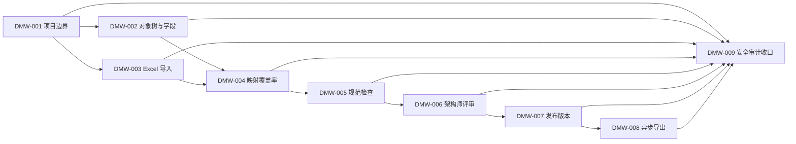

# 企业数据模型协作工作台 MVP 垂直切片 Issue 索引

- 日期：2026-07-02
- 阶段：vertical slices / to-issues
- 状态：本地 Issue 草案，待用户确认粒度后发布到 GitHub Issues
- OpenSpec / Comet change：`openspec/changes/data-modeling-workbench-mvp`
- Comet 状态：`.comet.yaml` 已初始化，当前 `phase=open`，阶段守卫待用户确认后推进

## 输入资产

- PRD：`docs/requirements/2026-07-01-data-modeling-workbench-prd.md`
- PRD 校准：`docs/requirements/2026-07-02-data-modeling-workbench-prd-calibration.md`
- 交互设计：`docs/design/data-modeling-workbench-interaction-spec.md`
- 系统架构：`docs/architecture/2026-07-02-data-modeling-workbench-architecture-design.md`
- 数据架构：`docs/architecture/2026-07-02-data-modeling-workbench-data-architecture.md`
- OpenAPI Freeze：`docs/api/freeze/2026-07-02-data-modeling-workbench-openapi-freeze.md`
- Frozen OpenAPI：`docs/api/specs/data-modeling-workbench.yaml`
- 契约测试清单：`docs/testing/2026-07-02-data-modeling-workbench-contract-test-checklist.md`

## 切片原则

- 每个切片都必须可演示、可验证，并贯穿 UI、API、Application、Domain、Infrastructure / PostgreSQL、契约测试和必要的审计。
- 不按 Adapter / Application / Domain / Infrastructure 横向拆任务。
- 安全与审计不是最后补丁：DMW-009 是收口切片，但 DMW-001 到 DMW-008 也必须各自包含权限、审计、统一错误和人工审查点。
- Frozen OpenAPI 默认不回改；任何契约变更必须回到 OpenAPI Draft / Review / Freeze 流程。

## 建议切片

| Issue | 标题 | 阻塞关系 | 覆盖用户故事 / FR | 主要页面 | 主要契约测试 |
|---|---|---|---|---|---|
| DMW-001 | 模型项目与边界闭环 | 无 | 用户故事 1-5；FR-001、FR-002、FR-019、FR-021 | 模型工作台、项目详情 | CT-020 至 CT-023、CT-013、CT-014 |
| DMW-002 | 模型对象树与字段维护 | DMW-001 | 用户故事 6-8、11、28；FR-003、FR-005、FR-016、FR-019、FR-020 | 设计工作台、字段抽屉 | CT-010、CT-012、CT-014、CT-015 |
| DMW-003 | Excel 导入物理模型草稿 | DMW-001 | 用户故事 9、10、28；FR-004、FR-020 | 导入向导 | CT-030 至 CT-038、CT-093 |
| DMW-004 | 字段映射与覆盖率 | DMW-002、DMW-003 | 用户故事 12-15、18、22、28；FR-006、FR-007、FR-008、FR-021 | 映射抽屉、覆盖率面板 | CT-040 至 CT-045 |
| DMW-005 | 规范规则与检查运行 | DMW-004 | 用户故事 16-18、19、22；FR-009、FR-016、FR-020 | 规范检查面板 | CT-050 至 CT-054 |
| DMW-006 | 单一架构师评审 | DMW-005 | 用户故事 19-21；FR-010、FR-011、FR-019、FR-020 | 评审页 | CT-060 至 CT-065 |
| DMW-007 | 发布版本与新草稿 | DMW-006 | 用户故事 22、23、27；FR-012、FR-019、FR-020、FR-021 | 发布弹窗、版本中心 | CT-070 至 CT-075 |
| DMW-008 | 三类异步导出资产 | DMW-007 | 用户故事 24-26；FR-013、FR-014、FR-015、FR-020 | 导出中心、版本详情 | CT-080 至 CT-085 |
| DMW-009 | 安全、审计与契约收口 | DMW-001 至 DMW-008 | 用户故事 4、19、23、29；FR-019、FR-020、全局安全红线 | 全局 | CT-001 至 CT-004、CT-010 至 CT-015、CT-090 至 CT-094 |

## 依赖图

## 发布到 GitHub Issues 的建议

- 发布前先确认：切片粒度是否合适、依赖关系是否正确、是否需要合并或拆分。
- 发布顺序：按 DMW-001 到 DMW-009。
- 建议标签：`ready-for-agent`；若安全人工确认尚未安排，安全相关 Issue 同时标记 `ready-for-human` 或在 issue body 保留 `TODO-HUMAN-REVIEW`。
- 发布后将本地 `DMW-*` 引用替换或补充为真实 GitHub Issue 链接。

## 待用户确认

1. 切片粒度是否合适：是否需要把 DMW-002 拆成“逻辑模型维护”和“物理模型维护”两个 issue？
2. 依赖关系是否正确：DMW-003 是否可以和 DMW-002 并行，还是必须在 DMW-002 后启动？
3. DMW-009 是否保留为收口 issue，还是只作为每个 issue 的完成门禁？
